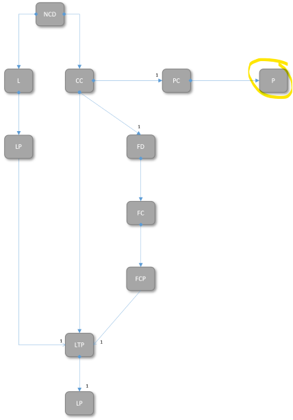

# Concept of Profiles

### Purpose of Profiles  
Profiles are for holding configuration information.  
Most the configuration information is for documenting traffic relationships (e.g. HttpServer, OperationClient).  
Profiles are for configuration information that is not directly related to an individual interface.  
Contained information could relate e.g.  
* to all or a group of interfaces  
* or to a process or calculation that is executed inside the application.  

Examples:  
- If there would be an application, which is documenting records about some type of events, it would probably make sense to make the number of events, which are to be recorded before deleting the eldest record, configurable.  
- If there would be an application for calculating some value from input from the network, there could be one or several static parameters in that formular. Potentially, it would make sense to make these parameters available for configuration during runtime of the application.  

Configuration information is not to be mixed with application data.  
While data is entering the application through body or response body of services, configuration information is read and set through GET and PUT requests in the OaM section of the REST API.  
Moreover structuring and storing of application data is implementation specific (could be e.g. a database), while structuring of configuration information is subject to specification and storing is happening in the CONFIGfile.  

### Structure of Profiles  
Every definition of a Profile has to contain:  
* ProfileName for identifying the kind of Profile  
* UUID for identifying the instance of Profile  
* Set of additional attributes that are specific to the individual kind of Profile  

Its independence from individual interfaces is also obvious from the core information model and the Profile class being separated from the LogicalTerminationPoint, respectively the LayerProtocol.  
  

**ProfileName**  
The name of the Profile must describe the data object in one or two meaningful nouns followed by "Profile".  
The name must be written in UpperCamelCase and it must be unique within the scope of the individual application.  

**UUIDs**  
UUIDs of Profiles have to comply with the rules defined in [Structure of UUIDs](../StructureOfUuids/StructureOfUuids.md).  

**Additional Attributes**  
The ApplicationOwner is free to define a set of additional attributes in the ProfileList.  
Attributes have to be substructured into:  
  * Invariant attributes that are for identifying the instance of Profile (Capability)  
  * Attributes that are available for storing values during run-time of the application (Configuration)  
(Capability attributes will only be represented by GET method in the OaM section of the OAS, while Configuration attributes will have PUT method, too.)

### Re-use of Profiles

Re-using already existing Profile definitions is very much recommended.  
Re-using is not just easier and faster during elaborating OpenApiSpecification and CONFIGfile, also program code is already available.  
The templates of the ProfileList and the ProfileInstanceList already contain the following definitions.

**ActionProfile**  
The ActionProfile is for defining a potential next step in the workflow that shall be represented in the GenericRepresentation.  
It is describing the label of a button that shall be shown and the request, which is to be sent, in case the button has been pushed.  
Even input fields for values, which need to be sent in the body of this request, can be defined.  
The ActionProfile is the most complex, but also the by far most often used Profile.  
It occurs several times in all existing applications.  

**FileProfile**  
The FileProfile contains the information, which is required for connecting with a file that holds application data.  
Aside identifying and describing the referenced file, it makes file path, access credentials and allowed operations available for configuration.  
The FileProfile is used whenever the application uses one or several files for storing internal data.  

**GenericResponseProfile** 
The GenericResponseProfile contains one out of potentially several response values of an *-in-generic-representation request.
The operation-name attribute works like a filter on the responses, which have to be put into an *-in-generic-representation request.
The name of the field and its datatype a are invariant, but the value is configurable.
The GenericResponseProfile occurs several times in all existing applications.  

**IntegerProfile**  
The IntegerProfile is for storing a single Integer value.  
In addition to the bare value, the Profile also allows to define unit, minimum and maximum values.  
It has been used for several times in multiple applications.  
E.g. it is holding the configuration of the number of records to be stored in the ExecutionAndTraceLog application.  

**StringProfile**  
The StringProfile is for storing a single String value.  
In addition to the bare string, the Profile also allows to define an array of legal values (enumeration) or a structure of the string (Regex pattern).  
It has been used in some applications.  
E.g. it is holding the operational mode of the OperationKeyManagement application.  

