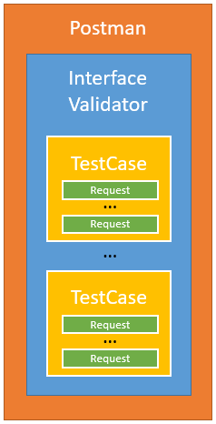

# Structure of Test Case Collection

The Test Case Collection is implemented in a kind of framework.  

First there is Postman.  
Postman supports the sending of HTTP requests to REST interfaces.  
Several different approaches are supported.  
Some are more for quick and dirty shots.  
Some facilitate to create sophisticated programs.  
The TCC uses Postman in an advanced form where many Requests get executed in a sequential order.  
Every individual Request consists of a  
- Pre-request Script that is used for preparing sending the HTTP request, an  
- HTTP request and a  
- Tests Script that is used for analysing the response of the HTTP request.  
Both Scripts are written a JavaScript code into the respective Postman sandbox.  

Second there is the InterfaceValidator.  
The InterfaceValidator was originally designed to test implementations of the ONF TR-532.  
It basically provides  
- a structure of folders that allows flexibly adding test cases,  
- a set of basic requests that are always required,  
- a concept for handling variables,  
- a scripting structure that allows to quickly read and navigate code contributed by different people,  
- a simple programming method that prevents the program flow from being interrupted when an error occurs,
- a harmonized way to represent testing results and  
- a unified way to display error messages and warnings that pop up during TCC execution.  

The framework can be flexibly adapted to the respective application under test.  
It can hold high numbers of test cases.  
Every test case may combine multiple Requests.  
Each Request combines Pre-Request Script, HTTP request and Test Script.  

  

Postman allows presenting Output in two ways:
- in the CollectionRunner
- in the PostmanConsole

The InterfaceValidator uses these two possibilities in the following way:
- The CollectionRunner represents the results of the test case.  
  The represented information is related with the application under test.  
- PostmanConsole shows information about the program flow of the InterfaceValidator.  
  This covers the sent requests, the data inside the InterfaceValidator, and notifications provided by the InterfaceValidator, etc.

.
.
.

Stoffsammlung

- Properly assessing the response requires reference values
  - could either be read from file
  - or read from the device/application under test
  - or from other devices/applications that are involved 
  anyway, several requests are involved for preparing and assessing a single Test Case
  here comes the InterfaceValidator into play
- It loads data into the environment that can be accessed and used by individual test cases 
- This reduces the total number of requests, which accellerates execution

- Schwachpunkt: Handling variables
  - world/environment/local ...
  - keine Klassen (daten schon aber keine methoden)
  - Empfehlung website von Postman zum Thema lesen

- Schwachpunkt: Re-use von code artifacts
  - die requests werden sequenziell abgearbeitet
  - Funktionen und Klassen können nicht definiert werden
  - es gibt eine möglichkeit strings zu definieren, diese Strings als Variable unter den Requests auszutauschen und bei Bedarf als Code zu interpretieren.
  - diese möglichkeit fügt sehr viel zusätzliche Komplexität ein, bringt relativ wenig Effizienzgewinne und macht den Code extrem unübersichtlich

Aufbau des Interface Validators
- Nutzer Konfiguration
- Laden von File
- Definition von Code