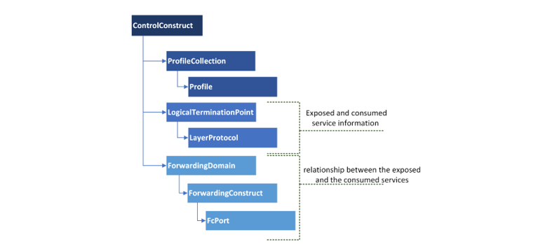

# ControlConstruct  

The ControlConstruct is the top level element of the data tree inside the applications.  
It represents the complete capability and functionality of the application.  
The generic template of the control construct looks as represented in the diagram.  

  

Apart from these lists of linked elements, a ControlConstruct (CC) comprises a universally unique identifier (UUID).  
The UUID is a String, which is unique across the all microservices in the MW SDN application layer.  
Exact details on the format of UUIDs can be found in [Structure of UUIDs](../../Names/StructureOfUuids/StructureOfUuids.md).  
