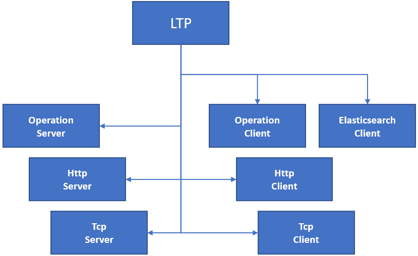

# LogicalTerminationPoint and LayerProtocol

### LogicalTerminationPoint

The ControlConstruct comprises a list of LogicalTerminationPoints (LTP).  
The LTP class represents the termination point of a logical connections, means: it's some sort of interface.  
The LTP is a generic class that holds the LayerProtocol class, which gets augmented with attributes that are specific to the individual kinds of interfaces.  

The following attributes are hold by the LogicalTerminationPoint:
- **uuid**: Identifier that is unique within the entire MW SDN application layer. Details can be found in [Structure of UUIDs](../../Names/StructureOfUuids/StructureOfUuids.md).  
- **ltpDirection**: The role of an LTP can be seen in two different context. It could be seen from outside the device/application, or from inside. Because the information about the LTP is provided by the device/application, it is necessary to take the internal point of view for understanding how to interpret the values of the ltpDirection.  
  - **core-model-1-4:TERMINATION_DIRECTION_SOURCE**: Looking at the _Forwarding_ inside the applications, it is the OperationServer, where the event, which causes a reaction at the OperationClient, happens. Consequently, the LTPs that are describing servers (OperationServer, HttpServer, TcpServer) are identified by being sources of the internal flow.  
  - **core-model-1-4:TERMINATION_DIRECTION_SINK**: Again looking at the internal _Forwarding_, the information is propagating towards the clients (OperationClient, ElasticsearchClient, HttpClient, TcpClient). Consequently, these interfaces are associated with being sinks of the internal flow.  
- **clientLtp**: This attribute does not relate to the relationship between applications, but OSI network layers. Example: An Ethernet PHY would be required for transporting an Ethernet MAC, and an Ethernet MAC would be required for transporting an IP layer. So, the Ethernet PHY is serving the Ethernet MAC, and the IP is client of the Ethernet MAC. Example in case of applications: OperationClients/OperationServers are referenced in the clientLtp attribute of the HttpClient/HttpServer.  
- **serverLtp**: Example in case of applications: TcpClients/TcpServers are referenced in the serverLtp attribute of the HttpClient/HttpServer.
- **layerProtocol**: List of logical layers that are terminated at the LTP. In case of MW SDN applications, but also in case of the MW information model, there is always just a single instance of LayerProtocol in this list.  

  


#### LayerProtocol

The LayerProtocol class describes the type of connection that is terminated.  
In principle, it is a generic class of the CIM, but it gets augmented with attributes that are specific to the individual kind of connection.  

In case of applications, the following attributes are common to all instances of LayerProtocol:  
- **localId**: Identifier that is unique just within the residing LogicalTerminationPoint.  
- **layerProtocolName**: Discriminator of kinds of LayerProtocol. LTP (actually it's the LP), ForwardingDomain, ForwardingConstructs and Links must share the same value in their layerProtocolName attribute for being able to span a topology. In case of the MW SDN applications, ForwardingDomain, ForwardingConstructs and Links are currently exclusively existing on the Operation layer. Since there would be always the same value, layerProtocolName attributes don't existing in these classes. The following values have been defined for the layerProtocolName attribute to destinguish the layers at the LayerProtocol:  
  - operation-server-interface-1-0:LAYER_PROTOCOL_NAME_TYPE_OPERATION_LAYER: 
  - http-server-interface-1-0:LAYER_PROTOCOL_NAME_TYPE_HTTP_LAYER: 
  - tcp-server-interface-1-0:LAYER_PROTOCOL_NAME_TYPE_TCP_LAYER: 

Further attributes are individual to the kind of LayerProtocol.  
The individual attributes have to be filled with the values that have already been defined in the ServiceList.  
The order of instances should be identical in ServiceList and CONFIGfile.  
Details about their individual meaning can be found in [Creating a ServiceList](https://github.com/openBackhaul/ApplicationPattern/blob/develop/doc/SpecifyingApplications/CreatingServiceList/CreatingServiceList.md).  

  

Each service that is provided by the application is represented as an **OperationServer** in the list of LTPs. In case of the OperationServer the following attributes get augmented:  
```
"operation-server-interface-1-0:operation-server-interface-pac": {
  "operation-server-interface-capability": {
    "operation-name": "/v1/register-yourself"
  },
  "operation-server-interface-configuration": {
    "life-cycle-state": "operation-server-interface-1-0:LIFE_CYCLE_STATE_TYPE_EXPERIMENTAL",
    "operation-key": "Operation key not yet provided."
  }
}
```

- The **HttpServer** describes the application that is subject to the specification. There will be just a single HttpServer instance per application. Its attributes have to be updated during specification phase. The following attributes get augmented:  
```
"http-server-interface-1-0:http-server-interface-pac": {
  "http-server-interface-capability": {
    "application-name": "RegistryOffice",
    "release-number": "2.0.1",
    "application-purpose": "All applications being part of the MBH SDN must be register here.",
    "data-update-period": "http-server-interface-1-0:DATA_UPDATE_PERIOD_TYPE_REAL_TIME",
    "owner-name": "Thorsten Heinze",
    "owner-email-address": "Thorsten.Heinze@telefonica.com",
    "release-list": [
      {
        "local-id": "0",
        "release-number": "1.0.0",
        "release-date": "04.12.2021",
        "changes": "Initial version."
      },
      {
        "local-id": "1",
        "release-number": "2.0.1",
        "release-date": "04.12.2022",
        "changes": "Update on ApplicationPattern 2.0.1."
      }
    ]
  }
}
```

- The **TcpServer** represents the current IP address and port of the application that is subject to the specification. There must be at least one instance of TcpServer. If the application shall be reachable from within and from outside the virtual privat cloud (name space behind TLS layer termination), separate TcpServers are required for http and https. The TcpServer has a complex datastructure that offers multiple ways of expressing the address information. Several attributes are for alternative usage (means: exclusive alternatives). It is recommended to study the definition of the ControlConstruct in the OpenApiSpecification of the ApplicationPattern, if a different way of expressing the application's own address would be required. In all the existing applications, the following attributes got augmented:  
```
"tcp-server-interface-1-0:tcp-server-interface-pac": {
  "tcp-server-interface-configuration": {
    "description": "Without TLS layer",
    "local-protocol": "tcp-server-interface-1-0:PROTOCOL_TYPE_HTTP",
    "local-address": {
      "ipv-4-address": "1.1.3.8"
    },
    "local-port": 3008
  }
}
```

- The **OperationClient** holds information about a service that is consumed at another application. The following attributes get augmented:  
```
"operation-client-interface-1-0:operation-client-interface-pac": {
    "operation-client-interface-configuration": {
      "operation-name": "/v1/notify-approvals",
      "operation-key": "Operation key not yet provided."
    },
    "operation-client-interface-status": {
      "operational-state": "operation-client-interface-1-0:OPERATIONAL_STATE_TYPE_NOT_YET_DEFINED",
      "life-cycle-state": "operation-client-interface-1-0:LIFE_CYCLE_STATE_TYPE_NOT_YET_DEFINED"
    }
  }
}
```

- The **ElasticsearchClient** allows configuring the connection towards a database that is storing ApplicationData. The ElasticsearchClient has a very comprehensive set of attributes. Most of them are not mendatory, but can be configured via the REST API. The following attributes have to be put into the CONFIGfile during design time:  
```
"elasticsearch-client-interface-1-0:elasticsearch-client-interface-pac": {
  "elasticsearch-client-interface-configuration": {
    "auth": {
      "api-key": "API key not yet defined."
    },
    "index-alias": "eatl-2-0-1"
  },
  "elasticsearch-client-interface-status": {
    "operational-state": "elasticsearch-client-interface-1-0:OPERATIONAL_STATE_TYPE_NOT_YET_DEFINED",
    "life-cycle-state": "elasticsearch-client-interface-1-0:LIFE_CYCLE_STATE_TYPE_NOT_YET_DEFINED"
  }
}
```

- The **HttpClient** identifies the application that provides the consumed services. The following attributes get augmented:  
```
"http-client-interface-1-0:http-client-interface-pac": {
  "http-client-interface-configuration": {
    "application-name": "ExecutionAndTraceLog",
    "release-number": "2.0.1"
  }
}
```

- The **TcpClient** stores the IP address and port of a serving application. In contrast to the TcpServer, just a single TcpClient shall be described. Alike the TcpServer, the TcpClient has a complex datastructure that offers multiple ways of expressing the address information. Several attributes are for alternative usage (means: exclusive alternatives). It is recommended to study the definition of the ControlConstruct in the OpenApiSpecification of the ApplicationPattern, if a different way of expressing the serving application's address would be required. In all the existing applications, the following attributes got augmented:  
```
"tcp-client-interface-1-0:tcp-client-interface-pac": {
  "tcp-client-interface-configuration": {
    "remote-protocol": "tcp-client-interface-1-0:PROTOCOL_TYPE_HTTP",
    "remote-address": {
      "ip-address": {
        "ipv-4-address": "1.1.3.8"
      }
    },
    "remote-port": 3008
  }
}
