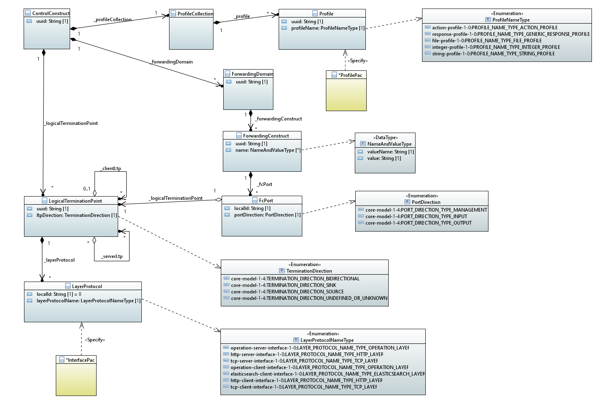

# ONF Core Information Model Overview

The configuration information inside the applications, their CONFIGfile and their DATAfile is structured according to the ONF Core Information Model (ONF TR-512 v1.4).  

The Core Information Model (CIM) has been developed by the Open Transport Configuration & Control (OTCC) project of the Open Networking Foundation (ONF).  
It provides a common language and structure for describing transport networks, which includes, but is not limited to a harmonized device management interface.  
The information modeling specifications are made in Unified Modeling Language (UML).  
This allows translating into multiple data modeling languages as e.g. Yet Another Next Generation (YANG), which is applied at the NETCONF interfaces of modern transport devices.  

The CIM defines a set of classes, relationships, and attributes that can be used to represent various aspects of a network, including equipment inventory, logical interfaces, traffic flows, and policies.  
It is designed to be vendor-neutral and technology-agnostic, meaning that it can be used to represent network resources and services regardless of the underlying technologies or vendors involved.  

The following picture shows the very small subset of components of the CIM that are used within the applications and the enumeration values that have been chosen for that purpose.  

  

In general, the generic objects, relationships, and attributes of the CIM get complemented by technology specific augmentations.  

In case of the information model that is used inside the applications, the ...
- [LayerTerminationPoint](../LogicalTerminationPoint/LogicalTerminationPoint.md) and its attached classes get complemented by attributes that are specific to the kinds of input and output interfaces that have to be configured at the applications.  
- [Profile](../Profile/Profile.md) class gets augmented by attributes for storing parameters that are required for calculations or processes that are executed inside the applications.  

The [ControlConstruct](../ControlConstruct/ControlConstruct.md) is the top level element of the data tree inside the applications.  
ForwardingDomain and [ForwardingConstruct](../ForwardingConstruct/ForwardingConstruct.md) are describing event-reaction-relationships similar to a traffic flow.  

