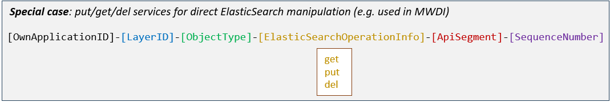

# Structure of UUIDs  

UUIDs are used for identifying the logical objects within the structure of the configuration data inside the applications.  
Example: If interfaces A and B are identified by UUIDs, it suffices to list the two UUIDs to express a connection between the two interfaces.  
Obviously, UUIDs have to be unique within the network domain for unambiguously describing a connection between interfaces at different applications.  

Uniqueness could have been assured by an algorithm for creating qualified random strings, but it has been decided to create UUIDs from information about the objects, which are to be identified.
These harmonized UUIDs are supporting reading and navigating through the configuration data of the individual applications.  
Unfortunately, it takes some training to properly put them together.

## UUIDs are composed from the following information:  

_Note that there are special cases where the format differs. The special case uuids are used for services directly accessing ElasticSearch with put/get/delete and are described further down._

---  

**OwnApplicationID**  
This application identifier relates to the application that contains the data object that is identified by the UUID (name space).  
It is composed from the official abbreviation of the _ApplicationName_ composed from the uppercase letters of the _ApplicationName_ (e.g. RegistryOffice=>RO, TypeApprovalRegister=>TAR), but transferred into lowercase letters (e.g. RO=>ro, TAR=>tar) and the official _ReleaseNumber_ of the specification of the application that contains the data object.  
Dots are to be replaced by hyphens (e.g. 1.0.0=>1-0-0, 1.0.1=>1-0-1).  
A hyphen is also used between abbreviation of the _ApplicationName_ and _ReleaseNumber_.  
Examples: ro-1-0-0, tar-1-0-1

(Now, it should be clear why [Structure of ApplicationNames](../StructureOfApplicationNames/StructureOfApplicationNames.md) prescribes abbreviations to be unique within the modular application layer.)  

---  

**LayerID**  
Currently the following layers are defined:  
- es = ElasticSearch  
- http = HTTP  
- meth = Method  
- op = Operation  
- prot = Protocol  
- tcp = TCP/IP  

If the _ObjectType_ identifies an instance of _Profile_ (p), the _LayerID_ is used for identifying the type of _Profile_.  
In principle, the _ApplicationOwner_ is free in defining _Profiles_ and choosing the _LayerID_, because instances of _Profile_ just exist within the scope of the application itself.  
If an already existing _Profile_ definition would be re-used, it would be recommended to re-use the same _LayerID_, too.  
The following _LayerIDs_ are already in use for _Profiles_:  
- action = For describing the consequent action in a generic representation  
- file = For storing information required for connecting to a file that is holding application data  
- integer = For storing a single Integer  
- response = For describing some response in a generic representation  
- string = For storing a single String  

---  

**ObjectType**  
Within the respective layers the following types of objects are defined:  
- c = _Client_  
- s = _Server_  
- fd = _ForwardingDomain_ (potential forwarding inside applications)  
- fc = _ForwardingConstruct_ (actual forwarding inside applications)  
- p = _Profile_  

---  

**ApiSegment**  
The _ApiSegment_ is contained in the UUIDs of _OperationServers_, _OperationClients_ and _FCs_.  
Basically, identical letters are used, but there is a slight divergence in the deep details of the semantical meanings.

_--- OperationServers ---_  
> The **OperationServers** are categorized according to the following two aspects:  
> - Own Management (receiving advice) vs. Offered Services (providing support)  
> - Basic to all applications vs. Individual to this application  

> This results in four categories:  
> - bm = Basic Management: _Operation_ for managing this application, but same _Operation_ is available at all other applications, too  
> - im = Individual Management: _Operation_, which is individual for managing this application  
> - bs = Basic Service: Offering a service, which must be provided by all applications  
> - is = Individual Service: Offering a services, which is individual to this application  

_--- HttpServer and TcpServer ---_  
UUIDs of **HttpServer** and **TcpServer** don't contain an ApiSegment.  

_--- OperationClients ---_  
The **OperationClients** are categorized according to the following two aspects:  
- Executed Management (giving advice) vs. Consumed Services (receiving support)  
- Basic to all applications vs. Individual to this application  

This results in four categories:  
- bm = Basic Management: All applications have this client for executing management on another application  
- im = Individual Management: Only this application has this client for executing management on another application  
- bs = Basic Services: All applications are consuming the same service from the same application  
- is = Individual Services: It's individual to this application to consume this service  

_--- HttpClient, TCPClient, FCs, Profiles and FDs ---_  
- UUIDs of **HttpClient** and **TcpClient** don't contain an ApiSegment.
- **FCs** are inheriting the ApiSegment from the connected OperationClients.  
- UUIDs of **Profile** and **FD** don't contain an ApiSegment.  

---  

**TargetApplicationID**  
This application identifier relates to the application that is connected by the described client interface object.  
It is **exclusively used with ObjectType c (Client)**.  
It is composed from the official abbreviation of the application name composed from the uppercase letters of the application name (e.g. RO, TAR), but transferred into lowercase letters (e.g. ro, tar) and the official release number of the specification of the application that is connected by the described client interface object.  
Dots to be replaced by hyphens (e.g. 1-0-0, 1-0-1) inside the release number.  
ElasticSearch would be identified by es-1-0-0.  
A hyphen also to be used between abbreviation of the application name and release number.  

---  

**SequenceNumber**  
The SequenceNumber is just distinguishing objects of the same kind.  
It has three digits.  
Counting is decimal.  

---  
**Special case: ElasticSearchOperationInfo**  
E.g. in MWDI there are services for direct access to the Cache for topology information, which is not available from the Controller/devices (in contrast to the ressource paths).  
These services have a slightly different uuid format, as they contain information about the related ElasticSearch operation.  

  

## Examples:  

| UUID | Object description |
| ---- | ------------------ |
| ro-1-0-0-op-s-bm-004 | OperationServer (for /v1/end-subscription) inside the RegistryOffice release 1.0.0 |  
| ol-1-0-0-op-c-bm-ro-1-0-0-010 | OperationClient (for /v1/relay-server-replacement) that is addressing the RegistryOffice release 1.0.0 inside the OamLog release 1.0.0 |  
| eatl-2-0-0-es-c-es-1-0-0-000 | ElasticSearchClient for connecting ExecutionAndTraceLog release 2.0.0 with its database |  
| ol-1-0-0-http-c-alt-1-0-0-000 | HttpClient that is addressing the ApplicationLayerTopology release 1.0.0 inside the OamLog release 1.0.0 |  
| aa-1-0-0-op-fc-003 | ForwardingConstruct for basic management tasks on the OperationLayer inside the AdministratorAdministration release 1.0.0 |  
| eatl-1-0-1-integer-p-000 | Profile storing an Integer value inside the ExecutionAndTraceLog release 1.0.1 |  
| mwdi-1-0-0-op-s-get-is-205 | Special case service offered by MWDI relase 1.0.0 to directly access ElasticSearch and get a data record |  

## UUIDs of Links:  

UUIDs of Links are exclusively created inside the ApplicationLayerTopology application.  
They shall be created according to the version 4 concept provided by IETF RFC4122.  

