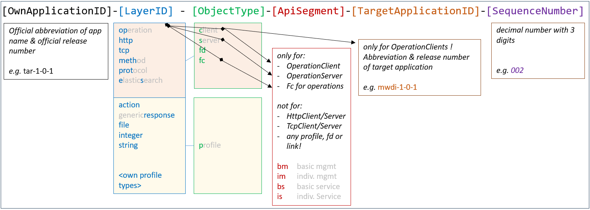

# Structure of UUIDs  

UUIDs are used for identifying the individual objects within the structure of the configuration data inside the applications.  
Example: If interfaces A and B are identified by UUIDs, it suffices to list the two UUIDs to express a connection between the two interfaces.  
Obviously, UUIDs have to be unique within the network domain for expressing connections between interfaces at different applications.  
Harmonizing UUIDs across all applications helps reading and navigating through the configuration data of the individual applications.  

**UUIDs are composed from the following information:**  

**OwnApplicationID**  
This application identifier relates to the application that contains the data object that is identified by the UUID (name space).  
It is composed from the official abbreviation of the application name composed from the uppercase letters of the application name (e.g. RO, TAR), but transferred into lowercase letters (e.g. ro, tar) and the official release number of the specification of the application that contains the data object, dots to be replaced by hyphens (e.g. 1-0-0, 1-0-1).  
A hyphen is also used between abbreviation of the application name and release number.  
Examples: ro-1-0-0, tar-1-0-1

(Now, it should be clear why [Structure of ApplicationNames](../StructureOfApplicationNames/StructureOfApplicationNames.md) prescribes abbreviations to be unique within the modular application layer.)  
If someone would find it more convinient, - UUIDs could be abstracted from OwnApplicationID inside ServiceList and ForwardingList, but OAS, CONFIGfile and test cases must contain the complete UUIDs.  

**LayerID**  
Currently the following layers are defined:  
- es = ElasticSearch  
- http = HTTP  
- meth = Method  
- op = Operation  
- prot = Protocol  
- tcp = TCP/IP  

If the ObjectType identifies an instance of Profile (p), the LayerID is used for identifying the type of Profile.  
In principle, the ApplicationOwner is free in defining Profiles and choosing the LayerID, because instances of Profile just exist within the application itself.  
If an already existing Profile definition would be re-used, would be recommended to re-use the same LayerID, too.  
The following LayerIDs are already in use for Profiles:  
- action = For describing the consequent action in a generic representation  
- file = For storing information required for connecting to a file that is holding application data  
- integer = For storing a single Integer  
- string = For storing a single String  

**ObjectType**  
Within the respective layers the following types of objects are defined:  
- c = Client  
- s = Server  
- fd = ForwardingDomain (potential forwarding inside applications)  
- fc = ForwardingConstruct (actual forwarding inside applications)  
- link = Link (actual forwarding outside applications)  
- p = Profile  

**ApiSegment**  
The services provided by the application (OperationServers) are categorized according to the following two aspects:  
- Own Management vs. Offered Services  
- Basic to all applications vs. Individual to this application  

This results in four categories:  
- bm = Basic Management, which is available at this application, but all other applications, too  
- im = Individual Management, which is individual to this application  
- bs = Basic Services, which have to be provided by all applications  
- is = Individual Services, which are individual to this application  

After categorizing all OperationServers, HttpServer and TcpServer are inheriting the highest category represented in the group of supported OperationServers.  

Same concept applies on OperationClients, HttpClients and TcpClients.  
FCs are also inheriting their cathegory from the connected OperationClients and OperationServers.

UUIDs of Profile, ForwardingDomain and Link don't identify an ApiSegment.  

**TargetApplicationID**  
This application identifier relates to the application that is connected by the described client interface object.  
It is **exclusively used with the combination of LayerID op (Operation) and ObjectType c (Client)**.  
It is composed from the official abbreviation of the application name composed from the uppercase letters of the application name (e.g. RO, TAR), but transferred into lowercase letters (e.g. ro, tar) and the official release number of the specification of the application that is connected by the described client interface object.  
Dots to be replaced by hyphens (e.g. 1-0-0, 1-0-1) inside the release number.  
A hyphen also to be used between abbreviation of the application name and release number.  

**SequenceNumber**  
The SequenceNumber is just distinguishing objects of the same kind.  
It has three digits.  
Counting is decimal.  

**Examples**  
| UUID | Object description |
| ---- | ------------------ |
| ro-1-0-0-op-s-bm-004 | OperationServer (for /v1/end-subscription) inside the RegistryOffice release 1.0.0 |  
| ol-1-0-0-op-c-bm-ro-1-0-0-010 | OperationClient (for /v1/relay-server-replacement) that is addressing the RegistryOffice release 1.0.0 inside the OamLog release 1.0.0 |  
| eatl-2-0-0-es-c-im-000 | ElasticSearchClient for connecting ExecutionAndTraceLog release 2.0.0 with its database |  
| ol-1-0-0-http-c-bm-alt-1-0-0-000 | HttpClient that is addressing the ApplicationLayerTopology release 1.0.0 inside the OamLog release 1.0.0 |  
| aa-1-0-0-op-fc-bm-003 | ForwardingConstruct for basic management tasks on the OperationLayer inside the AdministratorAdministration release 1.0.0 |  
| eatl-1-0-1-integer-p-000 | Profile storing an Integer value inside the ExecutionAndTraceLog release 1.0.1 |  
