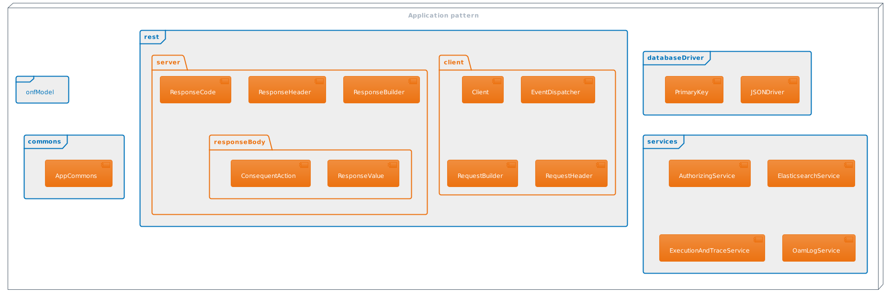

# ApplicationPattern Modules Documentation

**Purpose**

The purpose of this document is to outline the technical design of the application pattern generic modules in detail.  

It is detailing  
* the functionality provided by each class/file in the modules
* the functionality, which will be provided by each component and shows how various components interacts in the design

This document will be updated based on the changing requirement in the application pattern specification.  

**Scope**

The application pattern design charted in this document is based on the scope defined in the requirement (OAS).  
This document is not intended to address the installation and configuration of the deployment.  

**Introduction**

Application pattern Package is a ready-made library that has functionalities specific to the ApplicationPattern specification.

This library provides APIs,
- to manipulate the CONFIGFile, which is structured in the ONF Core model.
- to configure the LogicalTerminationPoint instances
- to configure and automate the forwardings between applications (please refer chapter about [ForwardingList](../../SpecifyingApplications/ConceptsOfForwardingList/ConceptsOfForwardingList.md) to learn more about forwarding)
- to configure the profile instances in the ProfileCollection
- to log the service request to the Execution And Trace Log(EATL) and OAM Log Application.
- to authenticate the OAM request in AdministratorAdministration Application.

    

### Application Pattern Modules Overview

[Application Pattern Modules Overview](../ConceptOfApplicationPatternPackage/ConceptOfApplicationPatternPackage.md)
