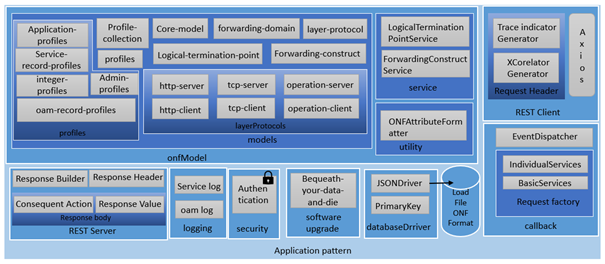
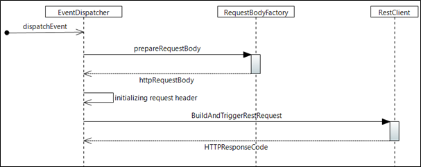

# Application Pattern Documentation

## Purpose

The purpose of this document is to outline the technical design of the application pattern generic modules in detail.

It's detailing 
* the functionality provided by each class/file in the modules
* the functionality, which will be provided by each component and shows how various components interacts in the design

This document will be updated based on the changing requirement in the application pattern specification.

## Scope

The application pattern design charted in this document is based on the scope defined in the requirement (OAS).  
This document is not intended to address the installation and configuration of the deployment.

## Introduction

Application pattern module is a ready-made framework that provides components and solutions that has generic functionalities specific to the SDN application pattern microservice specifications.

This framework provides APIs,
* to manipulate the LOADfile, which is in the ONF Core model.
* to configure and automate the forwardings between applications(please refer [chapter about ForwardingList](../../SpecifyingApplications/ForwardingList/ForwardingList.md) to learn more about forwarding)
* to log the service and the oam request to ExecutionAndTraceLog and OamLog application respectively.
* to validate authentication by interacting with the AdministratorAdministration application.

By including this already existing framework, one can focus on business logics rather than developing their own logic to provision their application into the microservice architecture.

## Application Pattern Modules

### Callbacks

Callback module provides functionality to formulate and dispatch the HTTP request to a target REST server.

#### requestBodyFactory

##### basicservices.js

Provides functionality to formulate HTTP request body for the forwarding HTTP requests that are part of the basic services. This module is generic across all the application that are having core-model-1-4:control-construct as the root entity of their LOADfile.