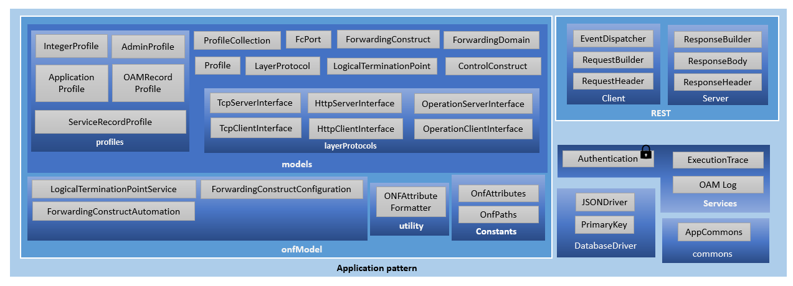

# Application pattern package

Application pattern Package is a ready-made library that has functionalities specific to the ApplicationPattern specification.

This library provides APIs,
- to manipulate the CONFIGFile, which is structured in the ONF Core model.
- to configure the LogicalTerminationPoint instances  
- to configure and automate the forwardings between applications (please refer chapter about ForwardingList to learn more about forwarding)
- to configure the profile instances in the ProfileCollection
- to log the service request to the Execution And Trace Log(EATL) and OAM Log Application.
- to authenticate the OAM request in AdministratorAdministration Application.

    

## Application Pattern Modules

ApplicationPattern modules consists of the following sub-modules:

### Commons
This module represents common functionality for the app.

**SubModules**
* [AppCommons](./SubModulesOfCommon/AppCommons.md)

### DatabaseDriver
This module consists of functionalities using which the CONFIGfile shall be manipulated.

**SubModules**
* [JSONDriver](./SubModulesOfDatabaseDriver/JSONDriver.md)
* [PrimaryKey](./SubModulesOfDatabaseDriver/PrimaryKey.md)
  
### ONFModel
This module consists of classes that defines the ONF core model.
The model is described in separate document [here](../../ImplementingApplications/ApplicationPatternDocumentation/ApplicationPatternDocumentation_onfmodel.md).

### Rest
This module consists of classes related to REST API. 

**SubModules**
* [client](./SubModulesOfRest/client.md)
* [server](./SubModulesOfRest/server.md)
  
### Services
This module consists of service classes.

**SubModules**
* [AuthorizingService](./SubModulesOfServices/AuthorizingService.md)
* [ElasticsearchService](./SubModulesOfServices/ElasticsearchService.md)
* [ExecutionAndTraceService](./SubModulesOfServices/ExecutionAndTraceService.md)
* [OamLogService](./SubModulesOfServices/OamLogService.md)
  

