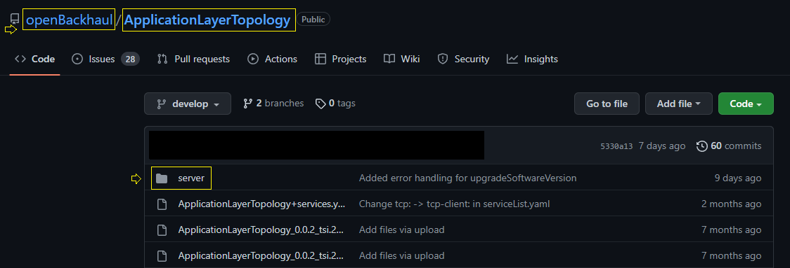

# Directory for server-side implementation

A dedicated directory that holds the server-side implementation is required and can be created by the application implementor. 
The server-side stub generated from the OAS should be placed inside this folder for further development.

In the develop branch , if a directory named “server” is not available in the root directory , then it should be created.

   

