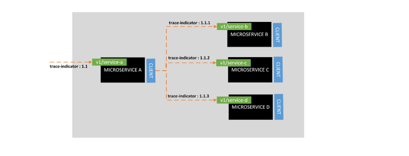

## Custom Request Header Fields
All service expects the following mandatory custom headers in the request, 
- User – The value should be the User identifier from the system starting the service call
- Originator – The value should be the Identification for the system consuming the API. Typically, the name of the application that’s consuming the service.
- customer-journey - Holds information supporting customer’s journey to which the execution applies.
- x-correlator - UUID for the service execution flow that allows to correlate requests and responses. `The valid syntax is '^[0-9A-Fa-f]{8}(?:-[0-9A-Fa-f]{4}){3}-[0-9A-Fa-f]{12}$'`
- trace-indicator - Sequence of request numbers along the flow. 
For example , if v1/service-a in Microservice-A calls v1/service-c in Microservice-C , then a call is made to v1/service-b in Microservice-B , then the trace-indicator will look like below, 

Also, there are few cases where a service request will result in a broadcast , insuch case the trace-indicator will increment as below, 

