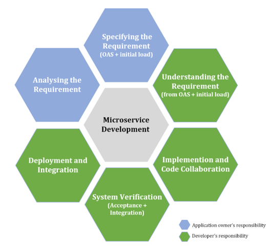

## Getting Started

The ultimate goal is to build an application layer on top of the SDN controller(s) based on the Microservice principles. The whole idea came out of the ONF openBackhaul program with a clear perspective to provide solution for a variety of use cases in the existing network environment.

Each microservice in our application layer,
- is developed based on the API first approach,
- have its own database, modelled based on the ONF core model concepts
- is a modular REST server designed for a single use-case 
- is capable of communicating with other Microservices in the architecture,
- is loosely coupled and independently deployable components
- is highly maintainable and testable

Since we are following an API first approach , an application owner will analyze a new business requirement and specify the application in OAS3.0 along with the initial load file. A developer can also be expected to engage in the specification phase to review and provide suggestion to refine the specification.

   

A developer's actual work starts after receiving the Open API specification and the initial load file from the application owner.

**Further reading ,** 
- Understanding the Requirement
- Implementation and code collaboration
- System Verification
- Deployment and Integration

**Further reading for beginners ,** 
- [What are Microservices ?](https://github.com/openBackhaul/ApplicationPattern/blob/PrathibaJee/issue86/doc/ImplementingApplications/Microservices/WhatAreMicroservices.md)
- [What is REST?](https://github.com/openBackhaul/ApplicationPattern/blob/PrathibaJee/issue86/doc/ImplementingApplications/RESTfulServices/RESTfulServices.md)
- What is an API first approach?
