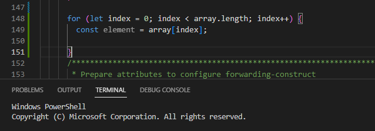

# Implementing Node.js application in VSCode

Step-by-step guide to utilize some basic features provided by VSCode to ease the javaScript development.

### To Support JavaScript Language
* Create a file with extenstion .js.

  

* VSCode interprets this file as JavaScript and will evaluate the contents with the JavaScript language service. 

### To include Type checking
* To enable type checks per file , include the following to the top of a JavaScript file
  `// @ts-check`

* To enable type checking for all JavaScript files without changing any code , 
  * Open `File -> Preference -> Settings` in VSCode
  * Select `Workspace -> Extension -> TypeScript`
  * Enable the property `JS/TS > Implicit Project Config: Check JS`
  
      

### To use Snippets
* VS Code includes basic JavaScript snippets that are suggested as you type.
  
  
* Based on the selection , snippets will be autogenerated by VSCode.
  
  

### To use JSDoc support
* Bring the cursor before a function declaration 
* Type `/**` and from the suggestion select JSDoc comment
  
  
* Selecting this will create a comment stub based on the argument of the underlying function
  
  

### Auto imports
* Start typing in the editor 
* VSCode will list suggestion based on the typed letter or word
  
  

* Selecting an option from the suggestion includes an import statement in the starting of the file

### Code navigation shortcuts
* Go to Definition `F12` - Go to the source code of a symbol definition.
* Peek Definition `Alt+F12` - Bring up a Peek window that shows the definition of a symbol.
* Go to References `Shift+F12` - Show all references to a symbol.
* Go to Symbol in File `Ctrl+Shift+O`
* Go to Symbol in Workspace `Ctrl+T`

### Unused variables and unreachable code
* Unused JavaScript code is faded out in the editor.
  
* This can be deleted directly to keep the code clean.

[Up to Preparing for implementing Applications](../PreparingImplementing.md) - - - [Ahead to Introduction to NPM ->](../Introduction2Npm/Introduction2Npm.md)
