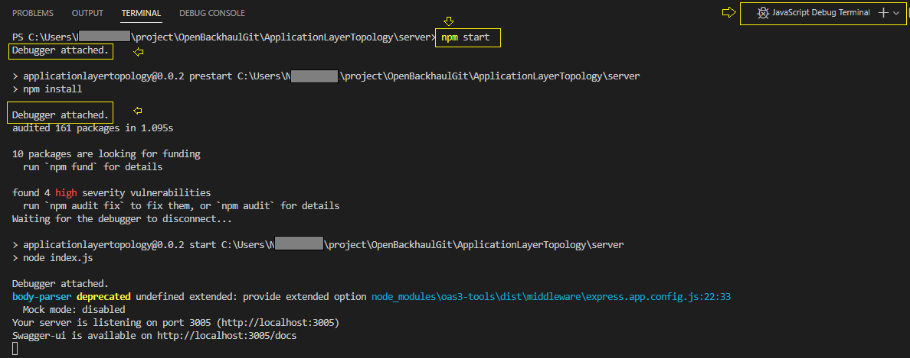

# Debugging Node.js application in VSCode

Node.js applications can be debugged in 3 different approaches in VSCode. JavaScript Debug terminal is one easy approach among them.

### Step-by-step guide to start application in debug mode
* Go to menu `View -> Terminal`
  
  
* This will open a integrated terminal. Select the `JavaScript Debug Terminal` from the terminal switcher dropdown.
  
   

* You can debug Node.js applications directly by using the command `npm start` or `node <starting JS file-name>`

   

### Step-by-step guide to add breakpoints
#### Breakpoints
* Double clicking in in the gutter beside a line number will include a breakpoint which will pause the execution while hitting the line.
* Alternatively , right-click in the gutter beside a line number and select " Breakpoint"

   
#### Conditional Breakpoints
* Right-click in the gutter beside a line number and select "Conditional Breakpoint"

   
* Create expression for the breakpoints that only pause when the defined expression returns a truthy value.

   
#### Logpoints
* Right-click in the gutter beside a line number and select "Log Breakpoint"

   
* Create logs that can be be printed while crossing this breakpoint.To print variable, place them inside `{variable-name}` curly braces.

   

### Debug action
* After launching the application in debug mode , a debug action toolbar can be viewed in the top of the editor. 

   

* Alternatively using the following shortcuts actions can be performed 
  * Continue / Pause `F5`
  * Step Over `F10`
  * Step Into `F11`
  * Step Out `Shift+F11`
  * Restart `Ctrl+Shift+F5`
  * Stop `Shift+F5`

[Up to Preparing for implementing Applications](../PreparingImplementing.md) - - - [Ahead to Introduction to NPM ->](../Introduction2Npm/Introduction2Npm.md)
