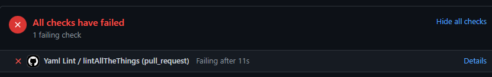
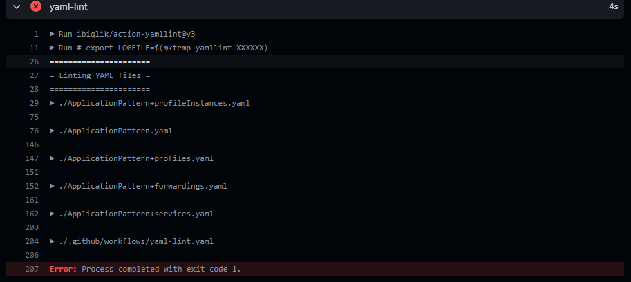
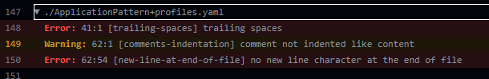

# Adding a yaml linter to GitHub

## Introduction

The yaml linter is a GitHub Action which checks if the document which will be merged is yaml-conform. If the check fails, the merge can't go through. This final check helps improving readability and usability of the document.

The linter follows the yamllint [default rules](https://yamllint.readthedocs.io/en/stable/configuration.html) with a few slight adjustments:

- _line-length: disable_
    Default value is 80 character per line, but that is not useful in this context due to long URLs.
- _document-start: disable_
    Default value is warning if no three dashes (---) at the start of the document is included. This is used for parsers which combine multiple files. However this will rarely happen in our context and probably leads to more confusion, so its disabled.

A full list of rules and further explanation can be found [here](https://yamllint.readthedocs.io/en/stable/rules.html).

## How to add the yaml linter to your repository

1. Find or create the `.github` folder in the root directory.
2. In that folder, add a new folder named `workflows` (if not already existing).
3. Add a new file named `yaml-lint.yaml` with following content:

    ```yaml
    name: Yaml Lint
    on:
      pull_request:
        branches: [develop]
    jobs:
      lintAllTheThings:
        runs-on: ubuntu-latest
        steps:
          - uses: actions/checkout@v2
          - name: yaml-lint
            uses: ibiqlik/action-yamllint@v3
            with:
              format: github
              config_data: |
                extends: default
                rules:
                  line-length: disable
                  document-start: disable
    ```

    This will add a GitHub action to your repository which runs every time a pull request on the develop branch is created or edited. The workflow first checks out the repository code and then runs the yaml linter. This checks all the yaml files in the repository for errors following the given rules. If the run fails, the errors needs to be adressed (see following chapter). If the run was successful, you can proceed as always.

4. Commit your file and start a pull request on your develop branch. Now you should see the action working.

## Where to see the errors and the result of the action

As soon as you created a pull request, follow these steps:

1. Check errors:
    You can see the errors by clicking on the `details` button in the checks-section of the Pull Request:
    
    Now you should see an overview of files which contain errors or warnings:
    
2. Click on a file name to see its errors:
    
    An error or warning is structured after following pattern:

    ```diff
    - Error|Warning: line:character: [error-name] error-message
    ```

    e.g. the first error appears in the `ApplicationPattern+profiles` file  in line 89 at charcter 22, which contains trailing spaces.
    More about this rule [here](https://yamllint.readthedocs.io/en/stable/rules.html#module-yamllint.rules.trailing_spaces).

3. Resolve the errors mentioned above. Warnings can be adressed but are not necessary for the action to suceed.
4. Commit your changes.
5. The check will run again and should be successful, if you would have fixed all the errors. If it fails, check the errors again.
6. If you resolved all errors: :sparkles:Congratulations!:sparkles: all your files are now following the yaml rules.

In the optimal case, the yaml linter will not fail in the first place because you have already linted your files before commiting. However thats not always the case so this additional step helps to fully assure, that every yaml file merged is correct and well formed.
