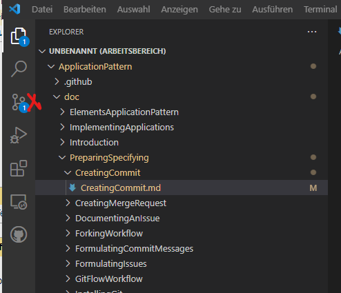
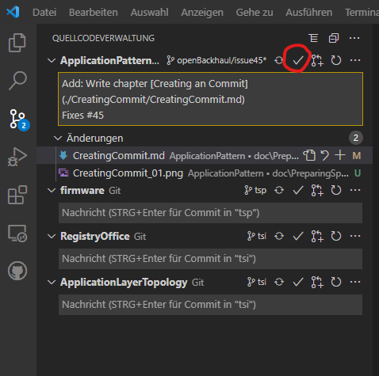
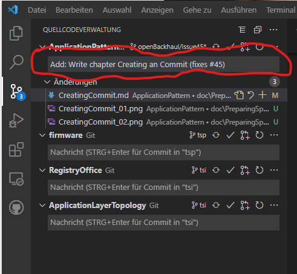

# Creating a Commit

### Committing

While changing the files in a branch, which has been generated based on an _Issue_, in your local copy of the repository, you might have saved them several times.  
After completing at least a subtask of the _Issue_, which is underlying the branch, you should create a commit.  

A commit captures the currently staged changes in such a way that you can return to this status again later, if necessary.  
Of course, it makes sense to properly define this status by a meaningful description (see chapter about [Formulating Commit Messages](../FormulatingCommitMessages/FormulatingCommitMessages.md)).  

For committing changes, click on the source control symbol (the branch icon in the menu bar to the left).  

  

If you would like to commit all changes, you would have to click the check mark box on the top.  

  

Please, enter a meaningful commit message.  
Particularly, the headline is very important.  
Please, regard the rules defined in the chapter about [Formulating Commit Messages](../FormulatingCommitMessages/FormulatingCommitMessages.md).  

  

After completing the commit message, press Ctrl+Enter.  
Now, you created a record of your local repository, which you could later return to, if it would be necessary.  

### Synchronizing with GitHub (_Pushing_)

Please, keep in mind that your commit has been stored just locally.  
If you would like to benefit from backup and sharing with the project team, you would now have to upload your commit by synchronizing your local copy of the repository with GitHub.  
To upload your changes press the "Sync Changes" button:  

If it would be your first commit to the repository, you would be asked to peform an authentication.  
The proceedure is well guided by the GitHub website; just provide the requested data.  

After authentication, VSCode will try to push the changes to the remote repository.  

It would not succeed, if you would neither be owner nor _Contributor_ to the addressed repository.  
In such case you would have to address your _Push_ to a _Fork_ (copy) of the original repository in your own GitHub account (see also [Forking Workflow](../ForkingWorkflow/ForkingWorkflow.md)).  

Even if you are _Contributor_ to the addressed repository, you need permission to _Push_ into the addressed branch.
This might not be given, in case you forgot to create a feature branch from the _Issue_ (see [Processing an Issue](../ProcessingAnIssue/ProcessingAnIssue.md)) before starting to work.
In such case, you would now fail to push your commit into _develop_ or _main_ branch. 

If you are _Contributor_ (as the ApplicationOwner you certainly are) and properly created a feature branch before starting to make changes, the latest state of the feature branch will now be published in the original repository on GitHub.  

[Up to Preparing](../PreparingSpecifying.md)
