# Completing an Issue and creating a Pull-Request

After _committing_ all changes, which are necessary to complete the _Issue_, into the local _feature branch_ it is time for consolidating your contribution into the public _develop_ branch (_origin/develop branch_).

For contributing your work, click on the source control symbol (the branch icon in the menu bar to the left).  

In a first phase of the process, you have to assure that your contribution is not creating any conflicts while _merging_ into the public _develop branch_ (_origin/develop branch_).  
For this purpose, you have to _merge_ the _origin/develop branch_ into your local _feature branch_. (Please, be aware that this is the opposite direction from the actually intended.)  

* Open the menu at the repository, which you would like to contribute to, click on "Branch zusammenführen"...  
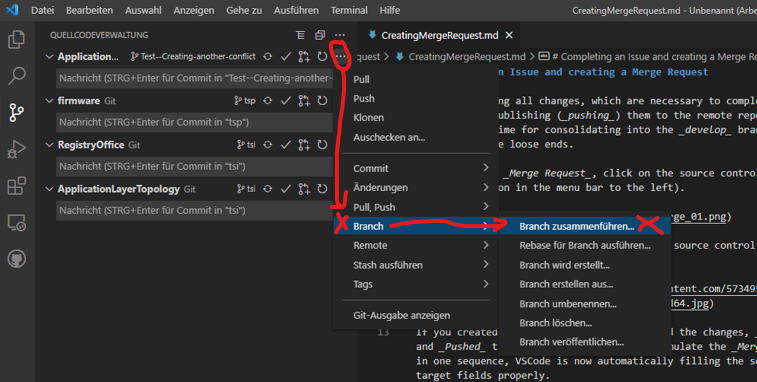

* ... and chose the _origin/develop branch_ from the list.  
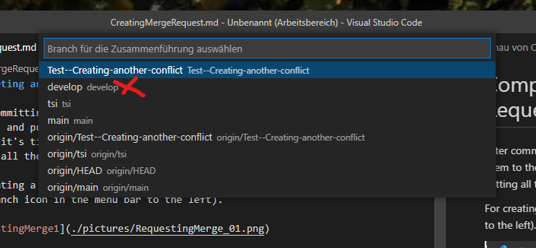

* If there would be any _conflicts_, they would show up now.
* After analyzing two conflicting versions of the code, you could decide for the versions (current, incoming or both) to become part of your local _feature branch_.  
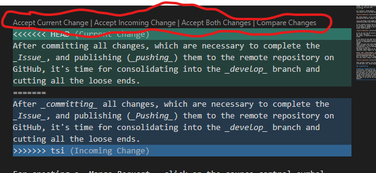

* Save the files, which got changed during resolving all _conflicts_ by Ctrl+s and _stage_ them for being _committed_ during the _merge_ of the _origin/develop branch_ into your local _feature branch_.  
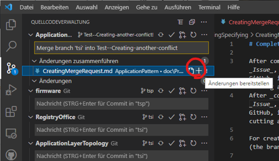

* Confirm the _merge_ of the _origin/develop branch_ into your local _feature branch_ ...  
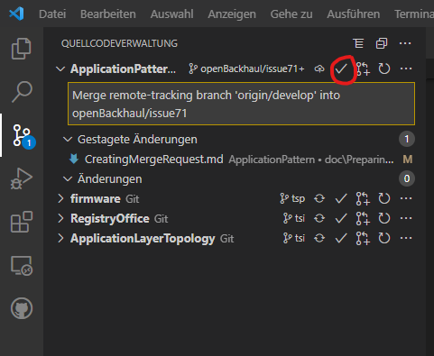

* ... and _push_ your local _feature branch_ with the resolved _conflicts_ to the remote repository (creates or updates remote _feature branch_).  
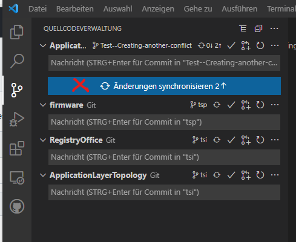

In the second phase of the process, you have to create the _Pull-Request_ for consolidating the remote copy of your _feature branch_ into the _origin/develop branch_.  

* Click on the _Pull-Request_ icon at the repository you would like to change.  
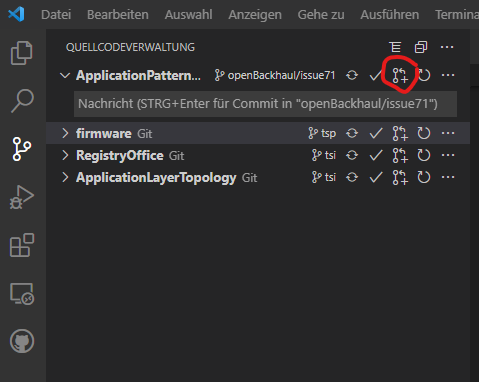

* VSCode is now automatically filling the source and target branch names into a form and you just have to double check.  
Please, add a _Pull-Request_ message, which is complying the chapter about [Formulating _Pull-Request_ Messages](../FormulatingCommitMessages/FormulatingCommitMessages.md) and click Create.  
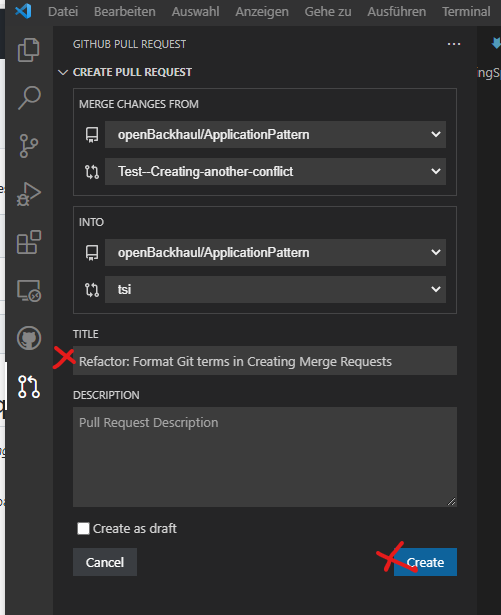

* Alike in the following picture, the _Pull-Request_ does not create any conflicts and can directly be _merged_ after reviewing the changes. As you can see, the _Pull-Request_ is not involving your local repository. The _Merge_ is happening exclusively in the remote repository on GitHub.  
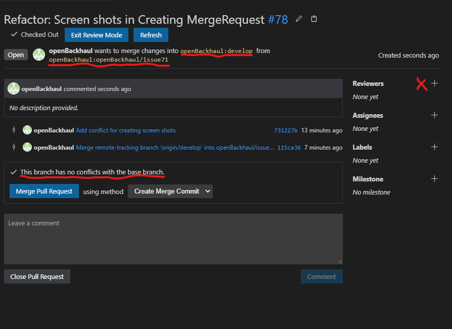

* At least the originator of the _Issue_, which is underlying the branch that is now requested to be merged, should be marked as a _Reviewer_.  
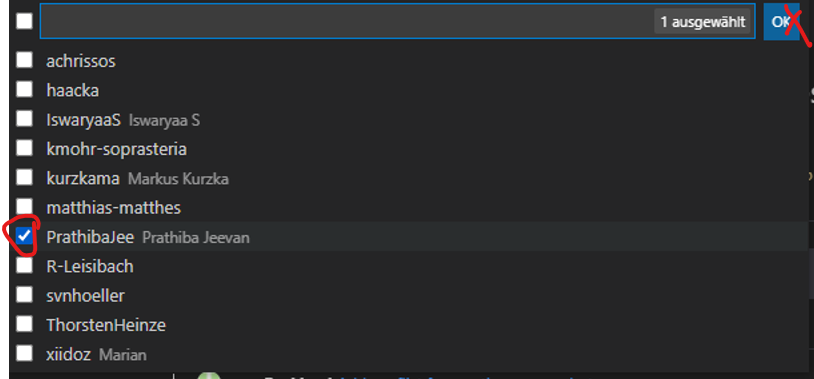

* The _Pull-Request_ shall be assigned to the person, who is consolidating potential feedback, merging the _Pull-Request_ into the _origin/develop branch_ and deleting the _feature branch_.  

In the third phase of the process, it is recommended to immediately clean up your local repository.  
After successfully _merging_ into the _origin/develop branch_, the remote _feature branch_ should have been deleted, but the local copy is still existing.  
For avoiding accumulation of useless branches in your local repository, it is recommended to delete the local _feature branch_ right after successfully _merging_ into the _origin/develop branch_.  

* For deleting the obsolete _feature branch_, you have to leave it first.  
So open the list of branches ...  
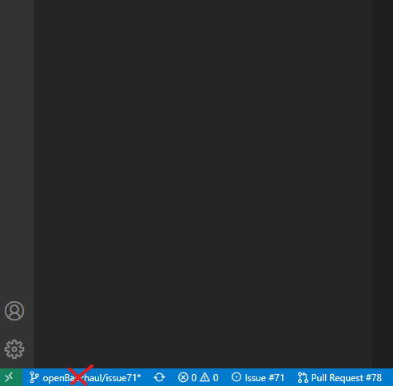

* ... and chose the _develop branch_ from the list.  
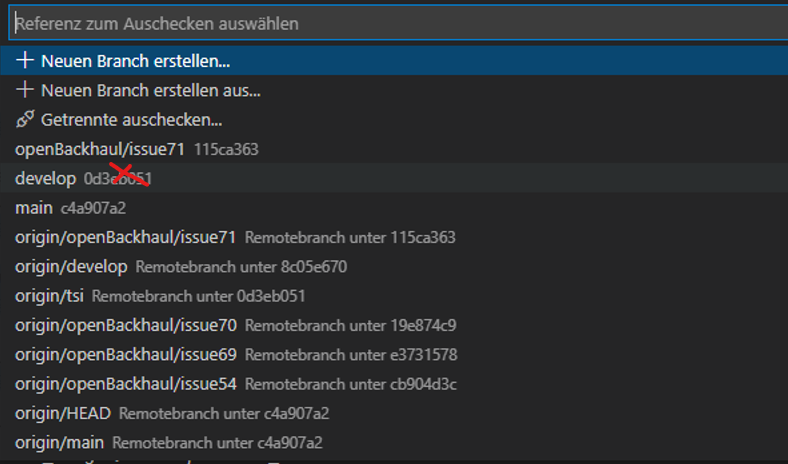

* Open the menu at the repository, which you would like to clean up, click on "Branch löschen"...  
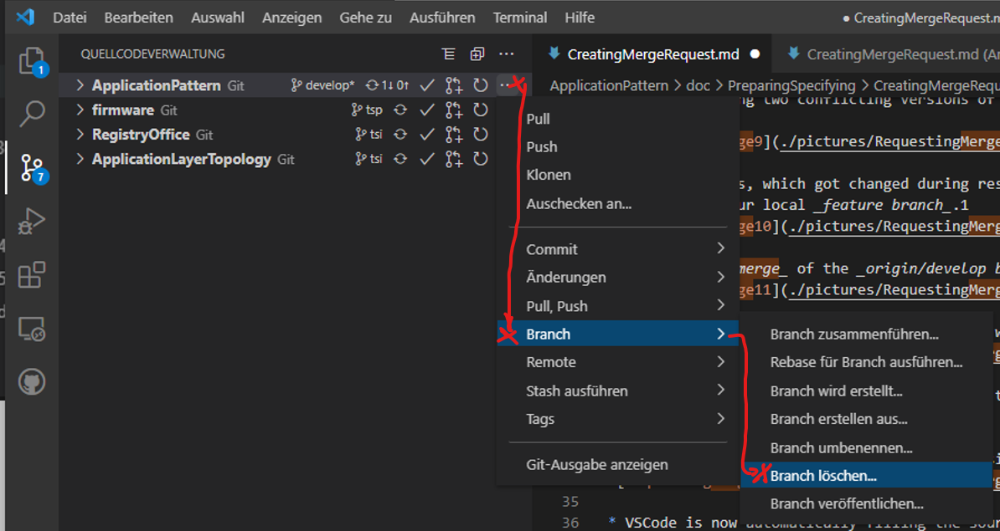

* ... and chose the obsolete _feature branch_ from the list.  
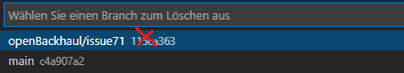

[<- Back to Creating a Commit](../CreatingCommit/CreatingCommit.md) - - - [Up to Preparing for Specifying Applications](../PreparingSpecifying.md)
