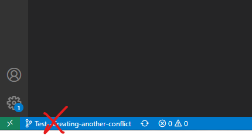
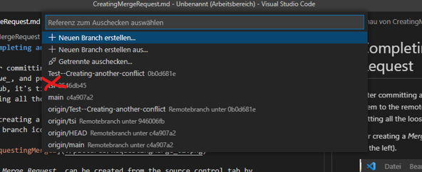
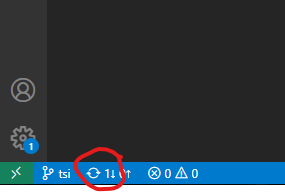

# Completing an Issue and creating a Merge Request

After _committing_ all changes, which are necessary to complete the _Issue_, it's time for consolidating your contribution into the common _develop_ branch.

For contributing your work, click on the source control symbol (the branch icon in the menu bar to the left).  

In a first phase of the process, you have to asure that your contribution is not creating any conflicts while _merging_ into the common _develop branch_.
For this purpose, you have to _merge_ an up-to-date copy of the _develop branch_ into your local _feature branch_.

* Click on the current branch name in the lower left corner of the VSCode window ...  

* ... and choose the _develop branch_ from the list.  

* Click on the round arrow for updating the local copy of the _develop branch_.  

* Click again von the current branch name in the lower left corner of the VSCode window ...  

* ... and change back into the _feature branch_ you would like to finish.  

* Now, open the menu at the repository, which you would like to contribute to, click on "Branch zusammenführen"...  

* ... and chose the _develop branch_ from the list.  

* If there would be any _merge conflicts_, they would show up now.
* After analyzing two conflicting versions of the code, you could decide for the versions (current, incoming or both) to become part of your local branch.  

* Save the files, which got changed during resolving all conflicts by Ctrl+s and _stage_ them for being _committed_ during the _merge_ of the up-to-date copy of the _develop branch_ into your _feature branch_.  

* Confirm the _merge_ of the up-to-date copy of the _develop branch_ into your _feature branch_ ...  

* ... and _push_ your local _feature branch_ with the resolved conflicts to the remote repository.  

In the second phase of the process, you have to create the _Merge Request_ for consolidating the remote copy of your _feature branch_, which is now cleared from conflicts, into the common _develop branch_.  

* Click on the pull request icon at the repository you would like to change.  

* VSCode is now automatically filling the source and target branch into a form and you just have to double check. Please, add a _Merge Request_ message, which is complying the chapter about [Formulating Merge Request Messages](../FormulatingCommitMessages/FormulatingCommitMessages.md) and click Create.  

* Alike in the following picture, the _Merge Request_ does not create any conflicts and can directly been _merged_ after reviewing the changes.  

As you can see from the pictures, the _Merge Request_ is not involving your local repository.  
The _Merge_ is happening exclusively in the remote repository on GitHub.  

After conducting the _merge_  
* the _Issue_, which initiated creation of the _feature branch_, will be closed
* and the remote copy of the _feature branch_ will be deleted.

Please, take care that you are also removing your local _feature branch_ after you got informed about the successfull _merging_. Otherwise your local repository will turn into a dump and you will get confused by mixing _branches_ of similar sounding names.

[Up to Preparing](../PreparingSpecifying.md)