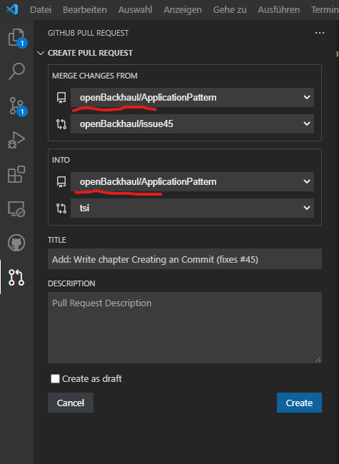
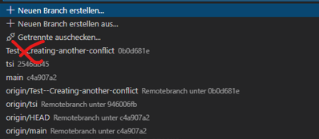

# Completing an Issue and creating a Merge Request

After _committing_ all changes, which are necessary to complete the _Issue_, and publishing (_Pushing_) them to the remote repository on GitHub, it's time for consolidating into the _develop_ branch and cutting all the loose ends.

For creating a _Merge Request_, click on the source control symbol (the branch icon in the menu bar to the left).  

  

New _Merge Request_ can be created from the source control tab by pressing the new pull request icon:  

If you created a branch from an _Issue_, did the changes, _Committed_ and _Pushed_ the changes and started to formulate the _Merge Request_ in one sequence, VSCode is now automatically filling the source and target fields properly.  

  

As you can see from the picture, the _Merge Request_ is not involving your local repository.  
The _Merge_ is happening exclusively in the remote repository on GitHub.  

If you would not have kept the process described above, you would now have to extremly carefully configure source and target branches.  
You have to undoubtedly identify the remote branch holding your changes.  
Please, be aware that there might be many branches with very similar names available at the remote repository depending on the number of _Collaborators_, who are working in parallel with you, and their disciplin to clean up.  
The target should always be the _develop_ branch on the remote repository (never request for _Merging_ into _main_).

Please, add a _Merge Request_ message, which is complying to chapter [Formulating Merge Request Messages](../FormulatingCommitMessages/FormulatingCommitMessages.md).  
Don't be concerned, if the _Merge Request_ message would be identical with your latest _Commit_ message.

  

After pushing "Create", the PlatformOwner of the repository will be informed about your _Merge Request_ and will soon review and _Merge_.

### Troubleshooting

**Conflicts in Merge Requests**  
In principle, altering the same source by several persons has the intrinsic risk of creating conflicts. If the described process has been followed, such conflicts should be rare.  
If there would be such conflicts between the branches, they would emerge during creating the "Merge Request". Before the changes can be _Merged_ into the target branch, these conflicts need to be resolved. This needs to be done by the user, who is addressing the "Merge Request".
