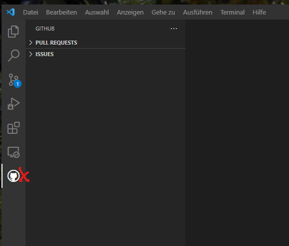
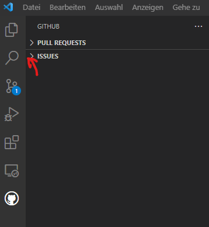
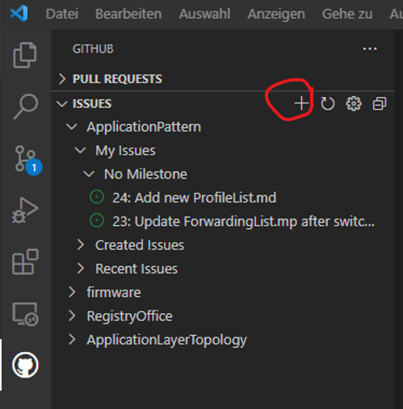
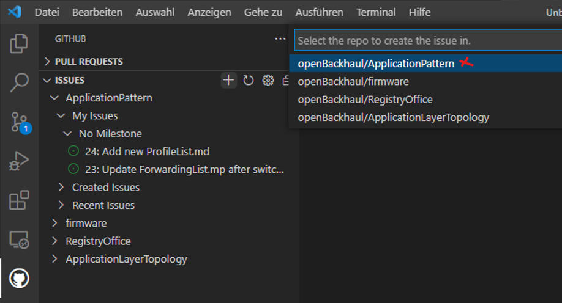
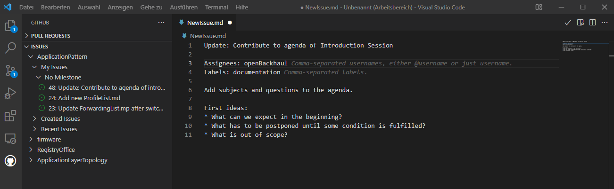
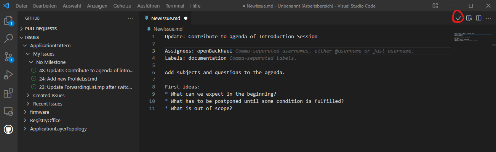

# Documenting an Issue

Click on the GitHub symbol to the left of the VSCode window.  

  

Expand the list of _Issues_ by clicking the arrow besides "ISSUES".  

  

Click on the "+" symbol besides "ISSUES" for creating a new _Issue_.  

  

Choose the repository, which shall be addressed by the new _Issue_, from the pull-down-menu.  

  

Formulate title and body according to the guidelines for [Formulating Issues](../FormulatingIssues/FormulatingIssues.md).  
Put an assignee and a label.  

  

Complete creating the _Issue_ by clicking the tick in the upper right corner and check for the confirmation at the lower right corner.  

  

If the creation of the _Issue_ has been confirmed, it has also been automatically published on the original repository on GitHub.

[<- Back to Connecting VSCode with GitHub ->](../VSCode2GitHub/VSCode2GitHub.md) - - - [Up to Preparing for Specifying Applications](../PreparingSpecifying.md) - - - [Ahead to Processing an Issue ->](../ProcessingAnIssue/ProcessingAnIssue.md)