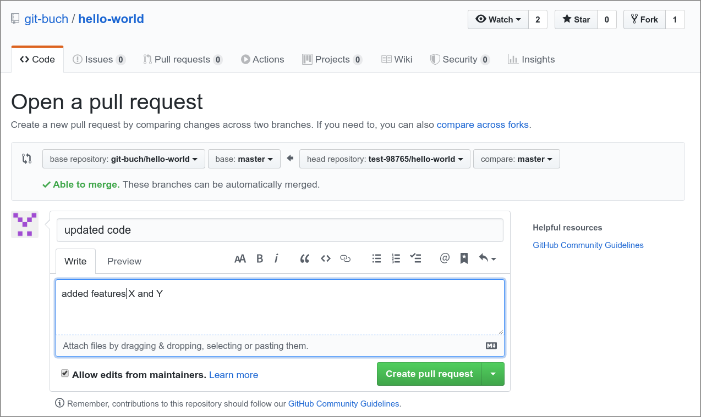

# Formulating Pull Requests

For contributing to a specification, please apply the following workflow.

**First Fork, ...**

* To contribute to a specification, navigate to its GitHub webpage and there press the *Fork* button
* By forking you will create a copy of the application's repository inside your own GitHub account
* Next you can create a local repository on your laptop from the copy via git clone
* There you can apply the desired changes and commit them
* If your changes are completed, they can be sychronised to your own GitHub fork (i.e. your copy of the original repository) by using git push

**... then Pull Request**

* Inside your own fork on the GitHub web gui there is a tab called "Pull requests"; it contains the button *New pull request*; pushing it will redirect you to the page of the original project  
    

* The GitHub gui first shows a summary of the applied changes
* In the next step you will send a message to the ApplicationOwner of the original repository; please apply the [rules for commit messages](../FormulatingCommitMessages/FormulatingCommitMessages.md)
* By pressing *Create pull request* the operation is finished.  
    

* The ApplicationOwner is now in charge of accepting your contribution (*Merge pull request*), declining it or suggesting improvals and asking you for further information or changes (*Comment*)

Pull requests are the only way to participate in GitHub projects even without being a member of the actual development team. We are using them to prevent uncoordinated changes to the repository.

Note that forks and pull requests are not Git techniques. Therefore, no git sub-commands exist. You rather have to conduct these operations inside the web gui of your Git plattform (or if Visual Studio Code is used, a special plugin can be used for operations - see [here](../VSCode2GitHub/VSCode2GitHub.md) for instructions). The nomenclature can be different across various plattforms. E.g. with GitLab they are called "Merge requests".  

Source: 
_Git - Projektverwaltung für Entwickler und DevOps-Teams_  
Bernd Öggl und Michael Kofler  
Rheinwerk Verlag

[Up to Preparing](../PreparingSpecifying.md)
