# Processing an Issue

In preparation for processing an _Issue_, you have to assure that you are working based on the correct and up-to-date _develop branch_.  

* For changing into the local _develop branch_, you have to open the list of branches ...  
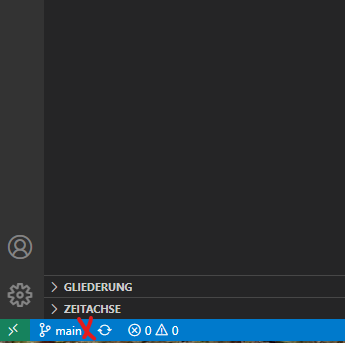

* ... and chose the _develop branch_ from the list.  
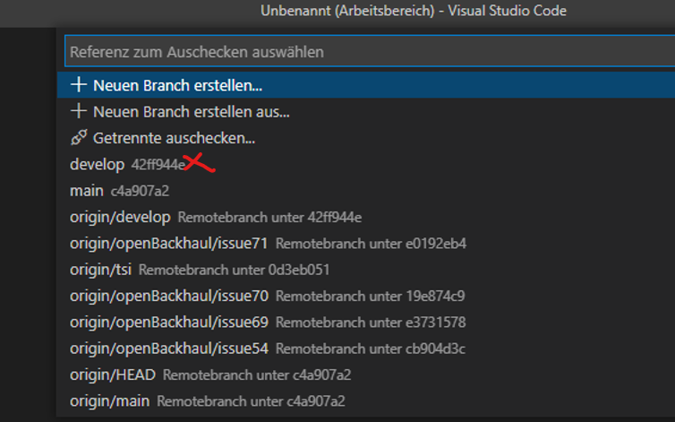

* Now, as the _develop branch_ is indicated in the lower left corner...  
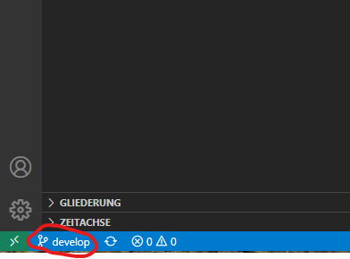

* ... you can assure your local data being in synch with the remote repository by clicking on the round arrow.  
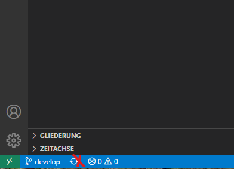

Starting to actually work on the _Issue_.  

* You have to click on the GitHub symbol to the left of the VSCode window.  
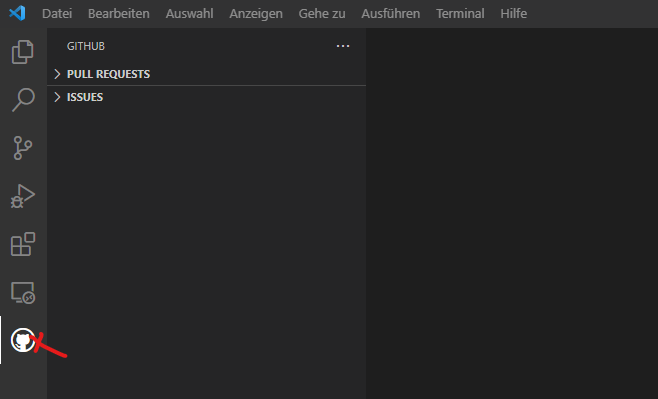

* Expand the list of _Issues_ by clicking the arrow besides "ISSUES".  
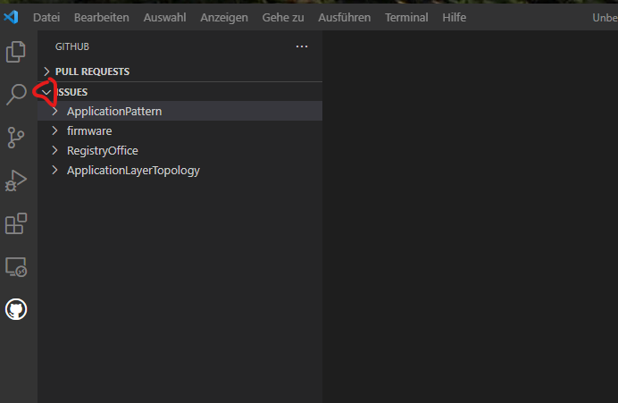

* Update the list of _Issues_ by clicking the circle arrow.  
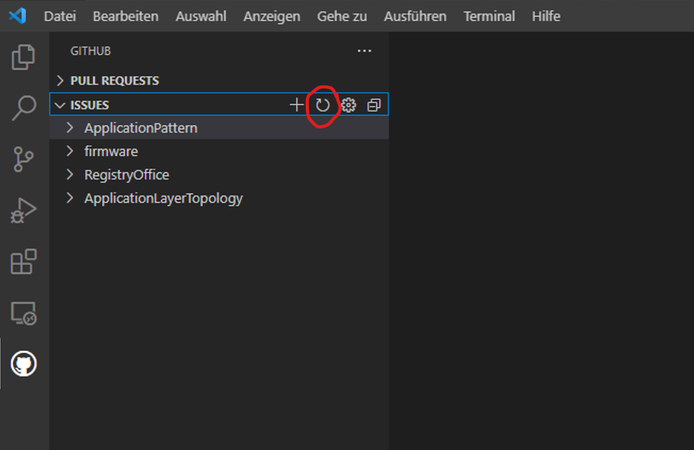

* Expand the repository, which shall be processed.  
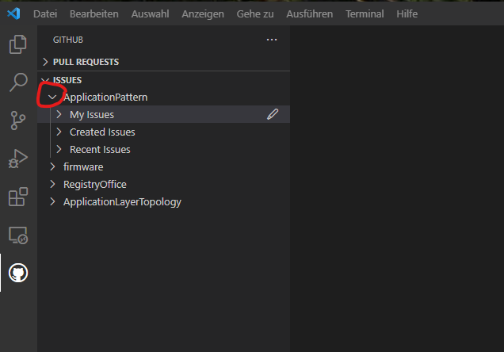

* If the _Issue_ has been assigned to you, you will find it in "My Issues".  
Otherwise, check "Created Issues", if you created the _Issue_ by yourself, but forgot to assign it to yourself.  
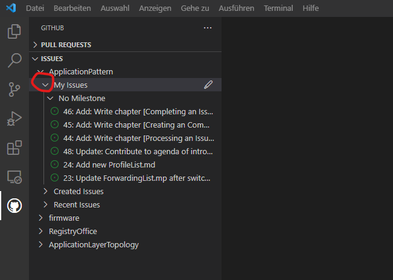

* Find the _Issue_, which you would like to process, and click the arrow to the right for starting to work on the _Issue_.  
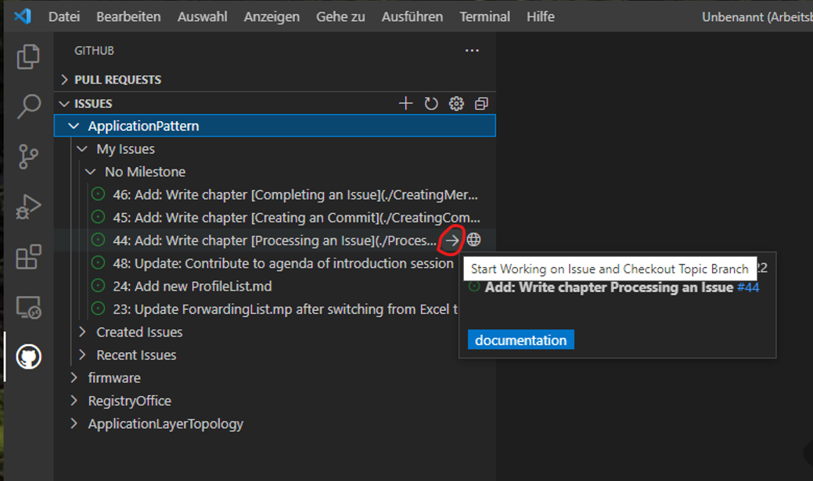

* Now, the _Issue_ is marked to be in grogress.  
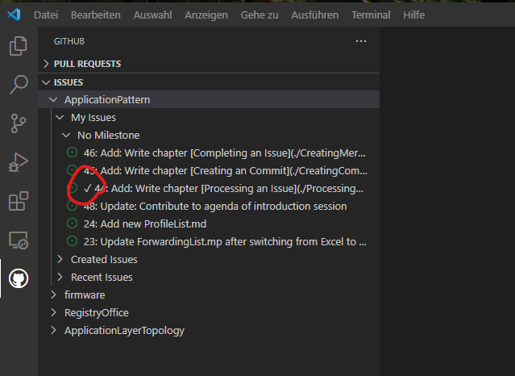  

Attention! During the latest step, a new branch has been created locally and VSCode automatically switched its view into this branch.  

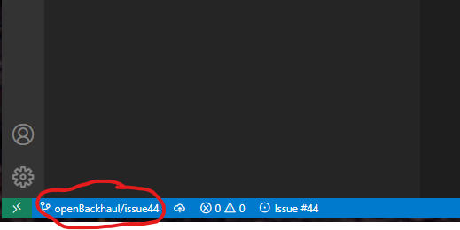

This step would not succeed, if you would neither be owner nor _Contributor_ to the addressed repository.  
In such case you would be informed about not having permission for _pushing_ into the addressed repository and you would be asked, whether you would like to _fork_ (copy) the addressed repository into your own GitHub account.  
If you would confirm _forking_, you would proceed according to the [Forking Workflow](../ForkingWorkflow/ForkingWorkflow.md), which is absolutely fine, too.  

* It is recommended to click the cloud symbol for publishing the new branch on the remote GitHub for indicating that work on this _Issue_ is on-going.  
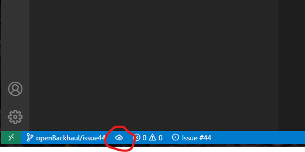

* Click on the Explorer symbol for starting to be productive in the new branch.  
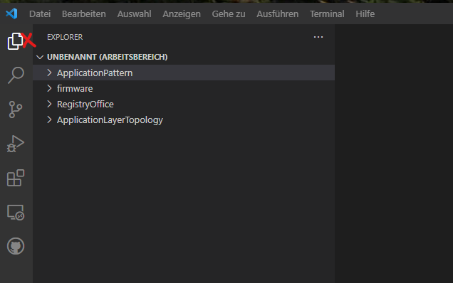

Of course, your actual doing should now exclusively relate to the chosen _Issue_ until you committed into the branch, which has been created for that purpose.  

See [Creating a Commit](../CreatingCommit/CreatingCommit.md) and [Creating a Merge Request](../CreatingMergeRequest/CreatingMergeRequest.md) for consequent steps.
