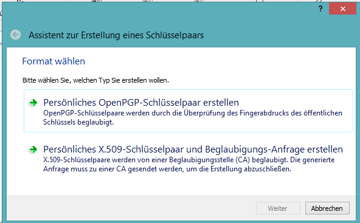
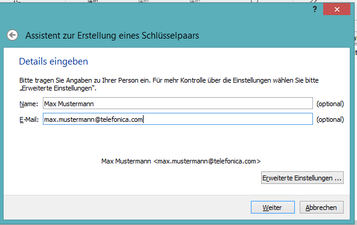
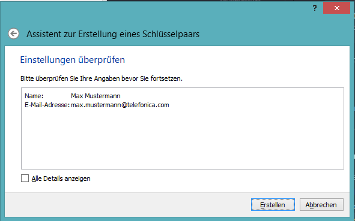
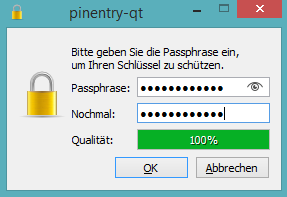
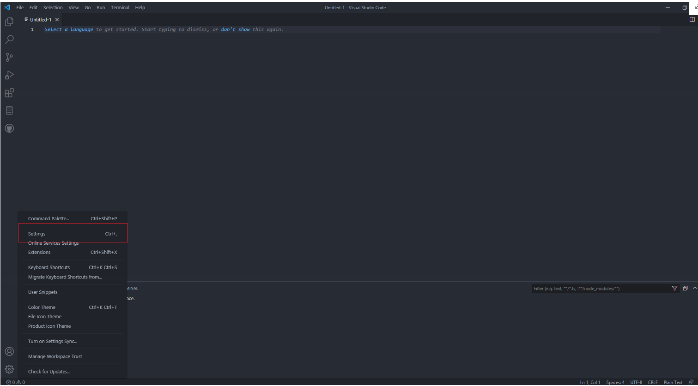
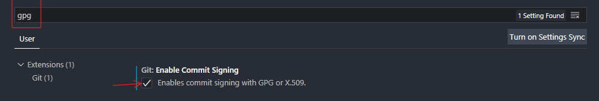

# Signing Git Commits in VS Code

When working on your computer locally, Git allows you to set the identity of the comitter and author of yor changes without further authentication (so potentially anyone could impersonate someone else). As a result, it can be tough for others to determine that commits and tags you create are actually yours. To overcome this problem you can sign your commits and tags.

A signed commit can be recognized by the green `Verified` bagde behind a commit:


This ensures the integrity of the commit, that means:

1. The author is really the person whose name is on the commit
2. The code change you see is really what the author wrote (i.e. it’s not been tampered with)

The following steps show how to set up verified commits for VS Code on Windows:

## Set up GPG

GPG is a system for en- and decryption but also for signing and verifying messages.

### Install GPG

First you have to install GPG (can be found in the Corporate Appstore -> `GPG4Win`).

You can check if it is installed correctly by opening PowerShell or cmd and enter

```console
gpg --version
```

If the output is something like

```console
gpg (GnuPG) <version>
libgcrypt <version>
```

you successfully installed GPG!

### Create key pair

If you already created a key pair in the past, you can skip this part.

There are two ways of creating a key pair: Kleoptra and CLI (only recommended for advanced users).

#### Kleopatra

1. Open Kleopatra (has been installed together with GPG4Win)

2. Press `Ctrl` + `N` to create a new key pair

3. Choose `Generate OpenGPG key pair` (`Persönliches OpenGPG-Schlüsselpaar erstellen`)
   
   

4. Enter your name and email.
   _Note that your email also has to be added and verified to your GitHub account, for more information click [here](https://docs.github.com/en/account-and-profile/setting-up-and-managing-your-github-user-account/managing-email-preferences/adding-an-email-address-to-your-github-account)._ Press `Continue`.

   

5. Check one more time if you input the right information and press `Create`.

    _This now may take a while._

6. Enter a passphrase in the popup (**DONT FORGET THIS PASSPHRASE!**).

   

7. After a while there should pop up an confirmation message. Press `Confirm`.

Congratulations, you just created your first key pair!

#### CLI

Open cmd/PowerShell and execute

```console
gpg --full-generate-key
```

Now there are a few configuration steps which have to be completed:

1. At the prompt, specify the kind of key you want, or press Enter to accept the default.
2. At the prompt, specify the key size you want, or press Enter to accept the default. Your key must be at least 4096 bits.
3. Enter the length of time the key should be valid. Press Enter to specify the default selection, indicating that the key doesn't expire.
4. Verify that your selections are correct and confirm your choices with _F_.
5. Enter your user ID information.\
   _Note that your email also has to be added and verified to your GitHub account, for more information click [here](https://docs.github.com/en/account-and-profile/setting-up-and-managing-your-github-user-account/managing-email-preferences/adding-an-email-address-to-your-github-account)._
6. Enter a secure passphrase (**DONT FORGET THIS PASSPHRASE!**).

## Set up Git

1. Run

    ```console
    gpg --list-secret-keys --keyid-format=long
    ```

    in a powershell/cmd prompt to get a list of your secret keys.

    This should now look similiar to this:

    

2. Run the command below, but replace  \<your signing key> with your actual key (the string marked in the picture above).

    ```console
    git config --global user.signingkey <your signing key>
    ```

3. Tell Git to always sign commits:

    ```console
    git config --global commit.gpgsign true
    ```

4. Tell Git the path to your gpg.exe:

    The executable path can be found by running

    ```console
    where gpg.exe
    ```

    in your cmd/Powershell prompt.\
    Copy the output and run the command below, but replace `GPG.EXE PATH` with your actual path.

    ```console
    git config --global gpg.program "GPG.EXE PATH"
    ```

## Set up GitHub

Now you have to add your public key to GitHub.

1. To receive your public key, run

    ```console
    gpg --armor --export
    ```

2. Copy the public key (including `-----BEGIN PGP PUBLIC KEY BLOCK-----` and `-----END PGP PUBLIC KEY BLOCK-----`).
3. Log into your GitHub account, then go to `Settings`>`SSH and GPG keys` and click `New GPG key`.
4. Paste the key you copied before and click `Add GPG key`.

### Set up VS Code

Last you have to set up VS Code for signing commits

1. Open VS Code
2. Open Settings

   

3. Search for `gpg`
4. Check the box named `Enables commit signing with GPG`

   

## Sources

[dev.to: Signed git commits](https://dev.to/devmount/signed-git-commits-in-vs-code-36do)\
[GitHub: Generating a new GPG key](https://docs.github.com/en/authentication/managing-commit-signature-verification/generating-a-new-gpg-key)

## Navigation

[<- Back to VSCode2GitHub](../VSCode2GitHub/VSCode2GitHub.md) - - - [Up to Main](../Main.md) - - - [Ahead to Specifying ->](../SpecifyingApplications/SpecifyingApplications.md)
