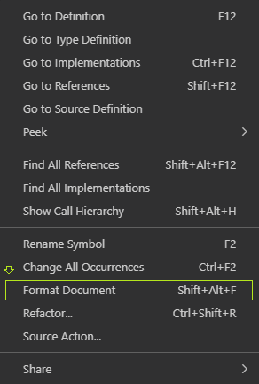

# Code Style and Formatting

Formatting JavaScript code can be automated in VisualStudioCode

### Step-by-Step Guidelines

* Click on the source code editor in VisualStudioCode
* Right click and select Format Documentation option
  
  
* Alternatively , the following shortcuts can also be used , 
  * On Windows `Shift + Alt + F`
  * On macOS `Shift + Option + F`
  * On Linux `Ctrl + Shift + I`  

