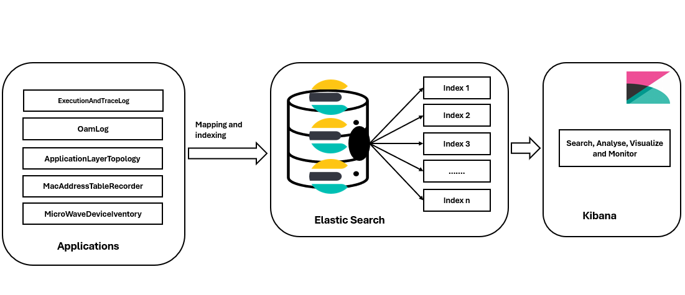
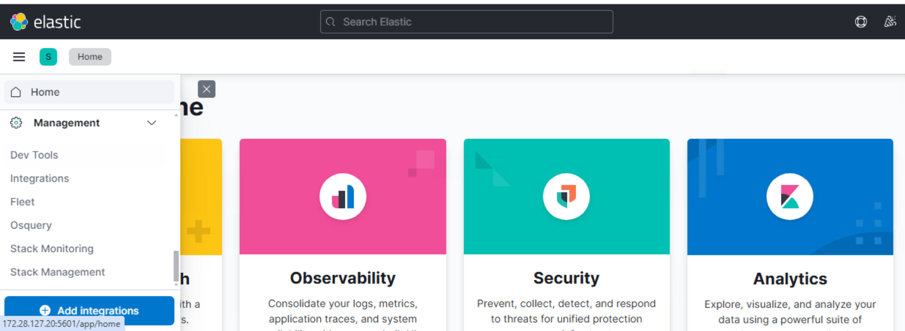
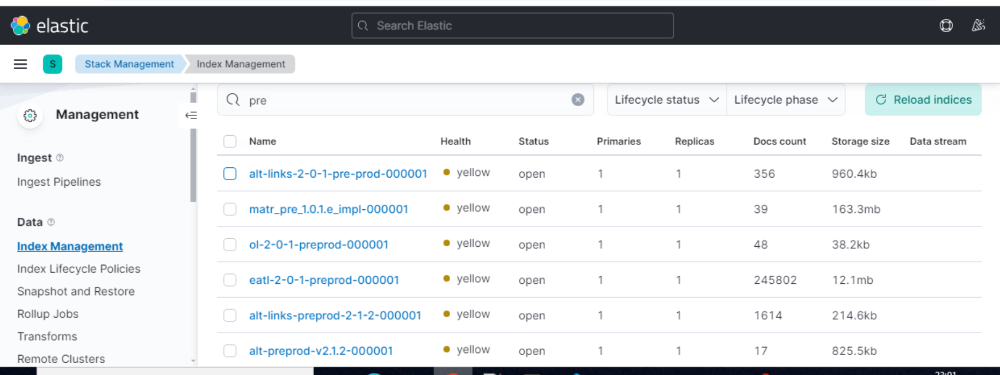
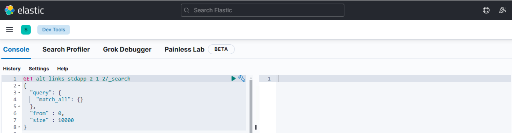

### Purpose
Elasticsearch in SDN enables to use at Application Layer for real-time data indexing, searching, and analysis. It Paired with Kibana, it gives SDN operators insightful dashboards for network observability, troubleshooting and automation. Each application data point is indexed as a JSON document and can be searched or aggregated in real time.

Integrating Elastic Stack and SDN applications offers a best solution for managing and accessing large amounts of data in an efficient, scalable way. It will give powerful search capabilities where can create a system which is fast, reliable, and capable of handling complex queries with ease and cached.

### Key Points:
#### Setting up Elasticsearch and Applications:  
This setup easily get started by installing Elasticsearch and setting up our sdn applications servers.
#### Indexing:
Elasticsearch allows to index, search, and update content efficiently.
#### Advanced Search Features: 
With features like fuzzy search, filtering, full-text search, and pagination, users can find information quickly and accurately.
#### Scaling and Monitoring: 
As data grows, Elasticsearch scales which can monitor cluster health, handle large volumes of data with bulk indexing.
#### Caching and Error Handling: 
Implementing caching with Redis and ensuring graceful error handling ensures your knowledge base runs smoothly under heavy load.

#### Brief introduction to ElasticSearch and components [Please refer here](https://github.com/openBackhaul/ApplicationPattern/blob/62d6386ed348ab028477155b81473f9604680f71/doc/ImplementingApplications/ConceptOfElasticsearch/ConceptOfElasticsearch.md#brief-introduction-to-es-buzzwords) 



### Configuration of Elastic search in Applications 
Each application configuration should contain at least three LTPs(ES client, HTTP client, TCP client) which are configured through applications with ES connection details(address, port, release-number etc.). Once applications deployed and tried to reach Elasticsearch.An index and its mapping should be created and defined in elasticsearch respectively to save data that is send being through applications. After index is created in elasticsearch, the same index can used to stash the data, visualize the through kibana.

#### Configuration 
To configure the applications, please refer documentation of [Applications configuration](https://github.com/openBackhaul/ApplicationPattern/blob/62d6386ed348ab028477155b81473f9604680f71/doc/ImplementingApplications/ConceptOfElasticsearch/ConceptOfElasticsearch.md#configuration) here.

### Visualize in kibana
To View Index Metadata in kibana (Index Management)
Use this for managing settings, mappings, etc. Below are steps to be followed. 

#### Steps to view data through index:

Go to Kibana -> Stack Management -> Index Management.

Here all the list of indices shown and click on the index name to view its details (mappings, settings, docs count, etc.). 

#### Steps to execute query in kibana console

To Query/execute API requests in Kibana Dev Tools, Console is a built-in tool for sending REST API requests directly to Elasticsearch and retrives & view data based on query.



Open Kibana -> Go to "Dev Tools" (found in the left-hand menu) -> console (In the Console, type api request GET, PUT, etc.) -> Press Ctrl + Enter (or click the Play ▶ button) to execute.

##### GET Request Example

Get all documents from an index:
```
GET my-index/_search
 {
     "query": {
    "match_all": {}
  }
} 
 
GET alt-stdapp-v2.1.2/_search
{
  "query": {
    "match_all": {}
  },
  "from" : 0,
  "size" : 10000
}
```

Here is standard documentation to find all GET, PUT, and other API documentation here: [Main REST API Reference](
https://www.elastic.co/guide/en/elasticsearch/reference/current/rest-apis.html) 

For more information about
Elasticsearch, go to [official documentation](https://www.elastic.co/guide/en/elasticsearch/reference/7.17/index.html) here.