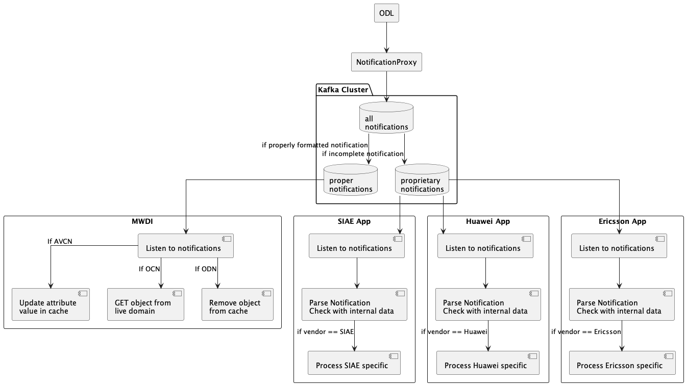

# Kafka Integration for MWDI and NotificationProxy

## Purpose

The goal of integrating Kafka into the system is to decouple the flow of notifications between components and enable a scalable and robust message processing pipeline. Kafka acts as a central broker that receives all incoming notifications and distributes them to appropriate consumers.

Instead of sending notifications directly to MWDI, all notifications are first sent to Kafka. This approach allows asynchronous processing, failure isolation, and better maintainability. MWDI is only responsible for consuming filtered, relevant notifications.

## Design

Kafka serves as the central notification hub. All incoming notifications, regardless of type, are first published to a single input topic (e.g., `all_notifications`). A Kafka Streams application is then responsible for filtering and routing these notifications to the appropriate output topics:

* `proper_notifications`: Contains well-formed, standards-compliant notifications (e.g., AVCN, OCN, ODN).
* `proprietary_notifications`: Contains incomplete, vendor-specific, or non-standard notifications.

MWDI is configured to only consume from `proper_notifications`, ensuring that it processes only the notifications that conform to expected formats and types.

### Flow

1. **NotificationProxy** sends all notifications to the Kafka topic `all_notifications`.
2. **Kafka Streams filtering application**:

   * Parses each message.
   * Applies logic to determine if the notification is proper or proprietary.
   * Routes the message to either:

     * `proper_notifications`, or
     * `proprietary_notifications`.
3. **MWDI** subscribes only to `proper_notifications` and executes update logic based on the notification type.



## Kafka Configuration – Project-Specific Parameters

| Parameter              | Example Value              | Why it matters                                                       |
| ---------------------- | -------------------------- | -------------------------------------------------------------------- |
| `advertised.listeners` | PLAINTEXT://localhost:9092 | Must match the hostname/IP MWDI and NP will use to connect to Kafka  |
| `log.dir`              | /var/lib/kafka-logs        | Must point to a writable, persistent directory on your VM            |
| `num.partitions`       | 3                          | Set >1 if you want parallel consumption (e.g., vendor-based scaling) |

## Kafka Configuration – General Parameters

| Parameter              | Example Value              | Comment                                                              |
| ---------------------- | -------------------------- | -------------------------------------------------------------------- |
| `broker.id`            | 0                          | Set to `0` for single broker                                         |
| `listeners`            | PLAINTEXT://0.0.0.0:9092   | Kafka listens on this address/port for incoming connections          |
| `advertised.listeners` | PLAINTEXT://localhost:9092 | Kafka tells clients (like MWDI and NP) to connect using this address |

---

## NotificationProxy – Kafka Producer Configuration

The NotificationProxy acts as a Kafka **producer**, sending all received notifications to the `all_notifications` topic.

### Operational Parameters

| Parameter    | Description                                                                             |
| ------------ | --------------------------------------------------------------------------------------- |
| `topic-name` | Name of the Kafka topic to which notifications are published (e.g.,`all_notifications`) |

### Configuration Parameters

| Parameter   | Description                                                            |
| ----------- | ---------------------------------------------------------------------- |
| `username`  | Kafka authentication username — must be passed via config (SASL/SCRAM) |
| `password`  | Kafka authentication password — must be passed via config (SASL/SCRAM) |
| `broker`    | Kafka bootstrap server (e.g., `localhost:9023`)                        |
| `oauth-key` | OAuth token used for authenticating with Kafka (if applicable)         |

**Security Note:**
Kafka authentication can use **SASL/SCRAM** for secure credential-based access.
In this case, additional parameters must be included:

```yaml
security_protocol: SASL_PLAINTEXT
sasl_mechanism: SCRAM-SHA-256
sasl_username: 
sasl_password: 
```

### Capability Parameters

| Parameter   | Description                                                                                                 |
| ----------- | ----------------------------------------------------------------------------------------------------------- |
| `client-id` | Unique identifier for the producer application (e.g., `notification-proxy-producer`) — must be configurable |

### TCP Client Parameters

| Parameter    | Description                                        |
| ------------ | -------------------------------------------------- |
| `ip-address` | IP address of the Kafka broker (e.g., `localhost`) |
| `port`       | Kafka port (e.g., `9092`)                          |

---

## MWDI – Kafka Consumer Configuration

The MWDI application acts as a Kafka **consumer**, subscribing to the `proper_notifications` topic.

### Operational Parameters

| Parameter    | Description                                                                               |
| ------------ | ----------------------------------------------------------------------------------------- |
| `topic-name` | Name of the Kafka topic from which to consume notifications (e.g.,`proper_notifications`) |

### Configuration Parameters

| Parameter   | Description                                                                  |
| ----------- | ---------------------------------------------------------------------------- |
| `username`  | Kafka authentication username — must be passed via config (SASL/SCRAM)       |
| `password`  | Kafka authentication password — must be passed via config (SASL/SCRAM)       |
| `group-id`  | Kafka consumer group ID (e.g., `mwdi-consumer-group`) — must be configurable |
| `broker_id` | Kafka bootstrap server (e.g., `localhost:9023`)                              |
| `oauth-key` | OAuth token used for authenticating with Kafka (if applicable)               |

**Security Note:**
Kafka authentication can use **SASL/SCRAM** for secure credential-based access.
In this case, additional parameters must be included:

```yaml
security_protocol: SASL_PLAINTEXT
sasl_mechanism: SCRAM-SHA-256
sasl_username: 
sasl_password: 
```

### Capability Parameters

| Parameter   | Description                                                                                   |
| ----------- | --------------------------------------------------------------------------------------------- |
| `client-id` | Unique identifier for the consumer application (e.g., `mwdi-consumer`) — must be configurable |

### TCP Client Parameters

| Parameter    | Description                                        |
| ------------ | -------------------------------------------------- |
| `ip-address` | IP address of the Kafka broker (e.g., `localhost`) |
| `port`       | Kafka port (e.g., `9092`)                          |
