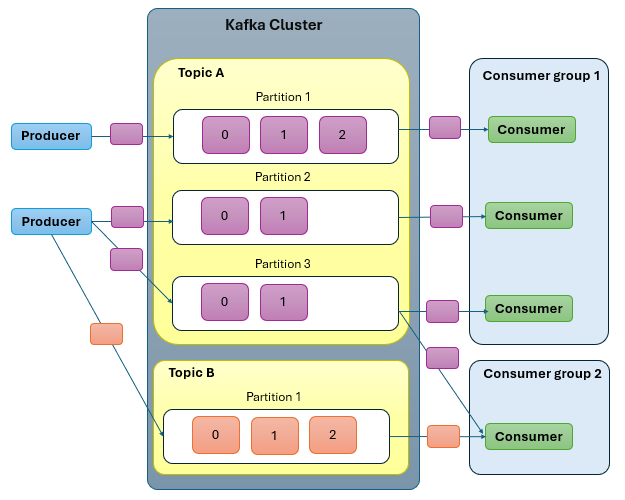
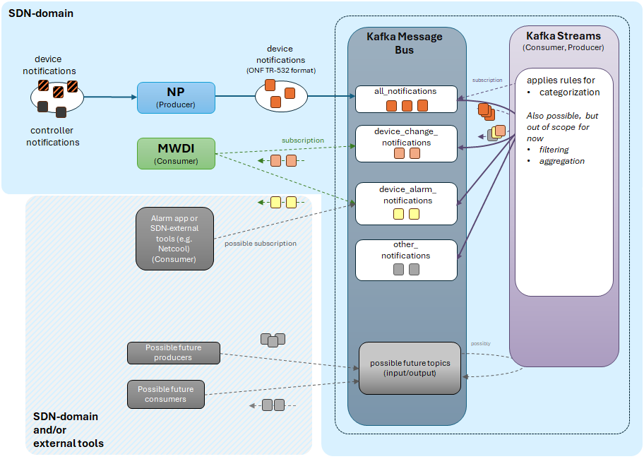

# Kafka

## Overview

Apache Kafka is a distributed event‑streaming data store designed to reliably transfer data between systems. Within our environment, Kafka functions as a message broker that decouples communication between components, enabling a scalable and resilient message‑processing pipeline. Its use supports asynchronous workflows, isolates failures, ensures data persistence, and improves overall maintainability.

If required, the Kafka deployment can be expanded into a multi‑node cluster or extended with additional topics to support future use cases. Messages can be produced and consumed not only by internal SDN applications but also by external systems. A practical example is the distribution of microwave (MW) interface performance data to external consumers via Kafka.

### Messaging Model: Combining Queueing and Publish–Subscribe

Kafka blends the benefits of both queueing and publish–subscribe models. It provides queue‑like scalability by allowing multiple consumer instances within a consumer group, while ensuring that each message is processed only once per group. At the same time, Kafka supports publish–subscribe behavior by allowing multiple consumer groups to independently read the same data stream.

In a single‑partition setup, only one consumer per group is active, preserving strict ordering. However, multiple groups can subscribe to the same topic, enabling parallel but independent processing paths. This allows internal SDN components and external systems to consume the same messages without interfering with each other.

The model supports decoupling, flexibility, and easy integration of new consumers. It also enables asynchronous workflows and failure isolation. Overall, Kafka’s hybrid messaging approach fits well with our need to distribute data to both SDN and non‑SDN applications.

### Core concepts and terminologies

**Topic**: A topic is a category or feed name to which records are stored and published. It’s the fundamental unit for organizing data in Kafka. Topics group messages that belong to the same business domain or purpose. Producers write to topics, and consumers read from them.

**Partition**: Each topic is split into partitions, which allow Kafka to scale horizontally and process data in parallel. Partitions also preserve the order of messages within each partition.

**Offset**: Each message in a partition has a unique offset. This identifies the position of a message in the log which is used by consumers to track progress.

**Broker**: A broker is a Kafka server that stores data and serves client requests. A Kafka cluster consists of multiple brokers working together.

**Producer**: Application that publishes messages to Kafka topics.

**Consumer**: Application that reads messages from Kafka topics. Multiple consumers can subscribe to the same topic, but they typically work together as part of a **consumer group**.
 A consumer group is a coordinated set of consumers that share the work of reading data from a topic. Kafka guarantees that each message is processed by only one consumer within the group, ensuring no duplication of work.
To achieve this:

- Each partition of a topic is assigned to exactly one consumer in the group.
- When consumers join or leave the group, Kafka automatically rebalances the partition assignments.
- This design allows the system to scale horizontally, because adding more consumers increases the group’s ability to process data in parallel.

**Zookeeper (Legacy) / Kafka Raft (KRaft)**: Historically, Kafka used Zookeeper for cluster coordination. Modern Kafka versions use KRaft, Kafka’s built‑in consensus mechanism.

**Log**: Kafka stores messages in an append-only log on disk. This design enables high throughput and durability.

**Retention**: Kafka retains data for a configurable period (time-based or size-based), regardless of whether it has been consumed.

**Stream processing**: Kafka supports real‑time stream processing through the Kafka Streams API and ksqlDB, enabling transformations, aggregations, and joins on streaming data.
Our system specifically uses Kafka Streams for processing, which is a lightweight client‑side library for building real‑time event‑driven applications on top of Kafka

In short, Kafka is essentially a distributed, durable, scalable commit log where:

- Producers write events,
- Consumers read them,
- Topics organize them,
- Partitions scale them,
- Brokers store them,
- Replication protects them.

### Characteristics of Kafka

**Loose Coupling:** Producers and consumers are decoupled, allowing independent development, deployment, and scaling of services.

**Horizontal Scalability:** Partitioning and consumer groups enable linear scaling of both ingestion and processing workloads.

**High Availability:** Replication ensures resilience against broker failures, while Kafka Streams provides fault‑tolerant state management.

**Durability:** Kafka persists all messages to disk and retains them based on configurable retention policies, enabling replay and backfill scenarios.

**Real‑Time Processing:** Kafka Streams enables low‑latency, event‑driven computation without requiring a separate processing cluster.

### System Architecture

Kafka is deployed on a virtual machine, either by downloading and extracting a Kafka executable or pulling a Docker image by following the steps provided in <https://kafka.apache.org/quickstart>.



### kafka Configuration

Configuration shall be made in config/server.properties file.

**Project-specific parameters:**  

| Parameter              | Example Value              | Why it matters                                                       |
| ---------------------- | -------------------------- | -------------------------------------------------------------------- |
| `advertised.listeners` | PLAINTEXT://localhost:9092 | Must match the hostname/IP MWDI and NP will use to connect to Kafka  |
| `log.dir`              | /var/lib/kafka-logs        | Must point to a writable, persistent directory on your VM            |
| `num.partitions`       | 3                          | The default number of partitions for new topics. The number defaults to 1. |
| `log.retention.hours (or minutes/ms)`       | 24                          | How long messages are retained before deletion. |
| `auto.create.topics.enable`       | false                        | Defaults to false. Set to true if the producer is allowed to create new topics. However, it is set to false to prevent Kafka from automatically creating topics, allowing for better control over topic creation and configuration. |

**General parameters:**  

| Parameter              | Example Value              | Comment                                                              |
| ---------------------- | -------------------------- | -------------------------------------------------------------------- |
| `broker.id`            | 0                          | Set to `0` for single broker                                         |
| `listeners`            | PLAINTEXT://0.0.0.0:9092   | Kafka listens on this address/port for incoming connections          |
| `advertised.listeners` | PLAINTEXT://localhost:9092 | Kafka tells clients (like MWDI and NP) to connect using this address |

Note: Most Kafka broker configuration changes require a full broker restart to take effect.

#### Security Configuration

Apache Kafka provides comprehensive security features designed to safeguard data and control access across the platform. These include support for multiple authentication mechanisms such as SASL (PLAIN, SCRAM, OAUTH) and SSL certificate–based authentication, SSL/TLS encryption to protect data in transit, and fine-grained authorization through Access Control Lists (ACLs).

At present, authentication and authorization controls are not enabled in the current deployment. While this configuration facilitates ease of connectivity and reduces initial setup complexity, it does not enforce identity verification or access restrictions. As a result, the environment remains open to any clients with network access.

#### Kafka producer configuration

To ensure reliable and secure message publishing, the following producer parameters must be considered and they are provided through a configuration file

| Parameter    | Description                                                                             |
| ------------ | --------------------------------------------------------------------------------------- |
| `topic-name` | Name of the Kafka topic to which notifications are published. |
| `username`  | Kafka authentication username — must be passed via config (SASL/SCRAM) (if security enabled in kafka broker) |
| `password`  | Kafka authentication password — must be passed via config (SASL/SCRAM) (if security enabled in kafka broker) |
| `oauth-key` | OAuth token used for authenticating with Kafka (if applicable)         |
| `client-id` | Unique identifier for the producer application. Unique client ID per producer instance aids easier monitoring and troubleshooting |
| `ip-address` | IP address of the Kafka broker |
| `port`       | Kafka port (e.g., `9092`). ip.address, and port must align with the Kafka broker listener configuration                         |

#### Kafka consumer configuration

To support consistent and secure message consumption, the following consumer parameters must be taken into account

| Parameter    | Description                                                                               |
| ------------ | ----------------------------------------------------------------------------------------- |
| `topic-name` | Name of the Kafka topic from which to consume notifications |
| `username`  | Kafka authentication username — must be passed via config (SASL/SCRAM) (if security enabled in kafka broker)     |
| `password`  | Kafka authentication password — must be passed via config (SASL/SCRAM) (if security enabled in kafka broker)      |
| `group-id`  | Kafka consumer group ID |
| `oauth-key` | OAuth token used for authenticating with Kafka (if applicable)               |
| `client-id` | Unique identifier for the consumer application |
| `ip-address` | IP address of the Kafka broker (e.g., `localhost`) |
| `port`       | Kafka port (e.g., `9092`) ip.address, and port must align with the Kafka broker listener configuration   |

### Kafka Health and logging

Kafka generates logs at multiple levels, including broker logs — such as startup events, partition leadership changes, replication issues, and network errors — as well as producer and consumer logs. By default, these logs are stored in:

```
/var/log/kafka/server.log
/var/log/kafka/controller.log
```

The log directory can be customized using the *log.dir* parameter in the *config/server.properties* file.

In addition to log management, it’s important to continuously monitor the Kafka server’s CPU, memory, disk usage, and consumer lag to ensure healthy performance. Tools like Kafka UI can help visualize and track consumer lags, and maintain topics and partitions effectively.

### Other potential enhancements

#### Monitoring and Alerting
Kafka can be integrated with monitoring and alerting platforms such as Prometheus and Grafana to continuously observe cluster health and performance. These tools collect and visualize key metrics including throughput, latency, consumer lag, broker resource usage, and replication status. With dashboards and alerting rules in place, teams can proactively detect issues and maintain cluster stability.

#### High Availability Through Clustering and Replication
Kafka is typically be deployed as a cluster of multiple brokers, allowing data to be distributed and replicated across nodes. Using in‑sync replication (ISR), Kafka ensures that messages are copied to multiple brokers, reducing the risk of data loss in the event of a single broker or disk failure. This replication model provides strong resilience and enables the cluster to continue operating even when individual nodes become unavailable.

### Kafka Streams processing application

[Apache Kafka Streams](https://kafka.apache.org/documentation/streams/) is a client‑side, Java‑based library that integrates directly with Kafka topics to enable real‑time data processing. It is designed to handle operations such as filtering, categorization, aggregation, and stream transformations without requiring a separate processing cluster.

In our environment, Kafka Streams is provisioned inside a Java Spring Boot application. This application exposes REST APIs to start, stop, and retrieve the status of the running Kafka Streams instance, providing operational control and flexibility.

**Current Customization**: The Kafka Streams implementation is customized to filter and segregate incoming messages dynamically. Conditions for filtering are provided in the request body of the */start* API, allowing runtime configuration without redeployment. Based on these conditions, messages are routed to the appropriate output topics.
**Future Enhancements**: Multi‑tasking capabilities to support multiple processing pipelines within the same instance. Also, multi‑threading support to improve throughput and parallelism for high‑volume workloads.

**A usecase of Kafka streams in SDN architecture:**



#### Documentations

- [Producer Implementation](https://github.com/openBackhaul/ApplicationPattern/blob/develop/server/applicationPattern/applicationPattern/services/KafkaProducerService.js)
- [Consumer Implementation](https://github.com/openBackhaul/ApplicationPattern/blob/develop/server/applicationPattern/applicationPattern/services/KafkaConsumerService.js)
- [Kafka Streams Architecture for Confluent Platform](https://docs.confluent.io/platform/current/streams/architecture.html)
- [Apache Kafka](https://www.tutorialspoint.com/apache_kafka/apache_kafka_introduction.htm)
- [Kafka deployment](https://kafka.apache.org/quickstart)
