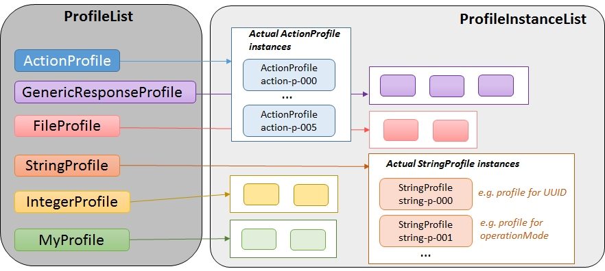

# Concepts of ProfileList and ProfileInstanceList 

### Concept of ProfileList

The _ProfileList_ is a compact notation for designing the _Profiles_ as classes.  
It provides full focus on composing the set of necessary attributes and their datatypes.  
In case of String datatype, it also allows defining generic expression about the allowed values of the String.  
This must be applied on the UUIDs and can be applied on any other String attribute.  
The _ProfileList_ distinguishes invariant and configurable attributes.  
The _ProfileList_ is preparing for defining the individual section of the OaM part of the OpenApiSpecification.  

Definition of the _Profiles_ gives much more freedom to the _ApplicationOwner_ than defining the interfaces.  
The template of the _ProfileList_ contains a set of definitions of already existing _Profiles_.  
Unused definitions need to be deleted from the application specific copy of the template.  
Additional _Profile_ definitions can be added, if needed.  

### Concept of ProfileInstanceList

The _ProfileInstanceList_ is a compact notation of the instances of _Profiles_ that are required for documenting the configuration of the application.  
It provides full focus on the values that shall be used right after instantiation.  
The _ProfileInstanceList_ is preparing for writing the profile section of the _CONFIGfile_ of the applications.  

The template of the _ProfileInstanceList_ contains the instances of _ActionProfile_ and _GenericResponseProfile_, which are necessary for the basic functions in _GenericRepresentation_.  
Further on, it contains forms for creating additional instances of _ActionProfile_, _FileProfile_, _GenericResponseProfile_, _IntegerProfile_ and _StringProfile_.
These forms shall provide guidance while filling in concrete values.
Unused forms need to be deleted from the application specific copy of the template.  

Additional instances can be described for additional definitions of _Profiles_, if needed.

### Commenting

The template of the _ProfileList_ and the _ProfileInstanceList_ is prepared in such a way that comments (## TODO:) have to be replaced by changes that are individual to the application under specification.  
If this initial concept would be followed, the _ProfileList_ and the _ProfileInstanceList_ would be finalized as soon as all "## TODO:" would either be replaced or deleted.  
If someone would find it helpful to add his thoughts into the _ProfileList_ or the ProfileInstanceList, he would be free to add own comments, but these comments should not start with "TODO:" after finalizing the respective list.  
If someone would decide to add comments into the _ProfileList_ or the _ProfileInstanceList_, it would be strongly recommended to properly indent the additional lines.

### Profiles and ProfileInstances

  

**Be aware that the template must not be altered outside the zones indicated by comments starting with '##'.**   
