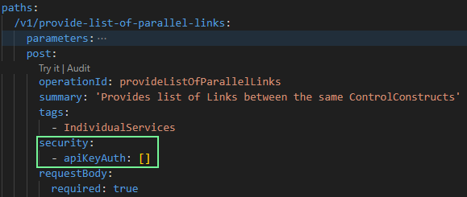
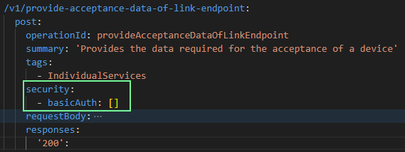
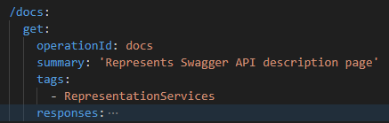
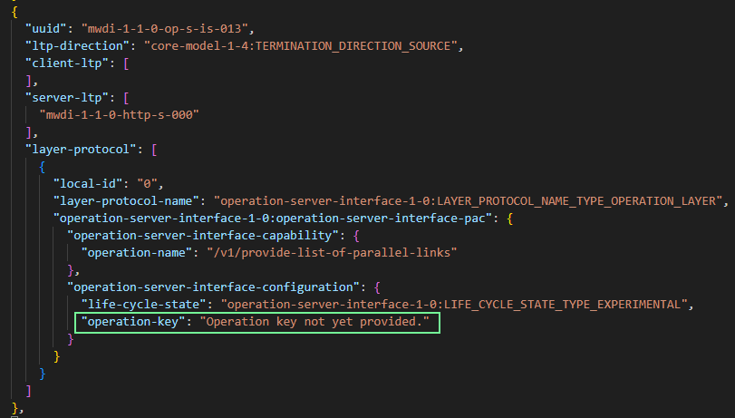
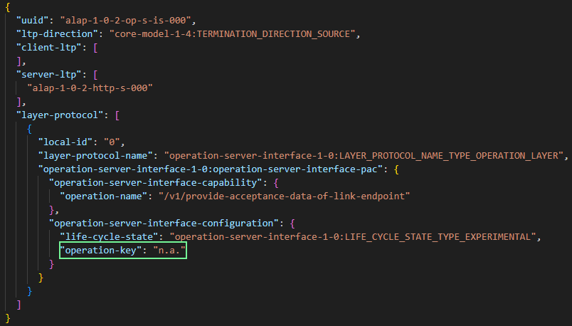
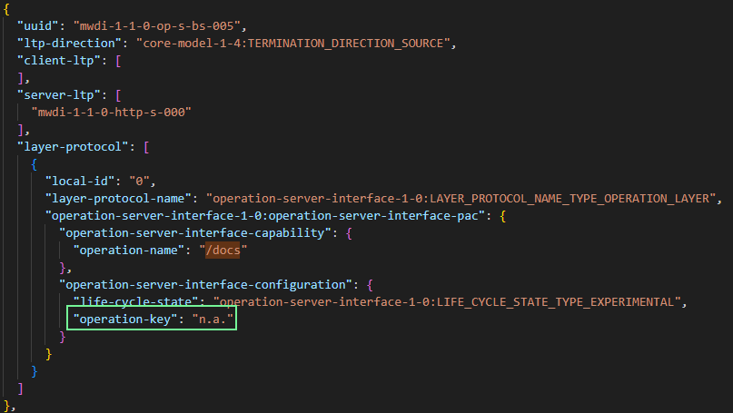

# Setting the correct operationKeys in the CONFIGfile

This document describes how to assign the correct operationKeys to OperationClients and OperationServers in the configFile.

### Concept

- For some operations an operationKey needs to be provided, whereas other operations do not require an operationKey to be provided.
- Whether providing an operationKey is required is defined in the `security` section of a given operations specification.
- Currently the following three options are available:
  1. `apiAuthKey`: an operationKey needs to be provided
     - operationKey = default operationKey = "Operation key not yet provided."
  2. `basicAuth`: instead of an operationKey an authorization code needs to be provided upon request execution
     - operationKey = "n.a."
  3. no security tag at all: no authentication is required.
     - operationKey = "n.a."

#### Examples
The following code snippets show OAS examples for all three options:

| OAS Example                                          | Info                                                                     |
|------------------------------------------------------|--------------------------------------------------------------------------|
|  | operationKey required,   operationKey = default operationKey          |
|    | requires authorizationCode instead of operationKey,    operationKey = n.a. |
|      | operationKey = n.a.                                                      |

Examples from ConfigFile:  
| ConfigFile Example       | ConfigFile                                                      |
|---------------|-----------------------------------------------------------------|
| 1. apiKeyAuth |  |
| 2. basicAuth  |    |
| 3. noAuth     |          |