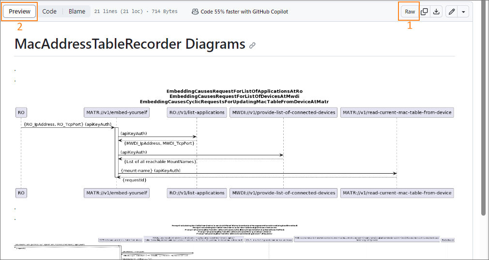

# Creating a Sequence Diagrams

This is a step by step cookbook for creating the _Sequence Diagrams_.  

**Please, read the background information about the [Concept of _Sequence Diagrams_](../ConceptOfSequenceDiagrams/ConceptOfSequenceDiagrams.md) before creating the the _Sequence Diagrams_.**   


### File Handling  

In your repository navibate to the _spec_ folder and if not yet available, create a new subfolder called _diagrams_.
There are no template files for the diagrams to be placed there.  
All diagrams are to be placed here, together with a readme file, which contains all the images created from the PlantUML files.


### Preparation  

* If not yet existing, create an _Issue_ for creating the _Sequence Diagrams_.  
* Open a local feature branch for creating the _Sequence Diagrams_.  


### General  

* Check out the diagrams at other application repositories, like [AutomatedLinkAcceptanceProxy](https://github.com/openBackhaul/AutomatedLinkAcceptanceProxy/tree/develop/spec/diagrams) or [NotificationProxy](https://github.com/openBackhaul/NotificationProxy/tree/develop/spec/diagrams) for examples
* Diagrams are typically only generated for individual parts, with one diagram per forwarding in most cases

### Identify which diagrams to specify  

* Typically, each individual operation server, i.e. those services listed under *operation-servers/own-pam/basic/individual* and *operation-servers/basic/individual* from your ServiceList is a starting point for a diagram
* An operation server can also be starting point for more than just one diagram
* There might be own diagrams for embed-yourself and bequeath-your-data-and-die sequences

### Specifying a Sequence Diagram

#### Assigning a proper name
* Create a new file under the diagrams folder, and name it according to one of the following schemas:
  * `<number>_<short-content-description>.plantuml`: e.g. *100_ReadingLtpStructure.plantuml*
  * `<is|im><number>_<short-content-description>.plantuml`: if there are own diagrams for *im* and *is* operation servers (individual managment and individual service), e.g. *im000_ListenToControllers.plantuml* or *is020_NotifiyingOfDeviceAlarms.plantuml*
* The name of the diagram should sufficiently indicate what the purpose of the diagram is
* The starting number refers the the sequence number of the uuid of the operation server the diagram is created for
  * sometimes a diagram may combine multiple forwardings with the same process flow, but for different operation servers; in those cases a *x* may be used to wildcard the related part of the sequence number, e.g. in MWDI there is diagram *00x_CyclicOperationBasedDeviceListSync.plantuml*, which maps four separate forwardings

#### Sequence Diagram Content


#### Export PlantUML Diagrams to Pictures in VSC 

After all the *.plantuml* files have been created, a *.png* file needs to be created for each diagram.  
For that purpose right-click on the related PlantUML files in VisualStudioCode and select Export Workspace Diagrams:  
  

If the *.plantuml* file was created according to above instructions, it will create a new *.png* with the same name as the *.plantuml* file.  
Ensure that the *.png* files are located in the same folder as the *.plantuml* files. If they are created to another folder, move them to the diagrams folder manually.

Notes:
1. It is sufficient to create the *.png* files after *.plantuml* files are finalized, as they will not get updated automatically, when the *.plantuml* files change. A preview of the diagrams can e.g. be opened by pressing `ALT+D`.  
2. If VSC does not automatically generate *.png* files when exporting the diagrams, the PlantUML plugin configuration needs to be modified accordingly (see option *Export format*). The configuration also has a option to set the export output directory (*Export Out Dir*).

#### Create the Readme

Once all the diagrams have been exported to *.png*, create the *README.md* file in the *diagram* folder.  
All of the pictures should be added there, the ordering of the pictures is according to the ordering of diagram names (i.e. sequence number).

The following snippet shows how the file should look like in the editor (for an application with two diagrams):
```
# <APPLICATION-NAME> Diagrams
.
.

.
.

.
.
```

The pictures show an example for the MacAddressTableRecorder. 
First, the *raw* view is shown; the 2nd picture shows a snippet from the preview in the browser.    




