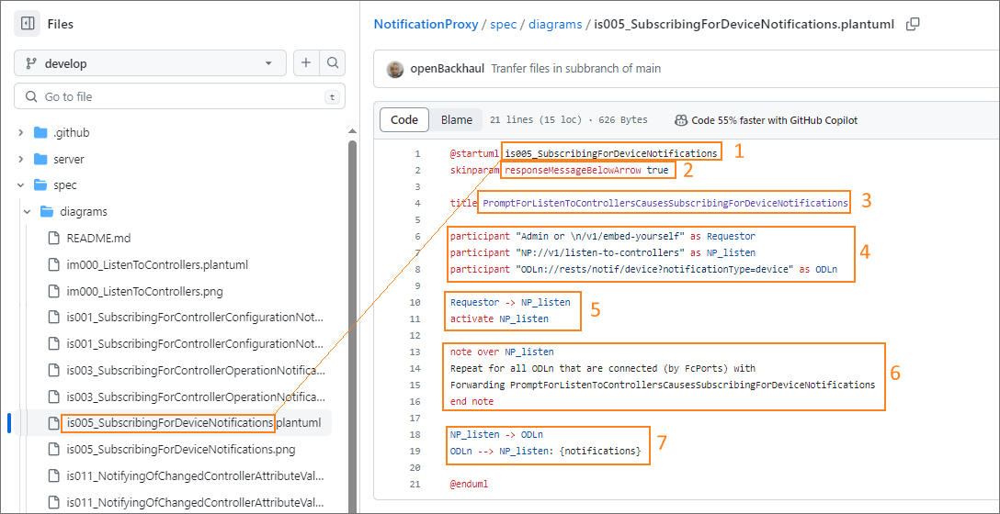
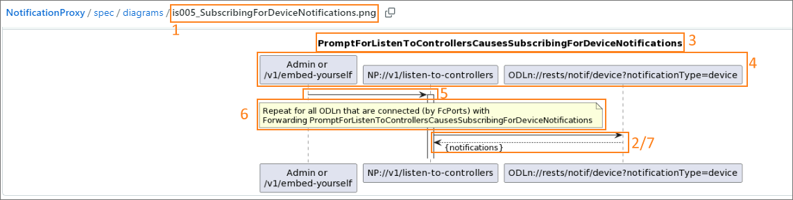
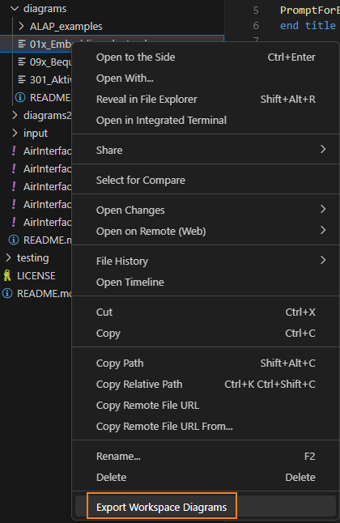
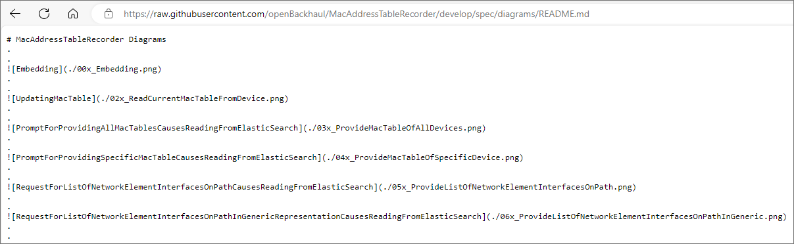

# Creating a Sequence Diagrams

This is a step by step cookbook for creating the _Sequence Diagrams_.  

**Please, read the background information about the [Concept of _Sequence Diagrams_](../ConceptOfSequenceDiagrams/ConceptOfSequenceDiagrams.md) before creating the the _Sequence Diagrams_.**   


### File Handling  

In your repository navibate to the _spec_ folder and if not yet available, create a new subfolder called _diagrams_.
There are no template files for the diagrams to be placed there.  
All diagrams are to be placed here, together with a readme file, which contains all the images created from the PlantUML files.


### Preparation  

* If not yet existing, create an _Issue_ for creating the _Sequence Diagrams_.  
* Open a local feature branch for creating the _Sequence Diagrams_.  


### General  

* Check out the diagrams at other application repositories, like [AutomatedLinkAcceptanceProxy](https://github.com/openBackhaul/AutomatedLinkAcceptanceProxy/tree/develop/spec/diagrams) or [NotificationProxy](https://github.com/openBackhaul/NotificationProxy/tree/develop/spec/diagrams) for examples
* Diagrams are typically only generated for individual parts, with one diagram per forwarding in most cases

### Identify which diagrams to specify  

* Typically, each individual operation server, i.e. those services listed under *operation-servers/own-pam/basic/individual* and *operation-servers/basic/individual* from your ServiceList is a starting point for a diagram
* An operation server can also be starting point for more than just one diagram
* There might be own diagrams for embed-yourself and bequeath-your-data-and-die sequences

### Specifying a Sequence Diagram

#### Assigning a proper name
* Create a new file under the diagrams folder, and name it according to one of the following schemas:
  * `<number>_<short-content-description>.plantuml`: e.g. *100_ReadingLtpStructure.plantuml*
  * `<is|im><number>_<short-content-description>.plantuml`: if there are own diagrams for *im* and *is* operation servers (individual managment and individual service), e.g. *im000_ListenToControllers.plantuml* or *is020_NotifiyingOfDeviceAlarms.plantuml*
* The name of the diagram should sufficiently indicate what the purpose of the diagram is
* The starting number refers the the sequence number of the uuid of the operation server the diagram is created for
  * sometimes a diagram may combine multiple forwardings with the same process flow, but for different operation servers; in those cases a *x* may be used to wildcard the related part of the sequence number, e.g. in MWDI there is diagram *00x_CyclicOperationBasedDeviceListSync.plantuml*, which maps four separate forwardings

#### Sequence Diagram Content

Check how the already existing diagrams of other applications look like to get an idea for how your application's diagrams need to be created!

The sequence diagram consists of several building blocks.   
The picture shows an example from the NotificationProxy.  
 

**1: Diagram name = *.pgn* file name**  
* right after the opening `@startuml` the diagram name has to be provided
* this is the same string as in the filename without the *.plantuml* file ending
* when the diagram is exported to *.png*, the created picture file will be named with the string provided here

**2: Diagram Title = ForwardingName**
* the title is what will be shown as title in the rendered diagram
* here, the name of the forwarding has to be provided
* to come up with a proper name, it is advised to read [Structure of Internal _ForwardingNames_](../../ElementsApplicationPattern/Names/StructureOfInternalForwardingNames/StructureOfInternalForwardingNames.md)

**3. Participants = diagram nodes**
* the participant block is used for easier editing of the diagram
* for each node in the diagram create a participant
  * format: `participant "<text to be displayed in the diagram>" as <alias>`
  * the `"<text>"` part contains what is shown in the diagram, the `<alias>` is the reference to the node in the *.plantuml*
* the ordering of the participants determines the order in which the nodes are displayed in the diagram
* typically, the first participant is the iniator of the request
  * some examples for the `"<text>"` are "Admin", "/v1/embed-yourself", "external", "cyclic", a specific other applications (abbreviated) name or a combination of those
  * chose the alias according to the node type, this can e.g. be a requestor or subscriber
* if a node refers to a certain service it should be provided in the following format: `<AppAbbreviation>://<operation-name>`, e.g. *"NP://v1/listen-to-controller"* or *"MWDI://provide-list-of-connected-devices"*
  * including the AppAbbreviation allows to directly see to which service the operation server or operation client belongs to
  * the service from the ServiceList for which the diagram was created, typically is the operation server, whereas other operation-names included in the diagram called due to that operation server, are the operation clients (either from the same App or a 3rd App)

**4. Activation of the Forwarding**
* add a connection between the operation server and it's preceding participant
* then activate the operation server to indicate over which process steps the forwarding is active
* once the forwarding is finished, deactivate the operation server participant
* in the rendered diagram the activation is shown as a white vertical rectangle 

**5. Notes Boxes**
* sometimes additional information needs to be provided, e.g. if there are if-then-else conditions, which cannot be properly modelled in PlantUML
* encapsulate those notes in `note over <participant>` and `end note` statements
* the notes are shown as yellow boxes

**6. Connections between Participants**
* the connections between the participants show how the communication between the participants look like
* a sent request is modelled as `<caller participant> -> <called participant>: {input parameters}`
  * it's shown as a solid line
  * the parameters are optional, if there are none, leave out everything starting at the ":"
  * input information can e.g. be a linkId for which the service is called, or a list of multiple input parameters
* the resulting answer is modelled as `<caller participant> --> <called participant>: {answered parameters}`
  * the answer is shown as a broken line 
  * again, parameters are optional
  * omit the answer line, if it is not required
* note: an answer may not be given directly, but only after some additional steps in the sequence have been carried out

The image shows how the rendered diagram from the above example looks like:  


The following code snippet can be used as a basis to create your own diagrams:  
```
@startuml <diagramName>
skinparam responseMessageBelowArrow true

title <forwardingName>

participant "<initiator-text-goes-here>" as Requestor
participant "<the-operation-server>" as alias1
participant "<another-called-operation-client>" as alias2

Requestor -> alias1: {<if needed add parameters>}
activate alias1

alias1 -> alias2: {<optional>}
alias2 --> alias1: {<optional>}

deactivate alias1

@enduml
```

#### Export PlantUML Diagrams to Pictures in VSC 

After all the *.plantuml* files have been created, a *.png* file needs to be created for each diagram.  
For that purpose right-click on the related PlantUML files in VisualStudioCode and select Export Workspace Diagrams:  
  

If the *.plantuml* file was created according to above instructions, it will create a new *.png* with the same name as the *.plantuml* file.  
Ensure that the *.png* files are located in the same folder as the *.plantuml* files. If they are created to another folder, move them to the diagrams folder manually.

Notes:
1. It is sufficient to create the *.png* files after *.plantuml* files are finalized, as they will not get updated automatically, when the *.plantuml* files change. A preview of the diagrams can e.g. be opened by pressing `ALT+D`.  
2. If VSC does not automatically generate *.png* files when exporting the diagrams, the PlantUML plugin configuration needs to be modified accordingly (see option *Export format*). The configuration also has a option to set the export output directory (*Export Out Dir*).

#### Create the Readme

Once all the diagrams have been exported to *.png*, create the *README.md* file in the *diagram* folder.  
All of the pictures should be added there, the ordering of the pictures is according to the ordering of diagram names (i.e. sequence number).

The following snippet shows how the file should look like in the editor (for an application with two diagrams):
```
# <APPLICATION-NAME> Diagrams
.
.

.
.

.
.
```

The pictures show an example for the MacAddressTableRecorder. 
First, the *raw* view is shown; the 2nd picture shows a snippet from the preview in the browser.    



