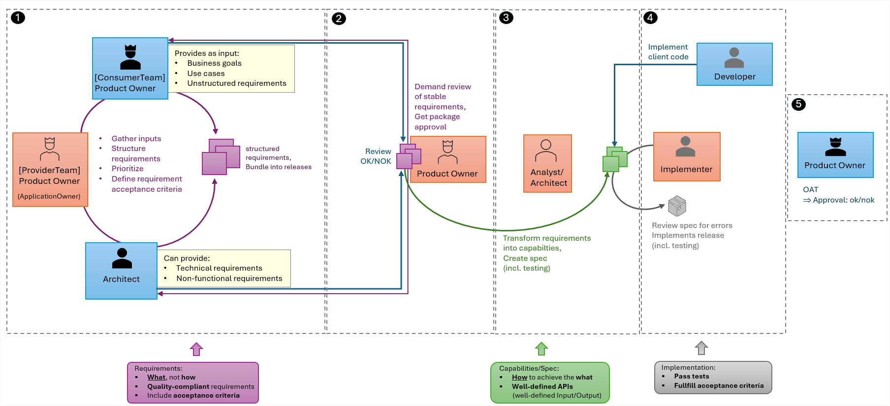

# Concept of Requirements

A requirement defines a specific need or expectation that an application must fulfill to deliver value to its users or stakeholders. Clear, well‑defined requirements are essential because they provide a shared understanding of what should be built and form the foundation for accurate design, implementation, and testing.  

A concept is required to capture, document, and manage requirements throughout the application lifecycle. It should define how requirements are reviewed and validated, how they are prioritized and assigned to releases, and which measures ensure that requirements are ultimately implemented, verified, and formally closed.  

## Criteria for good requirements  

Requirements should fulfill certain quality criteria - they should be:
- **unambiguous**: clearly stated without room for interpretation
- **complete**: containing all necessary information
- **consistent**: free of contradictions
- **testable**: verifiable through defined acceptance criteria
- **necessary**: required for the system/application or its purpose
- **understandable**: clear and comprehensible to all stakeholders
- **solution-neutral**: describing the *what*, not the *how*
- **traceable**: linked to sources, goals, and related artifacts

## Where to capture and manage requirements?  

The requirements shall be documented and managed in dedicated Github repositories.  
Other tools, like e.g. Jira shall not be used.  

This means that the requirements for a use case are handled in a central place.  

**Capabilities**:  
Requirements are fulfilled by capabilities (e.g. services or features), which are handled via dedicated issues.  
These capabilities are not necessarily limited to a single application and, therefore, the related capability issues can be distributed across different repositories.  

## How organize requirements?  

To ensure requirements are captured, structured, and maintained consistently, a clear approach is needed for how they are organized and managed throughout the development process.

1. **Use of different issue types**  
  To distinguish between functional requirements, non‑functional requirements, defects, and other work items.  
2. **Standardized templates**  
  To ensure every requirement follows the same structure and contains all necessary information.
3. **Labels**  
  Such as priority, status, and category (and optionally issue type as a label) to enable efficient filtering, tracking, and reporting.

### Possible issue types

Different issue types are possible, not all of them might be required in the respective context.  
Note that, instead of creating several issues (from different issue types) belonging to the same requirement, it would also be possible to have these as sections in the issue template. E.g. a non-functional requirement or constraint may directly be tied to a functional requirement - it can be captured within a dedicated section of the functional requirement issue.  

**Functional requirements**  
- describe **what** functionality a system/application shall provide, **not how** it shall provide it (i.e. the technical solution is not described in the requirement)
- typical contents are: purpose/target, description, **acceptance criteria**, business data objects, triggers and events and dependencies
- they can be use cases, user stories or operational functions

**Non-functional requirements**  
- describe **quality attributes**
- these can e.g. be security, performance, availability, compliance, scalability

**Business rule**  
- system-wide operational rules
- often re-usable
- should be managed centrally
- e.g. rules for computation, validation or decision logic

**Process/Domain issue**  
- used for processes, roles, domains, glossary

**Open question/clarification**  
- to handle any open questions or clarifications

**Constraint**  
- these can e.g. be legal requirements, corporate policies, dependencies or technical constraints

### Labels

Different label categories are possible.  
The following categories are recommended:
- **Priority**  
  `must`, `should`, `could`, `wont`
- **Type**  
  `functional`, `non-functional`, `business-rule`, `process`, `constraint`, `question`
- **Status**  
  `open`, `in refinement`, `approved`, `rejected`, `needs clarification`
- **Domain**  
  - this could be something like `customer` or `reporting`
  - here it makes more sense to add labels from the MW SDN context (e.g. `controller` or `config data`)
  - if requirements are documented inside a use case repository, the target applications could be used as labels (e.g. `mwdi` or `dpmdp`)

## Roles and Responsibilities

Roles and responsibilities within the MW SDN domain are as described in [Enterprise Architecture](https://confluence.telefonica.de/pages/viewpage.action?pageId=39068165&spaceKey=ARCH&title=Introduction).

## Workflow  

The diagram shows the workflow for capturing requirements (1), getting the consumer team approval (2),  transforming them into capabilities and release bundles, before creating the specification (3), implement the release (4) and finally (after rollout) getting the consumers approval of the implemented solution.  
Roles are as outlined in the previous section.  

