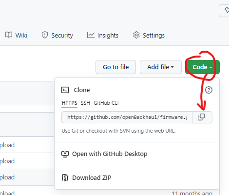
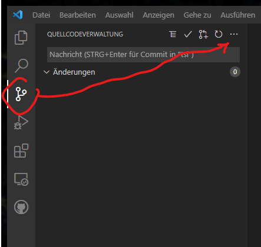
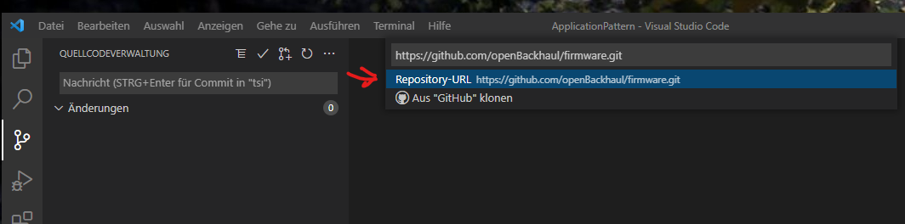

# Starting the Specification Process

### Creating the ApplicationRepository

- The ApplicationOwner has to put ApplicationName, description of the Purpose of the Application and a confirmation of the funding into an informal email to the PlattformOwner and request for creating an ApplicationRepository
- The PlattformOwner will create the ApplicationRepository
- The ApplicationOwner gets requested to accept being Collaborator on the repository and has to confirm
- The PlattformOwner will add a set of Issues for supporting the specification process

### Creating a local repository from the ApplicationRepository

- Use browser for going into the GitHub repository, which you would like to connect with VSCode  
- Open the “Code” menu and copy the HTTPS link  
  

- Go into the “Quellcodeverwaltung” and click on “Klonen” within the pulldown menu  

- Paste the HTTPS link into the field at the top of the VisualStudioCode window and click on "Repository-URL https:/..."  
  

- Chose the folder, which you wish all the local clones of GitHub repositories to be stored in (the additional folder required for the additional repository will be created automatically)  
- Choose to add the additional repository to the current workbench  
  

Don't forget to adjust the correct branch after connecting.