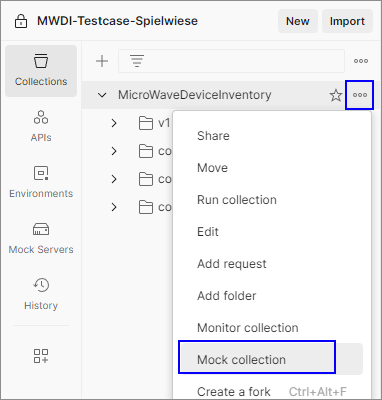
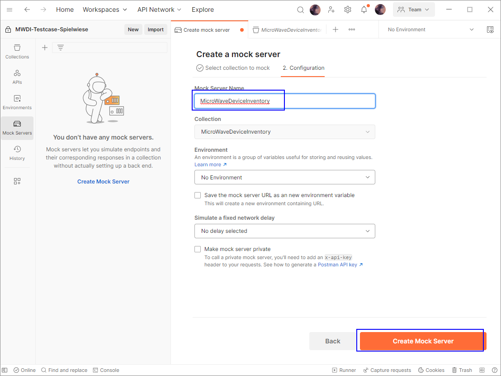
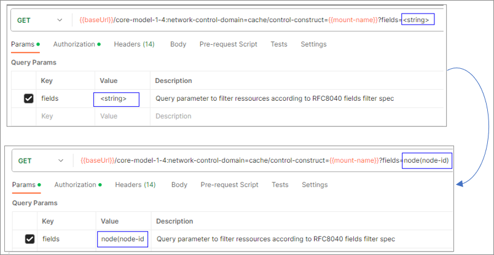

# Creating a Mock Server from the OAS

Prerequisite: OAS has been defined in VSCode.  

### Create the API from the OAS

Open your local Postman installation.  
Change to workspace "MW_SDN_Applications".  
(If the workspace does not appear in your Postman, send an email to: Thorsten.Heinze@telefonica.com to gain access.)  
  

The workspace already contains various APIs of other applications. (In subsequent screenshots they are not visible, as the captures were taken in a test workspace.)  
  

Click the _APIs_ folder at the very left of the Postman window.  
Click the "+" for creating a new API.  
  

Enter the official application name as a Name of the API definition.  
  

Enter a low version number like e.g. 0.0.1 (you will be able to adapt the version number at any time).  
Define Schema type to be "OpenAPI 3.0" and Schema format to be "YAML" and create the API.  
  

After the API has been created, click on the just created version.  
  

Click on "Definition".  
Click into the Postman editor, CTRL+a, delete all default content from the index file.  
Open your OAS in the VSCode editor, click into the editor, CTRL+a, CTRL+c. 
Change into the Postman editor, CTRL+v, CTRL+s.   
  

### Generate a collection and mock server
Click "Add collection", then "Generate from definition".  
  

Name your collection according to your application's name. Leave the parameters as they are.   
  

This will create a collection folder under *APIs*.  
  

Now also create a collection under the *Collections* tab.  
Under *APIs* navigate to your previously generated collection and select "Copy to collections".  
  

Wait until your collection has been created under *Collections*.    
  

Create the mock server via the "..." menu and selecting "Mock collection".  
  

Enter your application's name as name for the mock server. Keep the preset options.  
  

Copy the mock url and paste into some editor for later usage.  
  

Go back to the *Collections* tab and select your collection. On the left side click on the *Variables* tab to display the collection variables.   
  

Search for the "baseUrl" variable, paste to mock server url into the "CurrentValue" field and save your configuration via CTRL+s.
  

Before testing can be started, make sure to fix problems in your collection:  
- e.g. (duplicate) variables may have been created, which need to be cleaned-up
- also check your individual services and OaM *paths* for correct RequestBodies
- requests may also have query parameters, which would have to be set sufficiently in the "Params" tab of the respective request.
  

Executing an request against the mock server:    
- If you push "Send" on an example request, the newly created mock server will answer.
- It is a matter of coincidence, which status code the mock server answers, but if you would expand the list of answers for the request, you could find the 200 or 204 as the top-level entry in the list.  
- Here you could check the ResponseBodies of the successfully processed requests.  
- Actually, you just see the examples you defined in the OAS.  
- If you would not find the expected attributes, you most likely entered an example that is contradicting the structure or format definitions.  

The picture shows an example response:  
  
