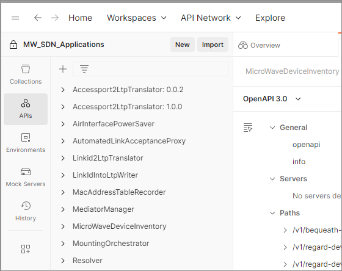
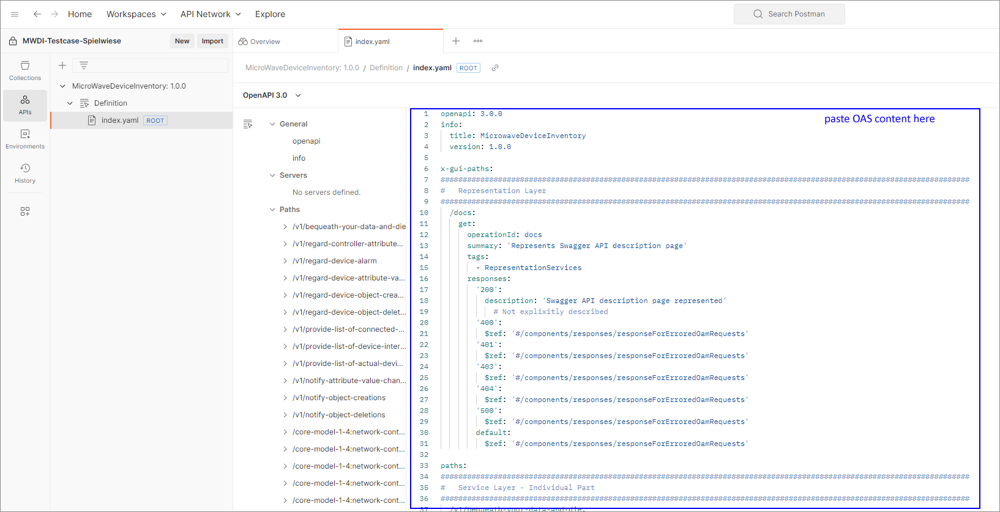
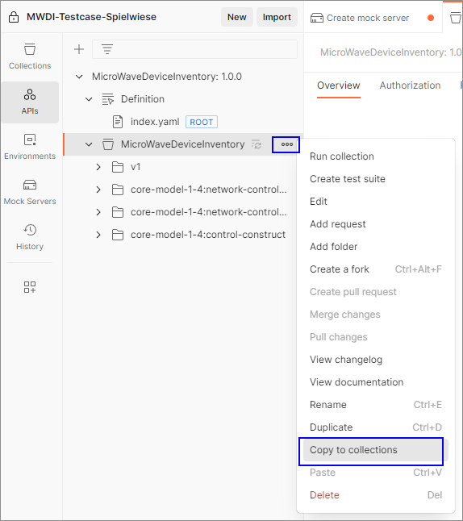
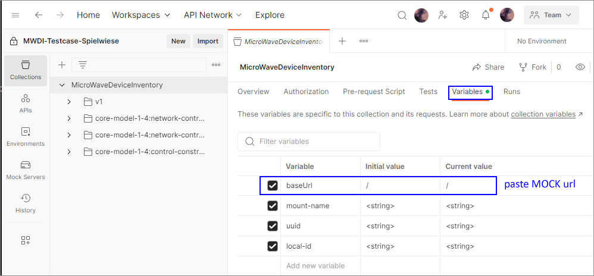

# Creating a Mock Server from the OAS

After AOS has been defined in VSCode.  

Open your local Postman installation.  
Change to workspace "MW_SDN_Applications".  

  
Click the _APIs_ folder at the very left of the Postman window.  
  
Click the "+" for creating a new API.  
Enter the official application name as a Name of the API definition.  
  
Enter a low version number like e.g. 0.0.1 (you will be able to adapt the version number at any time).  
Define Schema type to be "OpenAPI 3.0" and Schema format to be "YAML" and create the API.  
  
After the API has been created, click on the just created version.  
  
Click on "Definition".  
Click into the Postman editor, CTRL+a, delete all default content.  
Open your OAS in the VSCode editor, click into the editor, CTRL+a, CTRL+c. 
Change into the Postman editor, CTRL+v, CTRL+s.   
  

Click "Add collection", then "Generate from definition".  
  
Name your collection according to your application's name.  
  

Example for how the generated collection looks like:  
  

Depending on your Postman version... 
- Click "API Mocking".  
- Leave the rest of parameters as they are.  
- Click "Generate Collection & Continue".  
- Name your mock server according to your application's name.  
- Leave the rest of parameters as they are.  
- Click "Copy Mock URL".  
- Open some editor and CTRL+v the Mock URL for later use.  

or execute the following steps:
Under *APIs* navigate to your previously generated collection and select "Copy to collections".  
  

Wait for your collection to be created under *Collections*  
  

Create the MOCK server via the "..." menu and selecting "Mock collection".  
  

Enter your application's name as name for the Mock server. Keep the preset options.  
  

Copy the Mock url.  
  

variables: 
(if necessary cleanup auto-generated variables) 
  

Set current value of baseUrl:  
  

Send a request:  
  

TEXT VON UNTEN NOCH HIER OBEN EINTRAGEN  
.
.
.
.
_Nachfolgender Text wurde aus einem anderen Dokument übernommen und beschreibt die Schritt zur Überprüfung der Examples._  
_Es scheint eine Änderung in Postman gegeben zu haben, die RequestCollection wird nicht mehr automatisch mit dem MockServer erzeugt._  
_Die Schrittfolge muss noch angepasst werden._  

If you did not work in Postman:  
- Copy the OAS into the API file that you created in the beginning.  
- Save it.  

For verifying your examples (required for validating the test case collection) in Postman:  
- Click "Generate Collection".  
- Name your collection by application name and release number and tick "API Mocking".  
- Copy Mock URL.  
- Click the _Collections_ folder at the very left of the Postman window.  
- Click on your newly created collection.  
- Click on Variables.  
- Search for "baseUrl" and CTRL+v into the CurrentValue field.  
- Now, the Mock URL should be pasted into CurrentValue field of the baseUrl variable.  
- CTRL+s.  
- Check your individual services and OaM _paths_ for a correct RequestBodies.  
- If you would push "Send", your newly created mock server would answer.  
- It is a matter of coincidence, which status code the mock server answers, but if you would expand the list of answers for the request, you could find the 200 or 204 as the top-level entry in the list.  
- Here you could check the ResponseBodies of the successfully processed requests.  
- Actually, you just see the examples you defined in the OAS.  
- If you would not find the expected attributes, you most likely entered an example that is contradicting the structure or format definitions.  