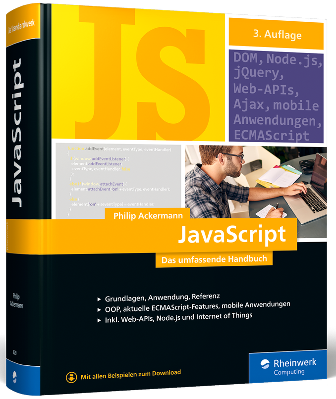
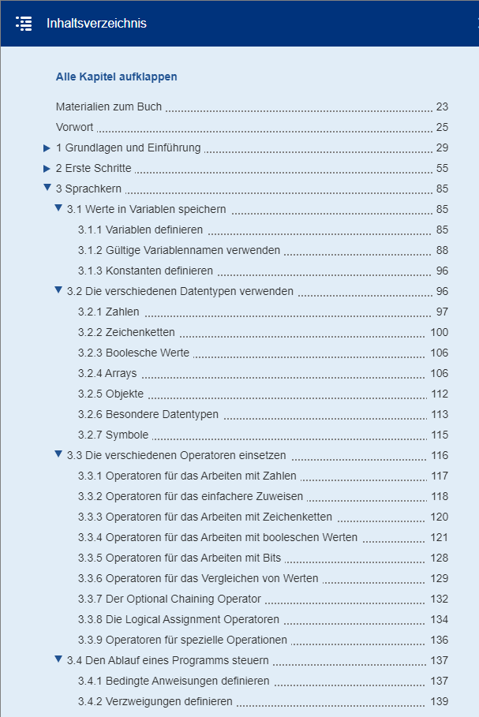
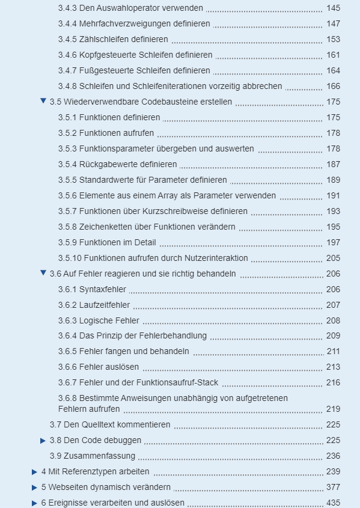
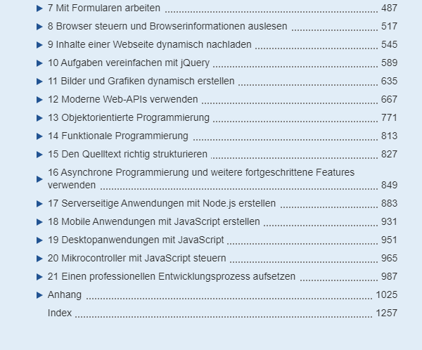

# Learning JavaScript Basics

For native German speakers without experience in JavaScript programming or generally rather rusty programming skills the JavaScript Handbuch from Rheinwerk Verlag might be a good introduction.  

  

Chapter 3 Sprachkern is sufficient to program test cases in Postman.  
Further chapters enable the reader to write programs for various purposes outside the Postman sandboxes.  

  
  
  

For employees in the Transport dept. at Telefonica Germany, it was agreed with the cost center management that the book could be purchased and billed through the travel expense software.  

Having the .pdf version of the book also helps with the work.  
Please note that the .pdf versions are personalized and must not get out of hand in any case.  
