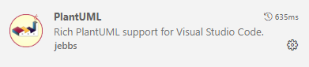
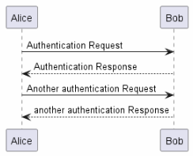
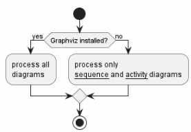
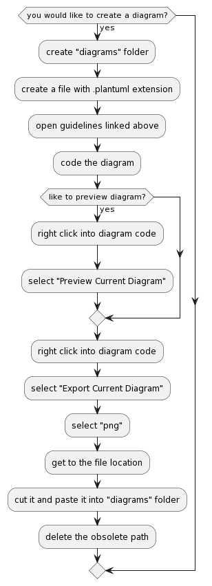

# Sketching Ideas  

During test case planning, it might make sense to visualize communication flows or sequences of activities.  

It is recommended to apply a text-based tool that integrates with the version control system of GitHub.  

  

After a little training, creating diagrams should even be faster than using a conventional graphical user interface.  

The sequence diagram is a very good choice, if e.g. sequences of requests between multiple applications would need to be visualized.  

  

PlantUML offers a really wide variety of design options.  
A detailed tutorial can be found [here](https://plantuml.com/de/sequence-diagram).  

If the application would implement a routine and the sequence of activities would have to be visualized, the activity diagram would be recommended.  

  

It is recommended to apply the new syntax.  
A description can be found [here](https://plantuml.com/de/activity-diagram-beta).  

An overview about all the diagram types that are supported by PlantUML can be found [here](https://plantuml.com/de/).  

**Please, be aware that the diagrams will not be part of the official specification.**  
They are for supporting you while internal clarification or preparing the specification documents (OAS, CONFIGfile and TCC).  

If you would decide to draw some, please create a "diagrams" subfolder to the "spec" folder of your repository ....

