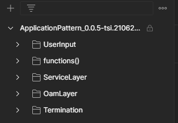

# Testcases

## Folder structure

The collection contains sub-folders like UserInput, functions(), ServiceLayer, OamLayer, Termination folders

### UserInput

Here the data from the input [load-file](../ConceptOfConfigFile/ConceptOfConfigFile.md) is extracted and stored for using it in proceeding testcases.

### functions()

In this folder, any common re-usable functions could be defined.

#### Some keywords used for defining the requests *(for reference)*

Every testing scenario of a service contains a set of requests each having a specific purpose like preparation, testing, clearance. Based on the purpose, a specific keyword is used for the requests.

|**Prefix keyword**|**Purpose of test scripts**|
| :---- | :---- |
|Reference|Gathering some required information related to the proceeding test script|
|Expected|Testing expected scenario specific testcases|
|Dummy|POST/PUT some randomly generated dummy values into request body|
|Initial|POST/PUT service/API with Initial values for inversing any potential change in configuration|
|Clearing|Operations performed for clearing any evident changes in the configuration|
|sampling|Testing the actual testcase (just for experimental purpose)|
|Check|Test script that test whether the configuration remains the same as initial data|
|for gating|a gating request between Continuous Integration and Acceptance block (decision based on input from user through load-file)|
|for exiting|a dummy request to indicate that a service has been tested successfully and the block has been exitied|

### ServiceLayer and OamLayer

This folder contains testcases for API enpoints exposed in serviceLayer and OamLayer. It further contains IndividualPart and BasicPart which refers to IndividualServices and BasicServices respectively in OAS specification. Under IndividualPart or BasicPart, testcases for all the services or API endpoints are listed.

Under each service, we have ContinuousIntegration, Acceptance, Gate and Exit folders.

#### ContinuousIntegration

The following scenarios are defined under Continuous Integration testcases of *Service Layer* services.

| |**Test cases**|**Description**|
|:----|:----|:----|
|Behaviour|Idempotence|Responds with 200 or 204 , if the incoming request is already satisfied by the application|
|Logging|Request notified|To make sure the service request is logged into ExecutionAndTraceLog|
|Request Parameters|Parameter completeness|To test if all the specified parameters are present in the incoming request(USER, X-CORRELATOR, TRACE-INDICATOR, ORIGINATOR, CUSTOMER-JOURNEY)|
| |Missing operation-key|Testing if the incoming request is carrying the security key for authentication|
| |Incorrect operation-key|Testing if the server is validating the security key in the incoming request|
| |Originator checked?|Testing if the server is correctly validating the originator parameter in incoming request|
| |X-correlator pattern|Testing if the server is correctly validating the x-correlator parameter in incoming request|
| |Trace-indicator pattern|Testing if the server is correctly validating the trace-indicator parameter in incoming request|
|Response Parameters|Header completeness|To check if the response contains the expected parameters in the header (X-CORRELATOR, EXEC-TIME, BACKEND-TIME, LIFE-CYCLE-STATE)|
| |X-correlator responded|To test if the x-correlator present in the response depicts the flow of the same request.|
| |Life-cycle-state responded|To test if the received life-cycle-state is as expected|

The following scenarios are defined for Continuous Integration testcases of *OAM APIs*

| | |**Test cases**|**Description**|
|:----|:----|:----|:----|
|Continuous Integration|Security key|Authorization code missing|Testing if the incoming request is carrying the security key for authentication|
| | |Authorization code checked?|Testing if the server is validating the security key in the incoming request|
| |Logging|Request notified?|   To make sure the service request is logged into OamLog|
| |Parameters|Uuid pattern checked?|Testing if the server is correctly validating the uuid pattern and value parameter in incoming request. It should reject for patterns like random string, application-name (random dummy value). release pattern - short , long, containing letters. layer - something other than op-s, http-s, integer etc., uuid suffix if (only four-digit number, containing letters), different separator|

#### Gate

This folder acts as a gate between Continuous Integration and Acceptance testcase considering user-input.

#### Acceptance

The following scenarios are defined for Acceptance testcases of *Service Layer* services.

| |**Test cases**|**Description**|
|:----|:----|:----|
|Response header|Life-cycle-state propagated?|Testing if the life-cycle present in the response header is adopting to the changes|
|Response body|Response body completeness|Testing if the retrieved attributes for completeness against the generated [JSON schema](./JsonSchemaFromSpecification.md) and also checking the values are correct against the load file.|
| |Vs oam put|Testing if the newly configured values are correctly getting retrieved in the services|
|Request body|attribute completeness|Testing if the server is accepting the service request only if it has all the required attributes present|
| |Attribute checked?|Testing if the server is accepting the service request only if each of the attributes is complying the specification (for each attribute)|
| |Attribute configured?|Testing if the server is accepting and updating the particular value of attribute present in request body - testing for different values(for each configurable attribute)|
|Forwarding construct|FC update|   Testing if the corresponding forwarding-construct is updated with operation-clients|
|Direct forwarding|Forwarding triggered?|Testing if the expected forwarding is happening if the service is called|
|Change notification to ALT|Update-LTP|Testing if any update in LTP is notified to ApplicationLayerTopology application|
| |Delete-ltp-and-dependents|Testing if any deletion of LTP is notified to ApplicationLayerTopology application|
| |Update-fc|Testing if any update in FC is notified to ApplicationLayerTopology application|
| |Update-fc-port|Testing if any update in FC-port is notified to ApplicationLayerTopology application|
| |Delete-fc-port|Testing if any deletion of FC-port is notified to ApplicationLayerTopology application|

The following scenarios are defined for Acceptance testcases of *Oam Layer* APIs.

| | |**Test cases**|**Description**|
|:----|:----|:----|:----|
|Acceptance|GET requests|Response body completeness|testing if the retrieved values are correct against the load file and validate against schema|
| |PUT requests|Vs oam-put|testing if the newly configured values are correctly getting retrieved in the proceeding GET request|
| | |Request body completeness|  testing if the PUT request is carrying the expected attribute (no request body)|
| | |Request body correctness|testing if the attribute in the request body is complying the patterns|

#### Exit

This folder acts as an exit point indicator for each service.

[<-- Back to Specifying Applications](../SpecifyingApplications.md) - - - [Ahead to Testing the server -->](./ExecutingTestSuite.md)
