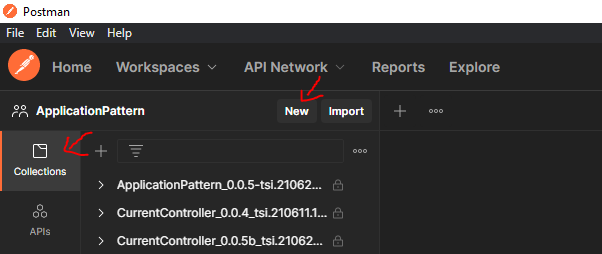
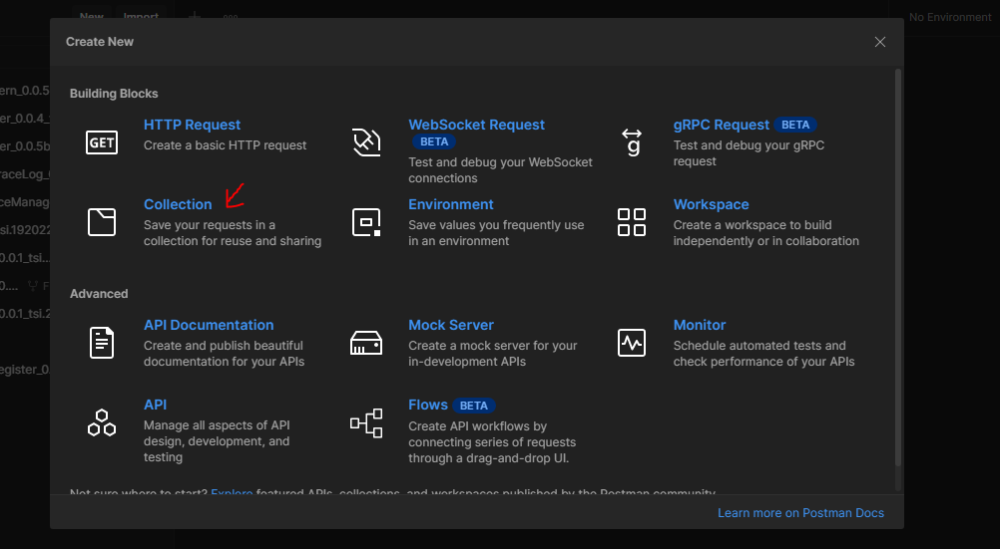

# Test suite

A test suite is a postman collection which consist of a set of test cases. A postman collection can be created inside an [workspace](https://learning.postman.com/docs/collaborating-in-postman/using-workspaces/creating-workspaces/).

## Creating new test suite

**Step 1**: Under **Collections** tab, click on **New** button

**Step 2**: A dialog box will openon which select **Collection** option

**Step 3**: A new collection will be created. Rename the collection to the corresponding application name in the below format

> ApplicationName_version_date.time+testcases.1

[<- Back to Specifying Applications](../SpecifyingApplications.md)  - - -  [Ahead to concept of Testing ->](./ConceptsOfTestCases.md)
