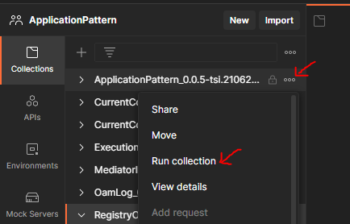
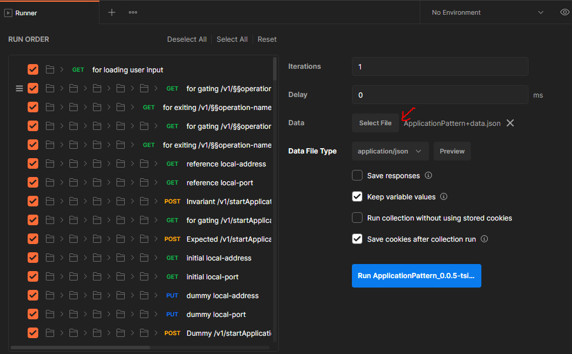
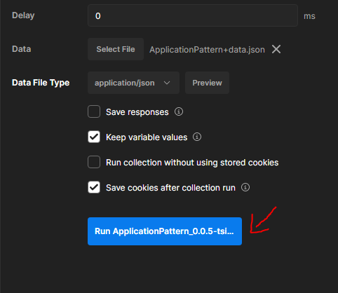
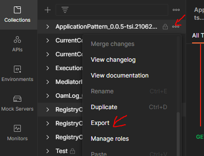
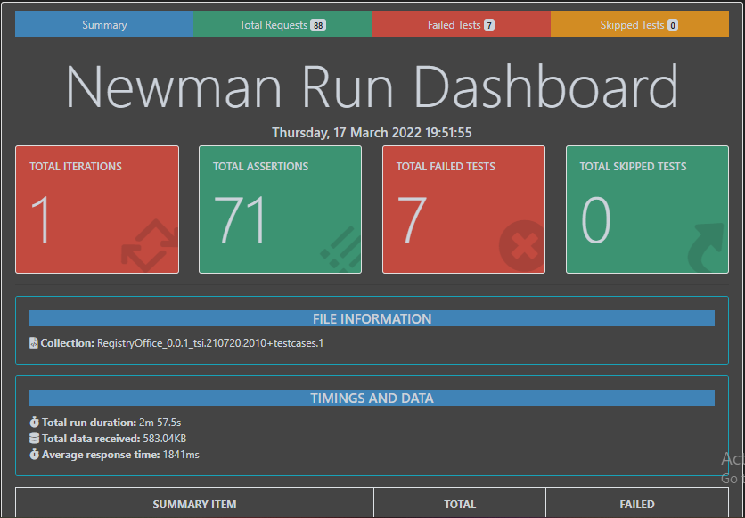
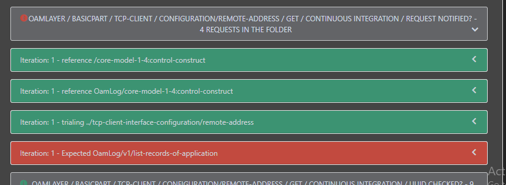

# Testing the applications

Implementing testcases for IndividualPart of Service Layer and Oam Layer will be sufficient in most cases. A set of common testcases (testcases for Basic part of Service Layer and Oam Layer) will be available in team workspace which could be integrated to the actual collection.

## Integrating test suites of Basic and Individual Parts

The ApplicationPattern test cases can be [imported](https://learning.postman.com/docs/getting-started/importing-and-exporting-data/) into the workspace.

- Copy the BasicPart from ServiceLayer of ApplicationPattern collection into ServiceLayer of application specific test suite (modify the content if required)
- Copy the BasicPart from OamLayer of ApplicationPattern collection into OamLayer of application specific test suite.

Now, The test suite can be used for validating the application. Initial testing can also be done against the [mock server](../CreatingMock/CreatingMock.md) for basic corrections before testing against the real server.

## Configuring load-file

Before running the collection, the attributes in input load-file needs to be customized according to the server (application) and environment.

- **typeOfTesting** value should be according to environment on which the collection is expected to run.
  - In testbed, it is necessary for executing both Acceptance and Continuous Integration testcases. In this case the value will be "Acceptance"
  - In production, only Continuous Integration testcases are executed. In this case, the value can be either "ContinuousIntegration" or "Integration"
- **dummyUrl** value should be a reachable URL according to environment(testbed or production) on which the collection is expected to run.
- **serverUrl** is filled with either URL of actual server or mock server against which the test suites are expected to be tested.
- **userName** should be filled  with a valid user name string. This value will be used for logging and debugging purposes.
- **authorizationCode** to be filled with a valid auth code as per Administrator Administration application's configuration. This code will be used by the test suite for executing test cases handling APIs of OAM layer.

## Executing testcases

### Method 1: Testing locally from postman

On clicking the three dots on right to the collection, a drop-down will appear on which click on Run Collection

A new *Runner* tab will open, on which click on *Select File* button. Once the button is clicked, user will be prompted for selecting the load-file of the application. Select the appropriate load-file according to the application.

After selecting the load-file, click on *Run Collection button*.

The collection will now start running, and the test results can be viewed in the runner tab. Also the logs could be found in the console.

### Method 2. Testing externally in command line using newman-reporter-htmlextra

The testing environment requires [npm](https://docs.npmjs.com/downloading-and-installing-node-js-and-npm), [newman](https://www.npmjs.com/package/newman) and [htmlextra](https://www.npmjs.com/package/newman-reporter-htmlextra) packages installed

In postman, click on the three dots which is present near to the collection on right side and select the **export** option in the appearing drop-down. On selecting the export option, user will be prompted for selecting the destination on where to store the collection. Once selecting the destination directory/folder, click on save.

Open terminal (command prompt, or vs code in windows or terminal in linux) or any other terminal of choice depending on the environmenty. Move to the current working directory where the actual collection and it's corresponding input load-file are stored. Run the following command
>       newman run --delay-request 1000 collection.js –d input_file.json –r htmlextra,cli

where collection.js is the actual collection that contains the test cases and input_file.json is the load-file for the test suite.

Once the run is complete, a folder will be generated named "newman" which will contained the output .html file. This file could be opened in any browser. The output file will contain all the details like test run summary, result details, consolidated failure list and other details.

[<-- Back to Specifying Applications](../SpecifyingApplications.md) - - - [Up to concepts of testcases -->](./ConceptsOfTestCases.md)
