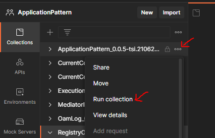
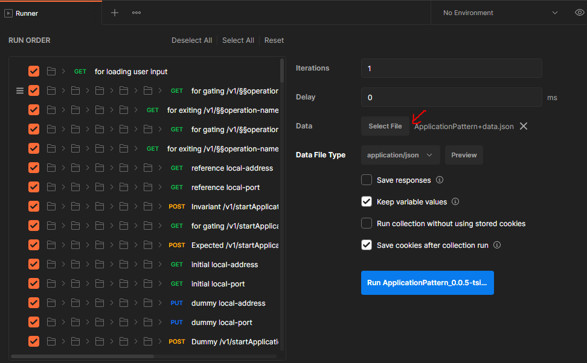
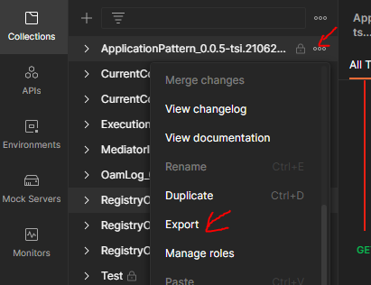

# Testing the applications

Implementing testcases for IndividualPart of Service Layer and Oam Layer will suffice. As a set of common testcases (testcases for Basic part of Service Layer and Oam Layer) will be available in the [ApplicationPattern repository](https://github.com/openBackhaul/ApplicationPattern) which could be added to the actual collection.

## Integrating test suites of Basic and Individual Parts

The ApplicationPattern test cases can be downloaded or [cloned](https://docs.github.com/en/repositories/creating-and-managing-repositories/cloning-a-repository) into the local system. [Import](https://learning.postman.com/docs/getting-started/importing-and-exporting-data/) the ApplicationPattern test suite into postman.

- Copy the BasicPart from ServiceLayer of ApplicationPattern collection into ServiceLayer of application specific test suite
- Copy the BasicPart from OamLayer of ApplicationPattern collection into OamLayer of application specific test suite.

Now, The test suite can be tested against the mock server initially for basic corrections before testing against the real server.

*Reference:* [*Mock Server*](../CreatingMock/CreatingMock.md)

## Testing the server

### Method 1: Testing locally from postman

**Step 1**: On clicking the three dots on right to the collection, a drop-down will appear on which click on Run Collection

**Step 2**: A new *Runner* tab will open, on which click on *Select File* button. Once the button is clicked, user will be prompted for selecting the load-file of the application. Select the appropriate load-file according to the application.

**Step 3**: After selecting the load-file, click on *Run Collection button*.

The collection will now start running, and the test results can be viewed in the runner tab. Also the logs could be found in the console.

### Method 2. Testing externally in command line using newman-reporter-htmlextra

### Pre-requisites

- [Install npm](https://docs.npmjs.com/downloading-and-installing-node-js-and-npm)
- [Install newman](https://www.npmjs.com/package/newman)
- [Install htmlextra package](https://www.npmjs.com/package/newman-reporter-htmlextra)

### procedure

#### Export the collection

In postman, click on the three dots which is present near to the collection on right side and select the **export** option in the appearing drop-down. On selecting the export option, user will be prompted for selecting the destination on where to store the collection. Once selecting the destination directory/folder, click on save.

#### Run the collection

Open command prompt, or vs code or any favourite terminal of choice and move to the current working directory where the actual collection and it's corresponding load-file are stored. Run the following command
>       newman run collection.js –d input_file.json –r htmlextra,cli --reporter-htmlextra-logs

where collection.js is the actual collection that contains the test cases and input_file.json is the load-file for the test suite.

Once the run is complete, a folder will be generated named "newman" which will contained the output html file. This file could be opened in any browser.

The output file will contain all the details like test run summary, result details, consolidated failure list and other details.

[<-- Back to Specifying Testcases](./Testcases.md)   - - -  [Up to Specifying Applications](../SpecifyingApplications.md)
