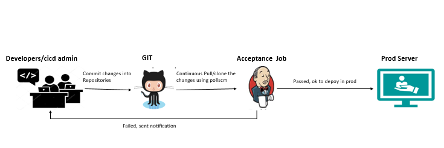

## Acceptance Testing 

## Concepts
- Overview
- Configure Pipeline job for running Acceptance test cases
    - source stage
    - Setup to run postman collection file
    - Run the test suites using newman
    - Results available
    - Email Notification

### Overview
Acceptance testing, is a quality assurance (QA) process and this technique performed to determine whether the software system has met the user/business requirement specifications. It evaluate the quality of software. Acceptance Testing run in testbed environment and if everything is ok from acceptance testing then approve the build to production environment to deploy.

### Configure Pipeline job for running Acceptance test cases
Once Application deployed and automatically acceptance testing performed.
- source stage
- Setup to run postman collection file
- Run Acceptance test cases
- Results available
- Email Notification

#### Source stage : 
Take clone from the github of current testcases
     
#### Setup to run postman collection file : 
- Update the file RegistryOffice_0.0.1_tsi.date.time+data.no.json with "typeOfTesting": "Acceptance"
- Update the file RegistryOffice_0.0.1_tsi.date.time+data.no.json file with proper "userName" and "authorizationCode" to access the applications from jenkins
- Update the file RegistryOffice_0.0.1_tsi.date.time+data.no.json "serverUrl" with current URL of application which is up and running
-  Finally, makesure that the application swagger loadfile should be updated with proper application pattern URL's

#### Run the test suites using newman
        
        ex: newman run RegistryOffice_0.0.1_tsi.date.time+testcases.1.postman_collection -d RegistryOffice_0.0.1_tsi.date.time+data.no.json -r htmlextra,cli --reporter-htmlextra-logs

#### Results available

As part of pipeline configuration once setup and run the test suites, we can also configure the workspace. Means after executing the suites, the results are available in a server path of **/var/lib/jenkins/workspace/RO_Testcases/newman**
    
    http://serverip:port/view/Applications/job/Registry_Office/2/

#### Email Notification

Once test suite execution is completed, then notification is sent to users. The notification contains execution reports and pipeline URL's.

[<- Back to SDNApplicationPatternDeployment](../SDNApplicationPatternDeployment/Overview.md) - - - [Back to Testing Applications](../../../TestingApplications.md) - - [Ahead to SDN Testing ->](../../IntegrationTesting/Overview/Overview.md)