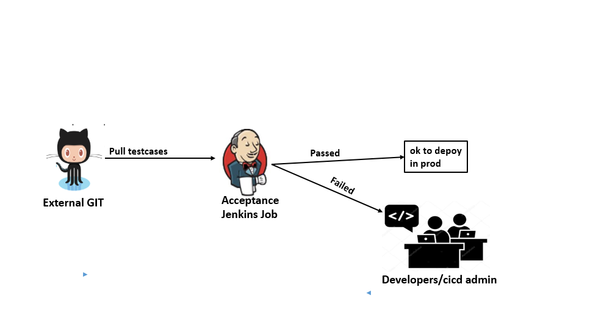

### Acceptance Testing
Once Application deployed and automatically acceptance testing performed on test server.

As a prerequisite, the related test tools mentioned earlier to be installed and set up the server.

Below is the overview of workflow

* External GIT is a version control system which holds the source code of applications and automated testsuites.
* Developers can develop the source code and test suites and pushed to github.
* Jenkins has acceptance job created by user with all configuration and run collects the test results.
* If no failures seen promoted the build to production, failures seen then informed to developers for fixing the issues.

### Procedure for automated testing

#### Configure Pipeline job for running Acceptance test cases

Please refer the previous section for [creating the jenkins job](../Tools/Jenkins/JenkinsJobsAndSDNDeployment.md#list-of-jenkins-jobs)

### Build the declarative pipeline script
Once job is created, please follow the below procedure to build the groovy script for testing.

        pipeline {
    agent {
        label 'test_server'
    }
    stages {
      stage ('source stage') {
           steps {
                git branch: 'develop', url: '<github repository link>' 
             }
            }
        }
        stage ('Setup to run testsuite collections') {
            steps {
                 dir ('/var/lib/jenkins/workspace')
                    {
                        <Update the configuration according to testing requirements in input file of applications>

                }
            }
        }
        stage ('run Acceptance test cases using newman') {
            steps {

                 dir ('/var/lib/jenkins/workspace/<jobworkspace>/')
                    {
                    
                   sh 'newman run <collectionfile> -d <inputfile> -r htmlextra,cli --reporter-htmlextra-logs'
                }
            }
        }  
        stage ('Print test results in workspace dir.') {
            steps {

                 dir ('/var/lib/jenkins/workspace/<jobname>/newman')
                    {
                    sh 'ls -lrt'
                }
            }
        }
    }

    }
    

#### Source stage 
Clone the current testsuite repository from the github though jenkins.
     
#### Setup to run testsuite collections 
- Update the file <inputfile.date.time+data.no.json> with "typeOfTesting": "Acceptance"
- Update <inputfile.date.time+data.no.json> file with proper "userName" and "authorizationCode" to access the applications from Jenkins
- Update <inputfile.date.time+data.no.json> file with "serverUrl" with current URL of application where it is up and running
-  Finally, makesure that the application loadfile properly updated with latest data (Ip address and Ports of applications in database).

#### Run Acceptance test cases using newman
To run the suite, we are using below command.

 newman run <postmancollectionjsonfile> -d <inputfile.date.time+data.no.json> -r htmlextra,cli --reporter-htmlextra-logs

        Example command used for RO suite: newman run RegistryOffice_0.0.1_tsi.date.time+testcases.1.postman_collection -d RegistryOffice_0.0.1_tsi.date.time+data.no.json -r htmlextra,cli --reporter-htmlextra-logs

### Results available

For every application testing, the workspace is created on same pipeline means after executing the suites, the results are available in this workspace which is a server path **/var/lib/jenkins/workspace/<respectivesuitename>/newman**

    Example path for RO suite and collected results :

    on server: /var/lib/jenkins/workspace/RO_Testcases/newman

    url to access the job: http://10.0.3.4:1234/view/Applications/job/Registry_Office/2/

[<- Back to main Testing Applications ->](../../TestingApplications.md)