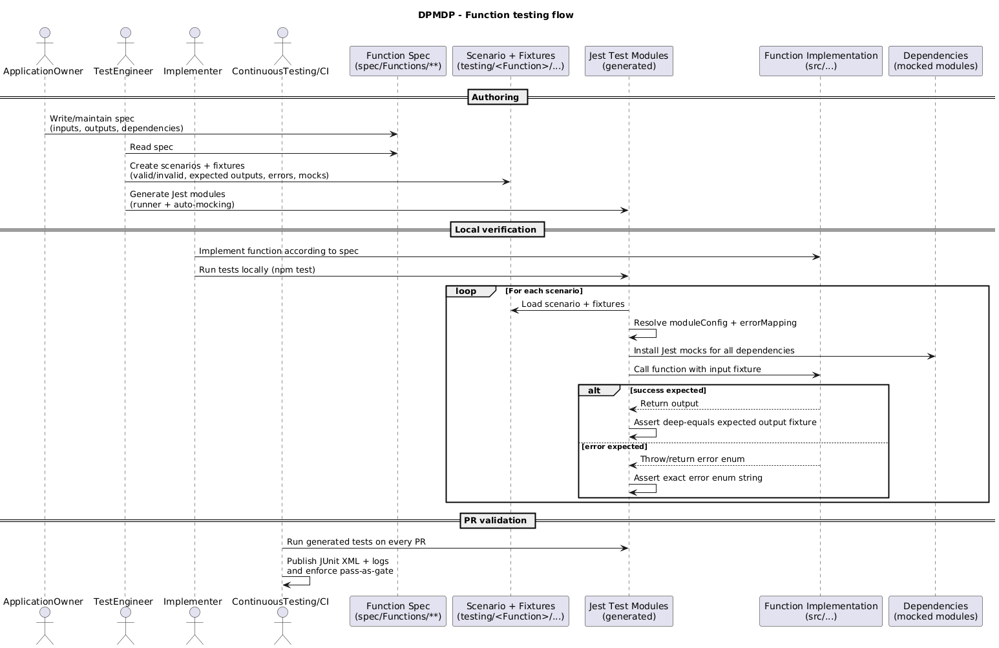
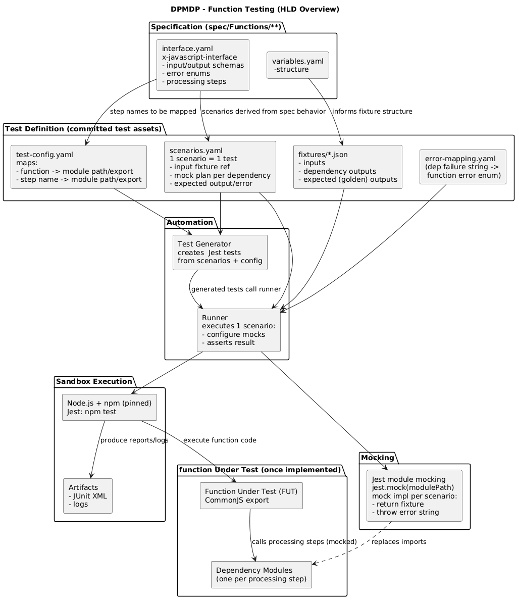
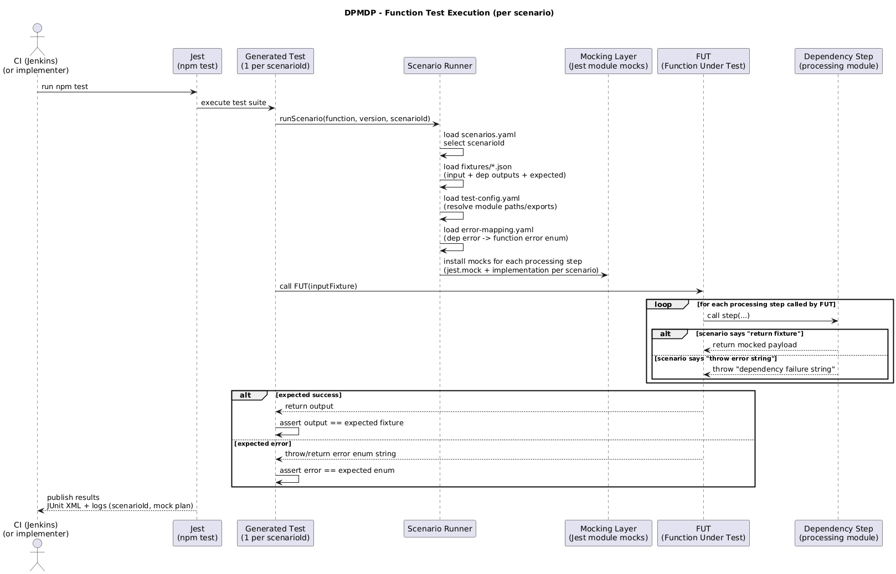

# High Level Design for Function Testing

This document describes testing Functions defined in spec/Functions/*.  
These functions use JavaScript instead of REST interfaces.  

### Design Targets

Function testing is designed to be:
- **Fast** : runs on every PR/Commit
- **Spec-driven** :  the specification is the single source of truth
- **Deterministic** : all external dependencies are mocked
- **Automated** : tests and mocks are generated from data files

### Coverage of Function Testing

Function Testing automatically checks that each Function implementation ...
- ... provides the function as defined in the spec
- ... returns outputs (structure + meaning) according to the spec (`interface.yaml`)
- ... validates inputs as described in the spec
- ... returns the exact error enum strings defined in the spec
- ... handles dependency failures in a predictable way (using defined error mappings)

### Roles

- **ApplicationOwner**: Provides the spec of the Function in a way that allows a high level of automation of the test case and mock server creation
- **TestEngineer**: Creates an automatically executable package of test cases and mock servers from the specification for each and every Function
- **Implementer**: Applies the package of test cases and mock servers on its individual Function implementation
- **ContinuousTesting/ContinuousIntegration**: Binding the test packages into an automation chain and executing it with every pull request or merge.

### Testing workflow

- **The ApplicationOwner** : writes the function specification, which defines inputs, outputs, and dependencies.
- **The TestEngineer** : Based on this specification creates the testing scenarios (including valid and invalid inputs, expected success outputs, and error cases) and generates the Jest test modules that automatically mock all dependent functions consumed by the function under test.
- **The Implementer** : Implements the function according to the specification and runs  these Jest modules locally against their function implementation to verify correctness.
- **The ContinuousTesting/ContinuousIntegration** : Ensures that all generated tests are executed automatically for every pull request, providing reproducible and deterministic validation of the function behavior.

### Description of the Testing Scenarios

The scenarios are described in a yaml file.
The yaml file shall have the following naming "/testing/p1FunctionName/scenarios.yaml".
The scenarios.yaml file shall contain the following information:
- Scenario ID and description (unique name for reporting and traceability)
- the input for the function under test : reference to an input JSON fixture in "testing/p1FunctionName/input/"
- the expected output for a given input : reference to an output JSON fixture in "testing/p1FunctionName/output/" 
- the expected error for a given input : exact string as defined in the spec
- the mocks : for each dependency step from the spec processing section, defining either:
  - a return payload (reference to an output JSON fixture)
  - an error string to throw (which the function must map deterministically)
- Module configuration : module path + export name for the function under test and each dependency (to keep tests independent of repository structure changes)
- Error mapping : (dependency failure string → function error enum string) to guarantee deterministic error handling across implementations

### Naming rules for the input/output

-  Scenario IDs : Use a stable, readable ID (e.g happy_path,invalid_missing_mountName ...)
-  Input fixtures : shall have the following naming in_scenarioId.json (e.g in_happy_path.json,in_invalid_missing_mountName.json ...)
- Expected function outputs : success → out_scenarioId_success.json (e.g., out_happy_path_success.json); errors → use error enums from scenarios.yaml
- Mock outputs for dependencies : shall have the following naming mock_dependencyStepName_scenarioId.json (e.g mock_p1FieldsFilter_happy_path.json)

### Concept

Function Testing is **spec-driven** + **scenario-based**.

### Inputs
1. **Function spec**: `spec/Functions/**/interface.yaml` and `spec/Functions/**/variable.yaml`
This is the definition of the function. It provides:
    - **Input schema**
        - required fields
        - types / formats (when declared)
    - **Output schema**
        - success output shape
        - error output enum strings
    - **Dependencies**
        - `processing` steps define what the function calls (external calls or sub-functions)
2. **Scenario matrix: `scenarios.yaml` (one per function version)**

This is the  list of test cases.
Each scenario defines:
- which **input fixture** is used
- how each dependency behaves during this scenario:
  - return a fixture, or
  - throw an error string
- what the function is expected to produce:
  - expected success output fixture, or
  - expected function-level error enum string
3. **Fixtures: JSON files**

Fixtures are committed JSON files used by scenarios:
- input fixtures (valid and invalid)
- dependency return payload fixtures
- expected (“golden”) output fixtures
4. **Configuration: `test-config.yaml`**

This maps spec dependency names to actual module paths and exports:
- function under test -> module path + export name
- dependency step name -> module path + export name
It allows the tests to be independent of repository structure changes.
5. **Error mapping: `error-mapping.yaml`**

Defines deterministic mapping from:
- “dependency failure string” -> “function error enum string”
This prevents ambiguous or inconsistent error handling between implementations.
### Sandbox Environment
The sandbox environment is a controlled, reproducible setup where Function Tests run the same locally and in CI.
**It includes** :
- a fixed Node.js + npm dependency set (pinned by lockfile / CI image)
- Jest as the test runner (npm test)
- committed test assets (scenarios + JSON fixtures + mappings)
- the function under test (once implemented)

**Key properties** :
- No external infrastructure is required .
- All dependencies listed in the spec processing section are mocked at module level (Jest module mocking).
## Mocking
### What is mocked?
**All dependencies** listed under `processing` are mocked.  
The function under test is the only “real” code executed (once implemented).
Dependencies typically include:
- external calls (e.g., reading from MWDI/ ES)
- sub-functions called as steps
### How mocks are defined (data, not code)
Mocks are defined in `scenarios.yaml`.
Each scenario provides, per dependency:
- **return fixture path** OR **error to throw**
So the “mock implementation” is just:
- “for this step, load this JSON file and return it”
- or “throw this failure string”
### How mocks are applied (scenario runner behavior)
For each scenario test, the scenario runner performs:
1. **Load scenario**
   - Read the scenario entry from `scenarios.yaml`.
2. **Resolve module paths**
   - Using `test-config.yaml`, determine which module path corresponds to each dependency step.
3. **Install mocks**
   - Use Jest module mocking (`jest.mock(modulePath)`) to replace each dependency module.
   - Each mocked module’s exported function is configured to:
     - return the referenced fixture JSON, or
     - throw the referenced error string.
4. **Execute function**
   - Call the function under test with the input fixture.
5. **Assertions**
   - If success: compare actual output to the expected success fixture (deep equality).
   - If failure: ensure actual error equals the exact expected error enum string.
### Keeping error handling consistent (error mapping)
When a dependency throws a failure string, the function is expected to map it to a function-level error enum.
The mapping is defined in `error-mapping.yaml`.
This produces:
- consistent results across implementations
- stable error messages for callers
### Mock maintenance rules 
When spec changes add or remove a `processing` step:
- update `test-config.yaml` so the runner can mock the new step
- update `scenarios.yaml` so each scenario defines behavior for the new step 
- add fixtures for the new step’s expected return payloads
### Specification team input to support maximum automation
To enable maximum automation in creating mocks and test cases, the specification team (ApplicationOwner + TestEngineer) shall provide, per function version:
1. **Scenario matrix (`scenarios.yaml`)**
   - happy path scenario(s)
   - negative scenarios covering:
     - all function-level input validation error enums
     - representative dependency failure cases
   - each scenario references fixtures and expected outcomes
2. **fixtures (JSON)**
   - function input fixtures (valid + invalid)
   - dependency output fixtures for each processing dependency:
     - success payload examples
     - error payload examples (if modeled as return values) or error triggers (if modeled as thrown errors)
   - expected function output fixtures  for success scenarios
3. **Error mapping rules (`error-mapping.yaml`)**
   - explicit mapping from dependency failure messages to function-level error enums
   - removes ambiguity and prevents inconsistent behavior across implementations
4. **Dependency  configuration (`test-config.yaml` )**
   - maps dependency (processing step names) to module path + export name
   - maps function under test to its module path + export name
   - makes test generation mechanical and repository-structure independent

### Test Cases
#### Design
- Test cases are coded and executed automatically.
- Language / framework:
  - JavaScript (CommonJS) + Jest
- Structure:
  - 1 generated Jest test file per function version
  - 1 test per scenario ID
#### Automatic test case creation
Test cases are automatically generated from:
- `scenarios.yaml` ( list of test cases)
- `test-config.yaml` (module paths/exports)

#### Reproducibility
**Goal:** A Function Test run must produce the **same result** (pass/fail and outputs) whenever it is executed against the same Git commit—locally or in CI.
We achieve this by applying the following rules:
1) **All test inputs are versioned**
- The complete test definition is stored in git:
  - `scenarios.yaml` (which scenarios/tests exist and which dependency behavior to use)
  - JSON fixtures (function inputs, dependency outputs, expected outputs)
- Therefore, a test run always uses the exact same test data for a given commit.
2) **No live dependencies**
- Function Tests SHALL NOT call real external systems (e.g., ES/Kafka/DB/HTTP services).
- All dependencies listed in the function spec `processing` section are mocked.
3) **Control variable inputs**
- This is done by:
  - using fixed values in fixtures, and/or
  - injecting or faking the variable source in tests.
**Outcome:** Tests are deterministic, reviewable, and reliable for PR gating because their behavior depends only on the committed code + committed test assets.
### Test Execution, Result Documentation and Acceptance Process
**Platform**
- Local execution for developers and TestEngineers
- CI execution for commit/PR creation (Jenkins)

**Execution**
- Command: `npm test`
- The test stage produces a binary result:
  - pass: function behavior matches the specification for all scenarios
  - fail: behavior deviates from specification, or test assets are incomplete

**Result documentation**

Artifacts produced per run:
- JUnit XML (CI-readable)
- logs including scenario ID and mock configuration (for traceability)

**Acceptance**

A function implementation is accepted when:
- all mandatory scenarios pass
- output fixtures match for success cases
- error enum strings match exactly for failure cases
- scenario coverage meets the agreed minimum 

