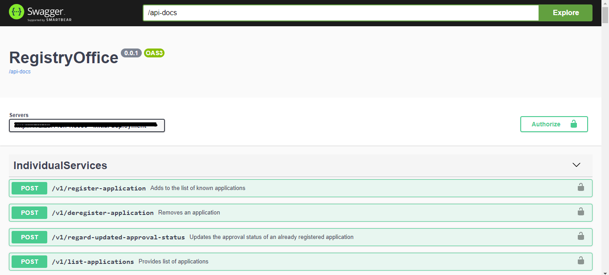
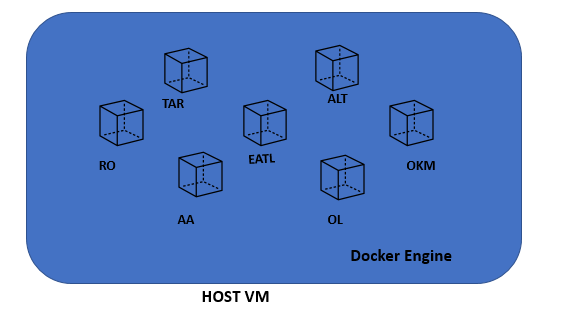

## Application Deployment in Production 
Once everything fine in test bed and acceptance test also passed then will promote the build to production. 
      
Here, we are not having connection directly between testbed and production, so **manually copy the images into production** server. Once copied, run the pipeline job in jenkins using docker containization tool and deploy the applications.

### Pipeline configuration:
Here how we configure Pipeline job in testbed environment, in the same way we have to configure and install all necessary tools in Jenkins server of production.

### Automated Pipeline Steps
- Create pipeline jobs with required configuration
- Pipeline Stages 
- CI/CD Pipeline Flow
- Declarative pipeline script
- Verify the applications are up and running
- Run the Automation testsuites
 
#### Create pipeline jobs with required configuration
- Goto DashBoard and select and create new item with pipeline job
- Once job created and Configure the job with all details that required like PollSCM time interval to perform monitering the pipeline 
- Then develop and add the pipeline script to current pipeline job
- Apply and save the configurations

#### Pipeline Stages 
- Take the copy of image into production server.
- Load the released docker image
- Run Docker container using image
- Testing stage(Integration tests in Production) 

#### Automated pipeline scripts
**Manual : Copy tar file into server**

#### Pipeline Configuration  
Basic scripting is provided and based on requirements we can use groovy scripts to write the pipeline scripts. Basic format provided here and required scripts and steps added as per requirement.

    pipeline {
      stage ('load the docker image'){
      load the image using docker load command
      } 
      stage ('Run Docker container using image') {
      create container from image using docker run command
      }
      stage ('notification') {
         send email with all details
         }
    }
    
#### Verify the applications are up and running
   
Once pipeline script executed and Applications(ex: RO,TAR,EATL etc) deployed using the dockrized containers and Go to the browser and check with the Ip address with port XXXx port mentioned in docker file. Verify the application swagger is up and running.
    
    http://<serverIp>:<port>/docs/
    ex: http://10.0.2.4:1234/docs/

 

Example structure of Applications deployed on docker engine:

#### Run the Automation testsuites 
Automation testsuites running immediately after the application deployment.Integration Testing run in production/preprod environment 

 - [**Integration Testing**](../../IntegrationTesting/Overview/ConceptsAndOverview.md)

 
#### Email Notification
Once test suite execution is completed, then notification is sent to users. The notification contains execution reports and pipeline URL's.

[<- Back to SDNApplicationDeploymentInTestBed](../SDNApplicationPatternDeployment/AppDeploymentInTestBed.md) - - - [Back to main Testing Applications](../../../TestingApplications.md) - - - [ahead to AcceptanceTesting ->](../../AcceptanceTesting/Overview/OverviewAndConcepts.md)