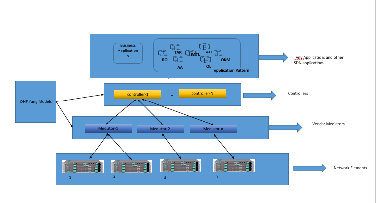

# SDN Laboratory Overview

**Concepts**

## SDN Laboratory
### Overview and General Concepts of the SDN Laboratory
Software Defined Networking (SDN) that uses open protocols to provide centralized, programmatic control and network device monitoring. In SDN laboratory, we have some general concepts like Controllers, Mediators, NEs and SDN Applications.

    
### Controller
The SDN Controller is the single point of contact for the applications to provide real-time information about status, configuration and topology for constant optimization and automation of the network. The SDN Controller offers a REST based interface at its northbound side towards the Applications at its northbound. The Applications can request the real-time network status and can provision the configurations at the network elements over the standard REST based interface. At the south side, the SDN controller will manage the underlying network elements through standardized netconf based requests.

Mediators are used to send the response towards NETCONF YANG interface. An OpenDaylight SDN Controller is translates the response from NETCONF to RESTCONF.

### Mediators
SDN Mediator for Microwave is a software product which enables SDN (Software Defined Networking) solutions to utilize an installed base of network elements without native NETCONF interfaces. It maps NETCONF messages based on the ONF YANG information model for microwave equipment to/from the proprietary protocols of the supported network elements. The mediator is not part of the network element software, but it is an external application. Different vendors has its own mediators which handles all specific NEs and individual software products.

### NetWork Elements(NE)

SDN Network Element, or SDN switch which provides APIs to interact with the SDN controller. NE's should be mounted to the controller based on controller basekeys which used to access resources that retrive, update/modify or store user data on the NE.

### SDN Applications

Currently, the application pattern is building an application layer on SDN controller using the microservice architecture where the complex applications are spilt into small pieces and make them run independently. 

### [Application Pattern testing through CICD](../../SDNApplicationPatternDeployment/Overview.md)
