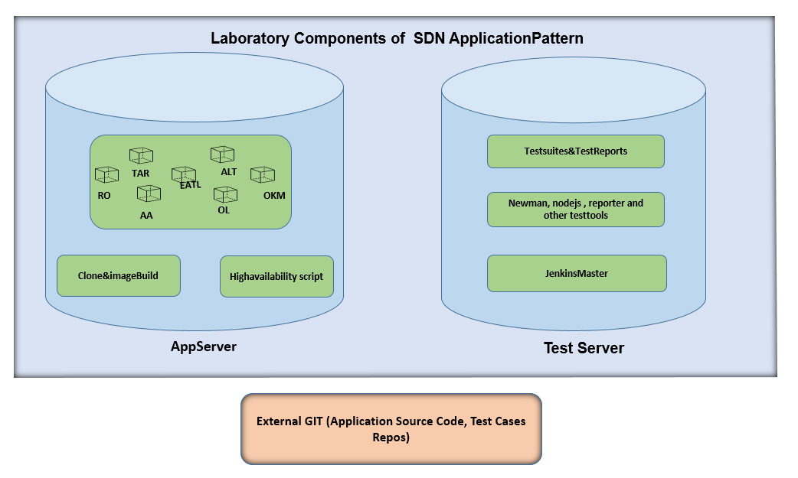

## SDN Laboratory Overview

Currently, the application pattern is building on application layer on SDN controller using the microservice architecture where all the complex applications are spilt into small pieces and make them run independently. 

Deploying and testing these application requires two servers and one source code repository.

* External GIT
    *  The git/github repository which contains all the source code and automated testsuites related to all applications.  

* Appserver
    
    * Appserver will be used to clone and build the images from source code using docker framework.
    * Deploys the applications as containers with port, once images are build on same server.
    * HA script also available on appserver which continuously monitor the applications.

* Test Server

     * Test server is used for testing the applications
     * Test server contains complete automation set up with required tools includes jenkins as CI tool, newman, newman-reporter for running the test suites and report generation.

To set up complete laboratory for deployment and testing, we required [tools](../../../TestingApplications.md#tools), changing default IP's to actual server Ip using concept of [Fake Addresses](../../../TestingApplications.md#fake-addresses) as prerequisite.

**Note**: The laboratory tools setup is same for both testbed and GCP/Production environment.

[<- Back to Testing Applications](../../../TestingApplications.md)
