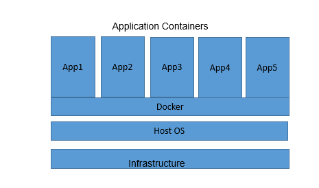

## Docker

## Table of contents

   * Overview
   * Advantages of Docker
   * Docker objects
        - Docker Images
        - Docker file
        - Docker conatiner
   * Install docker
   * Docker Usefull commands
   * Docker Volumes
        - Overview
        - Data persistance achieved with docker volumes
        - Docker Volume commands
   * Reference links

### Overview 
  Docker is an open source platform that enables developers to build, deploy, run, update and manage containers of applications. it is used to call as configuration management tool that is used to automate the deployment of software in lightweight containers which can run on any OS environment. These containers help applications to work efficiently in different environments. docker containization is very friendly in building and deploying the applications and below are advantages over docker.

### Advantages of Docker : 
* lighter weight process
* Easy and faster configuration
* Infrastructure independent
* Automated container creation
* Container versioning
* Container reuse
   

### Docker objects :

#### DockerImage: 
A Docker Image is a read-only file with a bunch of instructions. When these instructions are executed, it creates a Docker container.
#### DockerFile: 
Dockerfile is a simple text file that consists of instructions to build Docker images. DockerFile automates the process of Docker image creation.
#### Docker container: 
A Docker container image is a lightweight, standalone, executable package of software that includes everything needed to run an application: code, runtime, system tools, system libraries and settings.

#### Install Docker :  
It is recommend to check before installing the docker whether the docker is already available or not by using "docker --version".

if the response is empty, install the docker using below commands.
    
* sudo apt install docker.io  for ubuntu
* sudo dnf install docker-ce for redhat
* docker --version - check the docker installed or not

Start docker service and check the status using below commands for ubuntu and rhel.
##### Ubuntu
* "sudo systemctl start docker"
* "sudo systemctl enable docker"
* "sudo systemctl status docker"  

##### Rhel
* "sudo systemctl enable --now docker"
* "systemctl is-active docker"
* "systemctl is-enabled docker"

#### Docker Usefull commands : 

| Command   |     Description |
| -----------    | ----------- |
|docker attach  |   Attach local standard input, output, and error streams to a running container | 
|docker build	 |   Build an image from a Dockerfile | 
|docker commit	  |  Create a new image from a container’s changes | 
|docker config	  |  Manage Docker configs | 
|docker cp	 |       Copy files/folders between a container and the local filesystem | 
|docker diff	 |     Inspect changes to files or directories on a container’s filesystem | 
|docker images | 	  List images | 
|docker ps    |     list the conatainers | 
|docker inspect | Return low-level information on Docker objects|
|docker kill | Kill one or more running containers| 
|docker load  | Load an image from a tar archive or STDIN| 
|docker logs |    Fetch the logs of a container| 
|docker pull |    Pull an image or a repository from a registry| 
|docker push |   Push an image or a repository to a registry| 
|docker rename |  Rename a container| 
|docker restart | Restart one or more containers| 
|docker rm | Remove one or more containers| 
|docker rmi |  Remove one or more images| 
|docker run |  Run a command in a new container| 
|docker save |  Save one or more images to a tar archive (streamed to STDOUT by default)| 
|docker volume |  Manage volumes| 

### Docker Volumes
#### Overview

The Docker interface is simple and users can easily create and implement applications into their containers or carry out version management, copy, share, and modify, just like managing ordinary code. However, containers often need to use data beyond their container or share data between containers. to achieve this we need the data persistance with all across applicationpattern.

#### Data persistance achieved with docker volumes 
Docker volumes is a better solution is to work with persistent data in a container where data should be backed up and shared.

By using volumes  we will not lose the data stored and even if we restart/crashes the conatiners data lost will not happen. Docker volumes are dependent on Docker’s file system and are the preferred method of persisting data for Docker containers and services. When a container is started, Docker loads the read-only image layer, adds a read-write layer on top of the image stack, and mounts volumes onto the container filesystem.

|Command	|Description|
|------------|-------------------|
|docker volume create|	  Create a volume|
|docker volume inspect| 	Display detailed information on one or more volumes|
|docker volume ls	   |   List volumes|
|docker volume prune	    |Remove all unused local volumes|
|docker volume rm	     | Remove one or more volumes|

#### Docker in the Microwave SDN Laboratory and Application Pattern Deployment : 

To create and deploy the containers in a docker engine , we are following the procedure as below.

Please find the example flow below:

##### Prerequisite :
###### Context :
We are creating containers for the applications which are having database in the form of json file. This file will be modified based on certain actions. And this data needs to be persisted. So, to persist the data/getbacked up, we are creating persistent volume for every application in the docker environment. 
	
###### Steps :
* Create a docker volume and then use this volume while running the container.

        docker volume create <volumeName>
        ex: docker volume create registry-office

* After creating volumes , to make sure whether it is created by using, 
        docker volume inspect <volumeName>
        ex: docker volume inspect registry-office

##### Building images and creating containers :
Once created the volumes, attach these to the containers and storage will be mounted as database/filesystem to current created container from the docker application build image. 

While running the applications as container, the created volumes will be maintain the all application configured data.
* To build image,
        sudo docker build -t <image-name>
        ex: sudo docker build -t registry-office-image
* To run container and attach/map the volume,
        sudo docker run -d -p <port>:<port> --name <imagename> -v <volumename>:<pathtomount><localmountedpath>
        ex : sudo docker run -d -p <1234>:<1234> --name registry-office-image -v registry-office:/home/openbackhaul/registryOffice/database /home/registry-office
        
#### Dockerized SDN Application 

#### Reference links :
 [Docker Installation Process of RHEL](https://linuxconfig.org/how-to-install-docker-in-rhel-8)
 
[Docker Installation Process onUbuntu]( https://phoenixnap.com/kb/install-docker-on-ubuntu-20-04)

[Basics of Docker](https://docs.docker.com/engine/ )

[Docker Adoc Commands reference](https://docs.docker.com/engine/reference/commandline/docker/)

[Docker volumes reference](https://docs.docker.com/storage/volumes/)

