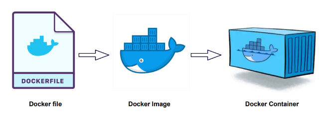

### Docker objects
By using the docker framework and dockerfile, user can build images and creating runtime containers.

### Docker Engine
Docker Engine is a part of docker which create, deploy and manage applications in a virtualized environment. The docker engine also provides an API for interacting with the hosted containers and a command line interface for managing them.
### DockerFile
A Dockerfile is a text document that contains the commands. It is used to create and automate the process of building Docker images. A Dockerfile is written using a simple syntax and contains instructions on how to build and configure an image. The instructions in the Dockerfile include things like which base image to use, which files to copy into the image, which commands to run, and which environment variables to set.
### DockerImage
A Docker Image is a read-only file with a bunch of instructions for creating a Docker container. Image contains the installations, applications code and dependencies.
### Docker container
A Docker container is a lightweight, standalone, executable package of software that includes everything needed to run an application code, runtime, system tools, system libraries and settings. They can be used to build, deploy, and manage applications.

[<- Back to Testing Applications](../../../TestingApplications.md) - - ->[Ahead to Docker adhoc commands](./DockerUsefulCommands.md)